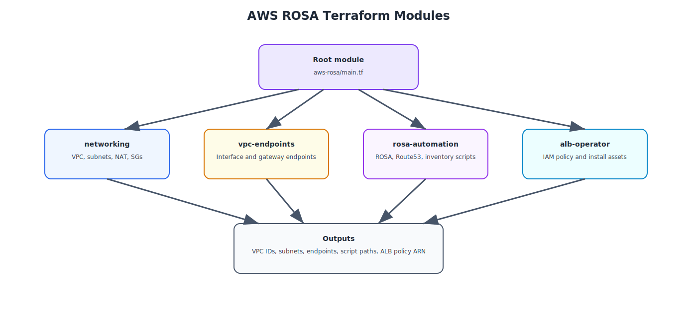

# AWS ROSA Terraform Code Reference

This page explains the Terraform implementation added under the repository's `aws-rosa/` folder.

## Module relationship

{: .drawio-diagram }

???+ note "Draw.io Source: AWS ROSA Terraform Modules"
    [:material-download: Download .drawio file](../diagrams/aws-rosa/03-aws-rosa-terraform-modules.drawio){ .md-button } — Open in [draw.io](https://app.diagrams.net) for interactive editing.

## Root module structure

```text
aws-rosa/
├── main.tf
├── variables.tf
├── outputs.tf
├── versions.tf
├── terraform.tfvars
├── azure-pipelines-rosa.yml
└── modules/
    ├── networking/
    ├── vpc-endpoints/
    ├── rosa-automation/
    └── alb-operator/
```

## `main.tf` orchestration

The root module composes the ROSA workflow in four parts:

1. `networking` — creates the VPC, subnets, route tables, NAT, and security groups
2. `vpc-endpoints` — creates AWS interface and gateway endpoints for private worker access
3. `rosa-automation` — renders preflight, cluster create, Route 53, and delete scripts
4. `alb-operator` — creates the IAM policy and install assets for ALB-backed ingress

### Key orchestration excerpt

```hcl
module "networking" {
  source = "./modules/networking"
}

module "vpc_endpoints" {
  source = "./modules/vpc-endpoints"
}

module "rosa_automation" {
  source = "./modules/rosa-automation"
}

module "alb_operator" {
  source = "./modules/alb-operator"
}
```

## `variables.tf`

The ROSA variables model AWS-specific concerns, including:

- `aws_account_id`
- `availability_zones`
- `public_subnet_cidrs` and `private_subnet_cidrs`
- `interface_vpc_endpoints` and `gateway_vpc_endpoints`
- `private_cluster`
- `route53_zone_id`
- CLI binary names for `rosa`, `aws`, `oc`, `jq`, and `helm`
- ALB namespace and ingress scheme defaults

## `modules/networking`

This module creates the AWS primitives ROSA depends on in the customer account:

- VPC with DNS enabled
- internet gateway
- public subnets
- private subnets
- public and private route tables
- optional one-per-AZ NAT gateways
- a compute security group
- an endpoint security group

The additional compute security group is emitted so the generated ROSA command can attach it to worker nodes.

## `modules/vpc-endpoints`

This module turns the ROSA network into a private-service-aware VPC by creating:

- interface endpoints such as STS, EC2, ECR, ELB, and CloudWatch
- gateway endpoints such as S3

It also produces an inventory output that the generated `rosa-environment.md` file captures for operators.

## `modules/rosa-automation`

This module renders the operational hand-off files under `aws-rosa/generated/<cluster>/`:

- `rosa-preflight-checks.sh`
- `create-rosa-cluster.sh`
- `configure-route53-aliases.sh`
- `delete-rosa-cluster.sh`
- `rosa-environment.md`

The generated cluster command uses **ROSA STS auto mode**, which is the cleanest way to keep the Terraform layer readable while still capturing the real creation flow.

## `modules/alb-operator`

This module adds the application ingress extension path:

- creates an AWS IAM policy for the load balancer controller
- writes the policy JSON to disk
- renders `install-alb-operator.sh`
- renders a sample `sample-alb-ingress.yaml`

That means the ROSA blueprint includes both the cluster foundation and the post-install ingress pattern many teams actually need in production.

## Outputs

The ROSA module exposes the most useful deployment references:

- VPC and subnet IDs
- endpoint inventory
- generated asset directory
- ROSA preflight and cluster create scripts
- Route 53 helper script
- ALB IAM policy ARN
- ALB install script and sample ingress manifest
