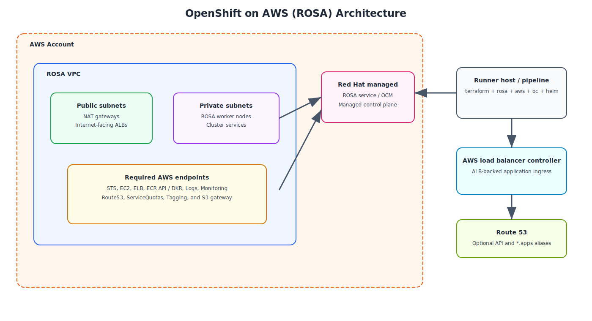

# AWS ROSA — OpenShift on AWS

This section adds an **OpenShift on AWS (ROSA)** deployment path alongside the existing x86 bare-metal and IBM Z content in this repository. The design focuses on **ROSA with STS**, a customer-owned **multi-AZ VPC**, the **AWS VPC endpoints** private worker nodes commonly need, and a generated **ALB operator** enablement workflow.

{: .drawio-diagram }

???+ note "Draw.io Source: AWS ROSA Architecture Overview"
    [:material-download: Download .drawio file](../diagrams/aws-rosa/01-aws-rosa-architecture.drawio){ .md-button } — Open in [draw.io](https://app.diagrams.net) for interactive editing.

## Why ROSA needs its own implementation

The repository already covers self-managed OpenShift patterns on **x86 bare metal** and **IBM Z / LinuxONE**. ROSA changes the responsibility split significantly:

| Area | Existing repo patterns | ROSA implementation |
| --- | --- | --- |
| Control plane | Customer-managed IPI / UPI or bastion-driven agent install | Red Hat managed control plane |
| Worker VPC | Bare-metal VLANs, VIPs, HAProxy, Redfish | AWS VPC, private/public subnets, NAT, security groups |
| Service access | Air-gapped mirrors, site DNS, static routing | AWS endpoints, Route 53, STS, ELB, ECR, CloudWatch |
| Platform automation | `openshift-install`, BMCs, z/VM wrapper scripts | `rosa` CLI in STS auto mode plus AWS resources |
| Ingress expansion | Native router / bare-metal ingress | AWS Load Balancer Controller for ALB-backed app ingress |

## New repo assets

The ROSA code lives in the repository root under:

```text
aws-rosa/
├── README.md
├── versions.tf
├── variables.tf
├── terraform.tfvars
├── main.tf
├── outputs.tf
├── azure-pipelines-rosa.yml
└── modules/
    ├── networking/
    ├── vpc-endpoints/
    ├── rosa-automation/
    └── alb-operator/
```

## Deployment flow at a glance

1. Terraform creates the customer VPC, public/private subnets, route tables, NAT, and security groups.
2. Terraform creates AWS interface and gateway endpoints required by private ROSA workers.
3. Terraform renders preflight and cluster create scripts that use the `rosa` CLI in **STS auto mode**.
4. The generated ROSA command provisions account roles, OIDC, operator roles, and the cluster itself.
5. Terraform renders Route 53 helper assets for API and wildcard app aliases when a hosted zone is supplied.
6. Terraform creates an IAM policy and install script for the **AWS load balancer controller** so application ingress can use ALBs.

## Prerequisites

| Requirement | Details |
| --- | --- |
| **ROSA CLI** | `rosa` installed on the command runner or CI agent |
| **AWS CLI** | `aws` configured for the target AWS account |
| **OpenShift CLI** | `oc` used for cluster login and ALB setup |
| **Helm** | Required for the generated ALB controller installation script |
| **OCM token** | Exported in `OCM_TOKEN` or your configured token env var |
| **AWS account permissions** | IAM, EC2, ELB, Route 53, and VPC endpoint permissions |
| **Hosted zone (optional)** | Route 53 zone for custom API / apps aliases |

## Required AWS endpoints included in this blueprint

The ROSA module enables these interface endpoints by default for private worker subnets:

- `ec2`
- `elasticloadbalancing`
- `sts`
- `ecr.api`
- `ecr.dkr`
- `logs`
- `monitoring`
- `autoscaling`
- `route53`
- `servicequotas`
- `tagging`

It also creates the **S3 gateway endpoint** required by many AWS control-plane interactions and image flows.

## Recommended usage

- Start with `aws-rosa/terraform.tfvars` and replace the sample account ID, zone IDs, subnet CIDRs, and profile name.
- Keep the generated scripts under `aws-rosa/generated/<cluster>/` outside Git tracking.
- Use `terraform apply` to build the AWS foundation first, then review and execute the generated ROSA and ALB scripts.
- For local documentation preview, use the repo-standard Podman workflow: `podman compose up -d --build`.

## Where to go next

- [AWS ROSA Architecture](architecture.md)
- [AWS ROSA Code Reference](code-reference.md)
- [AWS ROSA Pipeline](pipeline.md)
