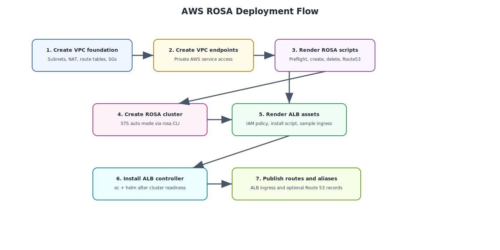

# AWS ROSA Pipeline

The file `aws-rosa/azure-pipelines-rosa.yml` adds an Azure DevOps workflow tailored for the ROSA Terraform blueprint.

## Purpose

The pipeline follows the same repo convention as the IBM Z and bare-metal content:

- validate Terraform
- render or apply the infrastructure foundation
- optionally execute the generated operational scripts
- leave human-readable artifacts behind for review and troubleshooting

## Workflow overview

{: .drawio-diagram }

???+ note "Draw.io Source: AWS ROSA Deployment Flow"
    [:material-download: Download .drawio file](../diagrams/aws-rosa/02-aws-rosa-deployment-flow.drawio){ .md-button } — Open in [draw.io](https://app.diagrams.net) for interactive editing.

## Pipeline stages

| Stage | What it does |
| --- | --- |
| **Validate** | Runs `terraform init`, `terraform fmt -check -recursive`, and `terraform validate` |
| **Provision** | Runs Terraform with `terraform.tfvars` and optional script execution flags |
| **Summary** | Prints guidance about the rendered ROSA and ALB assets |

## Parameters

| Parameter | Type | Purpose |
| --- | --- | --- |
| `terraformAction` | string | `plan`, `apply`, or `destroy` |
| `runRosaCli` | boolean | If true, lets Terraform run the generated ROSA preflight and create scripts |
| `runAlbSetup` | boolean | If true, lets Terraform run the generated ALB install script |

## Required pipeline secrets

The pipeline expects secret variables or variable-group entries for:

- `aws-access-key-id`
- `aws-secret-access-key`
- `aws-session-token` *(optional if not using temporary credentials)*
- `aws-region`
- `ocm-token`

## Recommended usage pattern

1. Run `plan` first to confirm VPC CIDRs, endpoint selections, and security group values.
2. Use `apply` with `runRosaCli=false` the first time if you want to inspect the generated scripts before execution.
3. Enable `runRosaCli=true` only on agents that already have `rosa`, `aws`, `oc`, and `jq` installed.
4. Enable `runAlbSetup=true` only after the cluster is created and reachable with `oc`.

## Operational notes

- The pipeline watches `aws-rosa/**`, `docs/aws-rosa/**`, and `docs/diagrams/aws-rosa/**`.
- Generated scripts land under `aws-rosa/generated/` during Terraform execution.
- The ALB workflow is intentionally post-install because it depends on the cluster OIDC endpoint and an active `oc` session.
