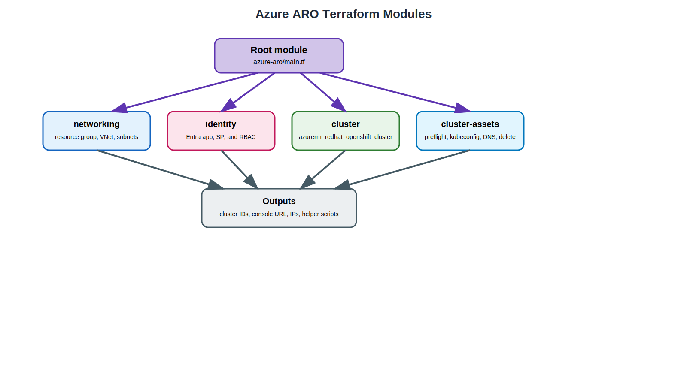

# Azure Red Hat OpenShift (ARO) Terraform Code Reference

This page explains the Terraform implementation added under the repository's `azure-aro/` folder.

## Module relationship

{: .drawio-diagram }

???+ note "Draw.io Source: Azure Red Hat OpenShift Terraform Modules"
    [:material-download: Download .drawio file](../diagrams/azure-aro/03-azure-aro-terraform-modules.drawio){ .md-button } — Open in [draw.io](https://app.diagrams.net) for interactive editing.

## Root module structure

```text
azure-aro/
├── main.tf
├── variables.tf
├── outputs.tf
├── versions.tf
├── terraform.tfvars
├── azure-pipelines-aro.yml
└── modules/
    ├── networking/
    ├── identity/
    ├── cluster/
    └── cluster-assets/
```

## `main.tf` orchestration

The root module composes the ARO workflow in four parts:

1. `networking` — creates the resource group, VNet, and the two required subnets
2. `identity` — creates or reuses a Microsoft Entra service principal and assigns Azure RBAC roles
3. `cluster` — provisions the managed ARO cluster resource
4. `cluster-assets` — renders preflight, kubeconfig, DNS, delete, and summary files

### Key orchestration excerpt

```hcl
module "networking" {
  source = "./modules/networking"
}

module "identity" {
  source = "./modules/identity"
}

module "cluster" {
  source = "./modules/cluster"
}

module "cluster_assets" {
  source = "./modules/cluster-assets"
}
```

## `variables.tf`

The ARO variables model Azure-specific concerns, including:

- `resource_group_name`
- `managed_resource_group_name`
- `vnet_cidr`, `control_plane_subnet_cidr`, and `worker_subnet_cidr`
- `cluster_domain`
- `api_visibility` and `ingress_visibility`
- `master_vm_size`, `worker_vm_size`, and `worker_node_count`
- `create_service_principal` and the existing-SP fallback variables
- optional `pull_secret`, `pull_secret_file`, and Azure DNS helper inputs

## `modules/networking`

This module creates the Azure primitives ARO depends on:

- resource group
- virtual network
- control-plane subnet
- worker subnet
- service endpoints for `Microsoft.Storage` and `Microsoft.ContainerRegistry`

The subnet layout mirrors Microsoft's quickstart guidance and keeps the root module readable.

## `modules/identity`

This module handles the identity boundary that ARO needs:

- creates a Microsoft Entra application and service principal by default
- optionally supports an existing service principal path
- grants **Contributor** on the cluster resource group
- grants **Network Contributor** on the VNet to the cluster service principal
- grants **Network Contributor** on the VNet to the ARO resource provider service principal

That means the cluster has the permissions it needs without forcing operators to hand-build every RBAC step.

## `modules/cluster`

This module wraps `azurerm_redhat_openshift_cluster` and captures the main ARO settings in one place:

- OpenShift version
- cluster domain
- optional pull secret
- pod and service CIDRs
- API and ingress visibility
- master and worker VM profiles
- host-based encryption toggles
- ARO managed resource group name

It also exports the console URL plus the API and ingress IP addresses used by the helper assets.

## `modules/cluster-assets`

This module renders the operational hand-off files under `azure-aro/generated/<cluster>/`:

- `aro-preflight-checks.sh`
- `get-admin-kubeconfig.sh`
- `configure-azure-dns-records.sh`
- `delete-aro-cluster.sh`
- `aro-environment.md`

The generated helper flow mirrors the AWS ROSA pattern: Terraform creates the durable infrastructure, then leaves explicit scripts behind for operator-facing steps.

## Outputs

The ARO module exposes the most useful deployment references:

- resource group and VNet IDs
- subnet IDs
- service principal client ID
- cluster ID
- console URL
- API server URL and IP
- ingress IP
- generated helper file paths
