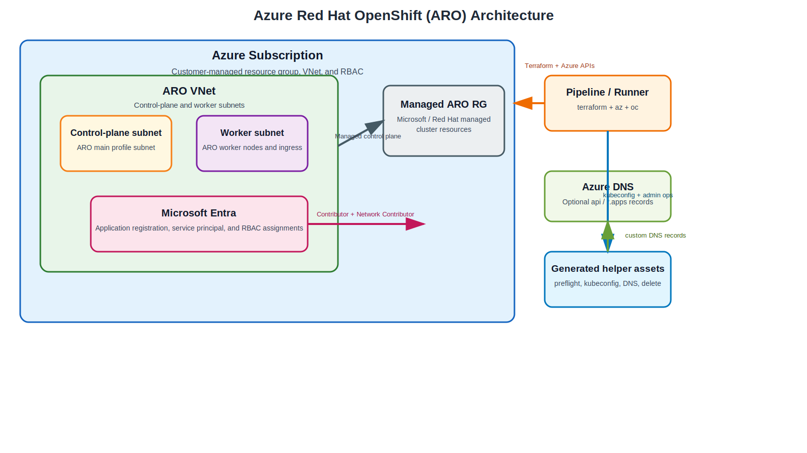

# Azure Red Hat OpenShift (ARO)

This section adds an **Azure Red Hat OpenShift (ARO)** deployment path alongside the existing bare-metal, IBM Z, and AWS ROSA content in this repository. The design focuses on a **Terraform-managed Azure network foundation**, **service principal and RBAC setup**, the managed **ARO cluster resource**, and generated helper assets for post-deployment operations.

{: .drawio-diagram }

???+ note "Draw.io Source: Azure Red Hat OpenShift Architecture Overview"
    [:material-download: Download .drawio file](../diagrams/azure-aro/01-azure-aro-architecture.drawio){ .md-button } — Open in [draw.io](https://app.diagrams.net) for interactive editing.

## Why ARO needs its own implementation

ARO shifts the responsibility split in a different way than the bare-metal and AWS variants:

| Area | Existing repo patterns | ARO implementation |
| --- | --- | --- |
| Control plane | Customer-managed IPI / UPI or ROSA service boundary | Microsoft and Red Hat managed control plane in Azure |
| Worker network | Bare-metal VLANs or AWS VPC + endpoints | Azure VNet with control-plane and worker subnets |
| Identity | Bastion credentials, Route 53 helpers, AWS STS roles | Microsoft Entra application, service principal, and Azure RBAC |
| Cluster provisioning | `openshift-install` or `rosa` CLI workflows | `azurerm_redhat_openshift_cluster` resource |
| Post-create operations | Bare-metal bootstrap or ROSA helper scripts | Azure CLI kubeconfig, DNS, and delete helper assets |

## New repo assets

The ARO code lives in the repository root under:

```text
azure-aro/
├── README.md
├── versions.tf
├── variables.tf
├── terraform.tfvars
├── main.tf
├── outputs.tf
├── azure-pipelines-aro.yml
└── modules/
    ├── networking/
    ├── identity/
    ├── cluster/
    └── cluster-assets/
```

## Deployment flow at a glance

1. Terraform creates the Azure resource group, virtual network, and the two empty subnets required by ARO.
2. Terraform creates or reuses a Microsoft Entra service principal and grants it the required Azure RBAC roles.
3. Terraform grants **Network Contributor** on the VNet to the Azure Red Hat OpenShift resource provider service principal.
4. Terraform provisions the managed ARO cluster using `azurerm_redhat_openshift_cluster`.
5. Terraform renders helper assets for preflight checks, admin kubeconfig retrieval, Azure DNS records, and cluster deletion.
6. Operators optionally run the helper assets or let the Azure DevOps pipeline fetch kubeconfig automatically.

## Prerequisites

| Requirement | Details |
| --- | --- |
| **Azure CLI** | `az` 2.67.0 or newer on the operator workstation or CI agent |
| **OpenShift CLI** | `oc` available for kubeconfig validation and cluster administration |
| **Azure permissions** | Contributor + User Access Administrator or Owner on the target scope |
| **Microsoft Entra permissions** | Application Administrator or equivalent if Terraform creates the service principal |
| **Provider registration** | `Microsoft.RedHatOpenShift`, `Microsoft.Compute`, `Microsoft.Storage`, and `Microsoft.Authorization` |
| **Quota** | At least **44 vCPUs** available during installation |
| **Subnets** | Two empty subnets, each **/27 or larger**, with no conflicting address ranges |
| **Pull secret (optional)** | Recommended if you need Red Hat or certified operators after install |

## Recommended usage

- Start with `azure-aro/terraform.tfvars` and replace the sample resource group, domain, CIDRs, and region values.
- Inject the Red Hat pull secret through a secure pipeline variable or a protected local file path.
- Use `terraform plan` first to confirm subnet ranges, visibility settings, and role assignment behavior.
- Review the generated helper assets under `azure-aro/generated/<cluster>/` after apply.
- For local documentation preview, use the repo-standard Podman workflow.

## Where to go next

- [Azure ARO Architecture](architecture.md)
- [Azure ARO Code Reference](code-reference.md)
- [Azure ARO Pipeline](pipeline.md)
