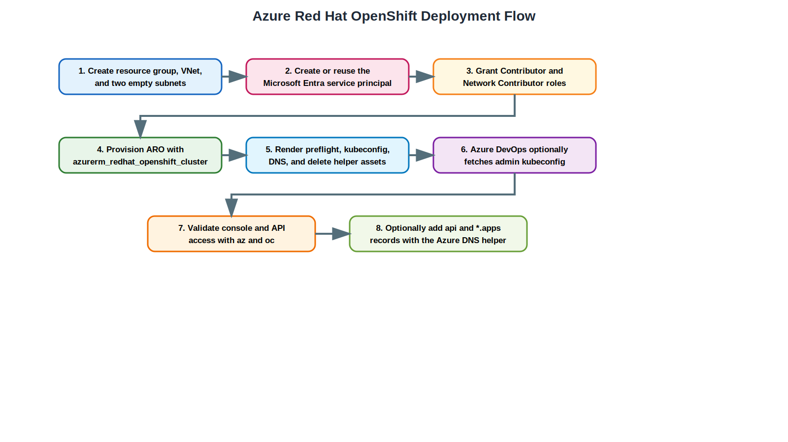

# Azure Red Hat OpenShift (ARO) Pipeline

The file `azure-aro/azure-pipelines-aro.yml` adds an Azure DevOps workflow tailored for the ARO Terraform blueprint.

## Purpose

The pipeline follows the same repository convention as the other platform variants:

- validate Terraform
- plan, apply, or destroy the Azure foundation and ARO cluster
- optionally fetch the admin kubeconfig after create
- leave human-readable helper assets behind for review and troubleshooting

## Workflow overview

{: .drawio-diagram }

???+ note "Draw.io Source: Azure Red Hat OpenShift Deployment Flow"
    [:material-download: Download .drawio file](../diagrams/azure-aro/02-azure-aro-deployment-flow.drawio){ .md-button } — Open in [draw.io](https://app.diagrams.net) for interactive editing.

## Pipeline stages

| Stage | What it does |
| --- | --- |
| **Validate** | Runs `terraform init`, `terraform fmt -check -recursive`, and `terraform validate` |
| **Provision** | Runs Terraform with `terraform.tfvars` and optional kubeconfig retrieval |
| **Summary** | Prints guidance about the rendered ARO helper assets |

## Parameters

| Parameter | Type | Purpose |
| --- | --- | --- |
| `terraformAction` | string | `plan`, `apply`, or `destroy` |
| `fetchAdminKubeconfig` | boolean | If true, runs the generated preflight and admin kubeconfig scripts |

## Required pipeline secrets

The pipeline expects secret variables or variable-group entries for:

- `azure-client-id`
- `azure-client-secret`
- `azure-subscription-id`
- `azure-tenant-id`
- `aro-pull-secret` *(optional but recommended for operators and partner content)*

## Recommended usage pattern

1. Run `plan` first to confirm resource names, CIDRs, and visibility settings.
2. Use `apply` with `fetchAdminKubeconfig=false` if you want to inspect the generated helper assets before they run.
3. Enable `fetchAdminKubeconfig=true` only on agents that already have both `az` and `oc` installed and authenticated.
4. Keep the pull secret in a secure variable group rather than inside `terraform.tfvars`.

## Operational notes

- The pipeline watches `azure-aro/**`, `docs/azure-aro/**`, and `docs/diagrams/azure-aro/**`.
- Generated scripts land under `azure-aro/generated/` during Terraform execution.
- The pipeline uses both `ARM_*` and `AZURE_*` environment variables so the AzureRM and AzureAD providers behave consistently in CI.
