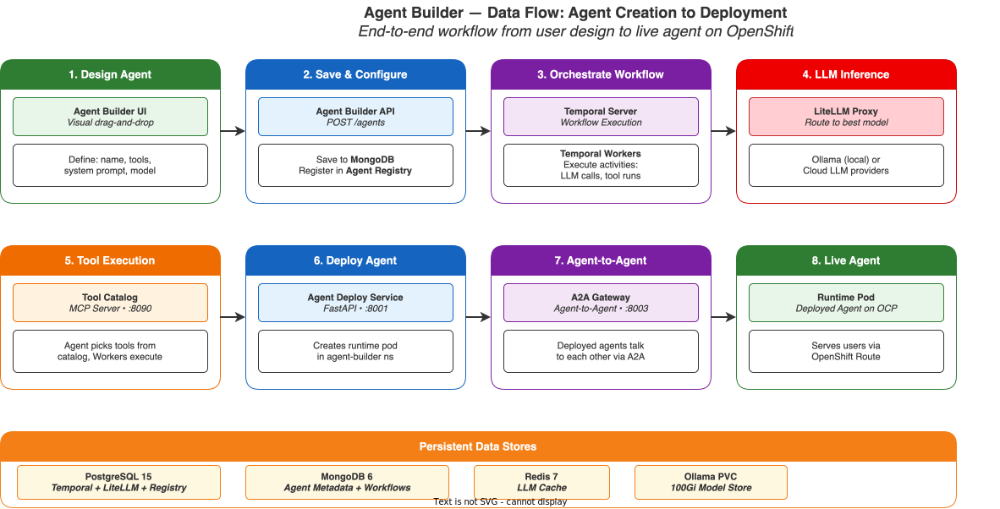
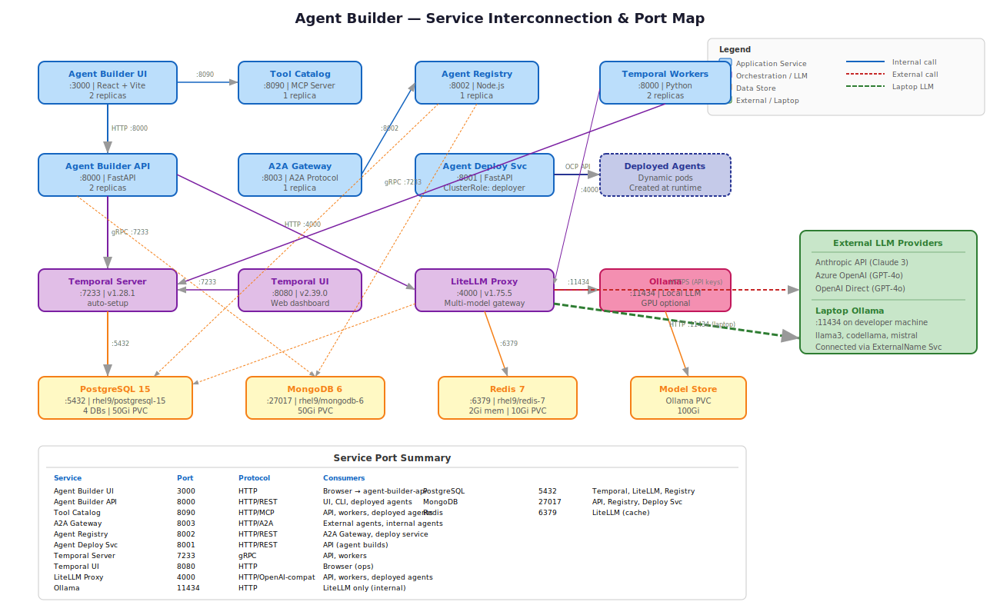

# Terraform Automation — Agent Builder Factory

This section provides the **Terraform IaC** for deploying the **Kyndryl Agent Builder Factory** — an enterprise AI agent building, deploying, and managing platform — on OpenShift Baremetal with local LLM support via Ollama.

!!! info "Agent Builder Platform"
    The Agent Builder Factory enables building AI agents with **MCP tools**, deploying them as containers, and connecting via the **Agent-to-Agent (A2A) protocol**. LLM inference is managed through **LiteLLM Proxy** supporting multiple providers including **Ollama (Llama3) on-cluster and on your laptop**.

## Architecture Overview

The platform deploys 14 microservices on OpenShift using Terraform via `null_resource` + SSH `remote-exec` + `oc` CLI pattern:

{: .drawio-diagram }

???+ note "Draw.io Source: Agent Builder Architecture"
    [:material-download: Download .drawio file](../diagrams/architecture/20-agent-builder-architecture.drawio){ .md-button } — Open in [draw.io](https://app.diagrams.net) for interactive editing.

## Project Structure

The Agent Builder Factory is deployed across 4 environments — IPI DC, IPI DR, UPI DC, and UPI DR:

=== "IPI DC Primary"

    ```
    ipi-method/agent-builder/
    ├── main.tf                       # Main orchestration — module wiring & dependencies
    ├── variables.tf                  # All variable declarations with types & defaults
    ├── terraform.tfvars              # Environment-specific values (edit this)
    ├── outputs.tf                    # Service URLs, endpoints
    ├── versions.tf                   # Provider version constraints (null, local, tls)
    └── modules/
        ├── namespace/                # OpenShift namespace with labels/annotations
        ├── postgresql/               # PostgreSQL 15 StatefulSet (4 databases)
        ├── mongodb/                  # MongoDB 6 StatefulSet (agent metadata)
        ├── redis/                    # Redis 7 StatefulSet (LLM response cache)
        ├── temporal/                 # Temporal Server v1.28.1 + UI v2.39.0
        ├── ollama/                   # Ollama local LLM (Llama3, optional GPU)
        ├── litellm/                  # LiteLLM Proxy v1.75.5 (multi-model gateway)
        ├── temporal-workers/         # Python Temporal workflow workers
        ├── agent-builder-api/        # FastAPI backend (core API)
        ├── agent-builder-ui/         # React + Vite frontend
        ├── tool-catalog/             # MCP Tool Catalog server
        ├── agent-deployment-service/ # Agent container build & deploy service
        ├── agent-registry/           # Agent metadata registry (MongoDB + PostgreSQL)
        └── a2a-gateway/              # Agent-to-Agent protocol gateway
    ```

=== "IPI DR Secondary"

    ```
    ipi-method/agent-builder-dr/
    ├── main.tf                       # DR orchestration — same modules, DR values
    ├── variables.tf                  # Same variable declarations
    ├── terraform.tfvars              # DR values: bastion=10.143.41.10, cluster=ocp-ai-dr
    ├── outputs.tf                    # Service URLs (DR domain)
    ├── versions.tf                   # Provider version constraints
    └── modules/                      # Same 14 modules as DC primary
    ```

=== "UPI DC Primary"

    ```
    upi-method/agent-builder/
    ├── main.tf                       # UPI DC orchestration
    ├── variables.tf                  # Same variable declarations
    ├── terraform.tfvars              # UPI DC values: cluster=ocp-ai-upi
    ├── outputs.tf                    # Service URLs (UPI domain)
    ├── versions.tf                   # Provider version constraints
    └── modules/                      # Same 14 modules
    ```

=== "UPI DR Secondary"

    ```
    upi-method/agent-builder-dr/
    ├── main.tf                       # UPI DR orchestration
    ├── variables.tf                  # Same variable declarations
    ├── terraform.tfvars              # UPI DR values: bastion=10.143.41.10, cluster=ocp-ai-upi-dr
    ├── outputs.tf                    # Service URLs (UPI DR domain)
    ├── versions.tf                   # Provider version constraints
    └── modules/                      # Same 14 modules
    ```

### Environment Summary

| Environment | Directory | Cluster | Bastion IP | Domain |
|-------------|-----------|---------|------------|--------|
| **IPI DC Primary** | `ipi-method/agent-builder/` | `ocp-ai` | `10.142.41.10` | `example.com` |
| **IPI DR Secondary** | `ipi-method/agent-builder-dr/` | `ocp-ai-dr` | `10.143.41.10` | `dr.example.com` |
| **UPI DC Primary** | `upi-method/agent-builder/` | `ocp-ai-upi` | `10.142.41.10` | `example.com` |
| **UPI DR Secondary** | `upi-method/agent-builder-dr/` | `ocp-ai-upi-dr` | `10.143.41.10` | `dr.example.com` |

### Pipeline Files

| Pipeline | IPI | UPI |
|----------|-----|-----|
| **Day 1 Deployment** | `ipi-method/azure-pipelines-agent-builder.yml` | `upi-method/azure-pipelines-agent-builder.yml` |
| **Day 2 Operations** | `ipi-method/azure-pipelines-agent-builder-day2.yml` | `upi-method/azure-pipelines-agent-builder-day2.yml` |

## Service Components

| Service | Port | Image | Replicas | Purpose |
|---------|------|-------|----------|---------|
| **Agent Builder UI** | 3000 | `node:20-alpine` | 2 | React SPA — agent design interface |
| **Agent Builder API** | 8000 | `python:3.11-slim` | 2 | FastAPI — core API & orchestration |
| **Tool Catalog** | 8090 | `python:3.11-slim` | 1 | MCP tool server — browsable tool registry |
| **A2A Gateway** | 8003 | `python:3.11-slim` | 1 | Agent-to-Agent discovery & routing |
| **Agent Registry** | 8002 | `python:3.11-slim` | 1 | Agent metadata & endpoint registry |
| **Agent Deploy Svc** | 8001 | `python:3.11-slim` | 1 | OCP build/deploy orchestrator |
| **Temporal Workers** | 8000 | `python:3.11-slim` | 2 | Workflow execution workers |
| **Temporal Server** | 7233 | `temporalio/auto-setup:1.28.1` | 1 | Workflow orchestration engine |
| **Temporal UI** | 8080 | `temporalio/ui:2.39.0` | 1 | Workflow monitoring dashboard |
| **LiteLLM Proxy** | 4000 | `ghcr.io/berriai/litellm:v1.75.5-stable` | 1 | Multi-model LLM gateway |
| **Ollama** | 11434 | `ollama/ollama:latest` | 1 | Local LLM (Llama3, GPU optional) |
| **PostgreSQL** | 5432 | `registry.redhat.io/rhel9/postgresql-15` | 1 | Temporal + LiteLLM + Registry DBs |
| **MongoDB** | 27017 | `registry.redhat.io/rhel9/mongodb-6` | 1 | Agent metadata + conversations |
| **Redis** | 6379 | `registry.redhat.io/rhel9/redis-7` | 1 | LLM response & semantic cache |

## LLM Connectivity

The platform supports multiple LLM providers through LiteLLM Proxy:

{: .drawio-diagram }

???+ note "Draw.io Source: LLM Connectivity"
    [:material-download: Download .drawio file](../diagrams/architecture/21-agent-builder-llm-connectivity.drawio){ .md-button } — Open in [draw.io](https://app.diagrams.net) for interactive editing.

### LLM Providers Supported

| Provider | Model | Access Method | Variable |
|----------|-------|--------------|----------|
| **Anthropic** | Claude 3 Haiku/Sonnet/Opus | HTTPS API | `litellm_anthropic_api_key` |
| **Azure OpenAI** | GPT-4o | HTTPS API | `litellm_azure_api_key` |
| **OpenAI** | GPT-4o | HTTPS API | `litellm_openai_api_key` |
| **Ollama (In-Cluster)** | Llama3, Llama3-chat | ClusterIP Service | `enable_ollama = true` |
| **Ollama (Laptop)** | Llama3, CodeLlama, Mistral | ExternalName Service | `enable_local_llm_laptop = true` |

### Connecting Your Laptop's Ollama

!!! tip "Local LLM on Your Laptop"
    To connect your laptop's Ollama instance to the Agent Builder:

    1. Install Ollama on your laptop: `curl -fsSL https://ollama.ai/install.sh | sh`
    2. Pull a model: `ollama pull llama3`
    3. Start Ollama with network binding: `OLLAMA_HOST=0.0.0.0:11434 ollama serve`
    4. Set Terraform variables:
    ```hcl
    enable_local_llm_laptop = true
    local_llm_laptop_url    = "http://192.168.1.100:11434"  # Your laptop IP
    ```
    5. Apply the LiteLLM module: `terraform apply -target=module.litellm`

## Data Flow

End-to-end flow from agent design to deployment:

{: .drawio-diagram }

???+ note "Draw.io Source: Data Flow"
    [:material-download: Download .drawio file](../diagrams/architecture/22-agent-builder-data-flow.drawio){ .md-button } — Open in [draw.io](https://app.diagrams.net) for interactive editing.

### Agent Lifecycle

1. **Design** — User designs agent in the UI (system prompt, tools, model)
2. **Orchestrate** — API triggers Temporal workflow, workers generate agent code
3. **Build** — Agent Deploy Service builds container image via OCP builds
4. **Register** — Agent registered in Agent Registry (MongoDB + PostgreSQL)
5. **Deploy** — Agent pod deployed with Service + Route on OpenShift
6. **Execute** — Agent receives invocations via API or A2A Gateway

## Service Interconnection Map

{: .drawio-diagram }

???+ note "Draw.io Source: Service Map"
    [:material-download: Download .drawio file](../diagrams/architecture/23-agent-builder-service-map.drawio){ .md-button } — Open in [draw.io](https://app.diagrams.net) for interactive editing.

## Prerequisites

Before deploying the Agent Builder Factory, ensure the following are in place:

### Infrastructure Requirements

| Requirement | Details |
|-------------|---------|
| **OpenShift Version** | 4.15+ (bare metal IPI or UPI) |
| **Terraform** | >= 1.5.0 with `null` (~> 3.2), `local` (~> 2.4), `tls` (~> 4.0) providers |
| **Bastion/Provisioner Node** | RHEL 8.x/9.x with `oc` CLI, SSH access to cluster nodes, Terraform installed |
| **SSH Key Pair** | Ed25519 or RSA key pair for bastion → cluster SSH (`remote-exec`) |
| **OCP CLI** | `oc` CLI installed on bastion and authenticated (`oc login`) to the target cluster |
| **Cluster Admin RBAC** | `cluster-admin` role on the target OpenShift cluster |
| **Container Runtime** | `podman` on bastion (for building Agent Builder container images) |

### Storage Requirements

| Component | PVC Size | Storage Class | Notes |
|-----------|----------|---------------|-------|
| **PostgreSQL** | 50Gi | ODF/Ceph (`ocs-storagecluster-ceph-rbd`) | 4 databases: temporal_db, temporal_visibility_db, litellm_db, agent_registry_db |
| **MongoDB** | 50Gi | ODF/Ceph (`ocs-storagecluster-ceph-rbd`) | Agent metadata, conversations, workflow states |
| **Redis** | 10Gi | ODF/Ceph (`ocs-storagecluster-ceph-rbd`) | LLM response cache, semantic cache |
| **Ollama** | 100Gi | ODF/Ceph (`ocs-storagecluster-ceph-rbd`) | LLM model storage (Llama3 ≈ 4.7GB, 70B ≈ 40GB) |
| **Total Minimum** | **210Gi** | — | Adjust Ollama PVC if loading multiple or large models |

!!! note "ODF Requirement"
    OpenShift Data Foundation (ODF) must be deployed and the `ocs-storagecluster-ceph-rbd` StorageClass available. If using a different StorageClass, update `terraform.tfvars`.

### Compute Requirements

| Component | CPU Request | CPU Limit | Memory Request | Memory Limit | GPU |
|-----------|-------------|-----------|----------------|--------------|-----|
| **PostgreSQL** | 500m | 2 | 1Gi | 4Gi | — |
| **MongoDB** | 500m | 2 | 1Gi | 4Gi | — |
| **Redis** | 250m | 1 | 512Mi | 2Gi | — |
| **Temporal Server** | 500m | 2 | 1Gi | 4Gi | — |
| **Temporal UI** | 100m | 500m | 256Mi | 512Mi | — |
| **LiteLLM Proxy** | 500m | 2 | 1Gi | 4Gi | — |
| **Ollama** | 2 | 8 | 8Gi | 16Gi | Optional: `nvidia.com/gpu: 1` |
| **Temporal Workers** (×2) | 500m | 2 | 1Gi | 4Gi | — |
| **Agent Builder API** (×2) | 500m | 2 | 1Gi | 4Gi | — |
| **Agent Builder UI** (×2) | 100m | 500m | 256Mi | 1Gi | — |
| **Tool Catalog** | 250m | 1 | 512Mi | 2Gi | — |
| **Agent Deploy Svc** | 500m | 2 | 1Gi | 4Gi | — |
| **Agent Registry** | 250m | 1 | 512Mi | 2Gi | — |
| **A2A Gateway** | 250m | 1 | 512Mi | 2Gi | — |
| **Total (approx.)** | **8 vCPU** | **30 vCPU** | **20Gi** | **60Gi** | 0–1 GPU |

!!! tip "GPU for Ollama"
    GPU is optional but strongly recommended for Ollama. Without GPU, Llama3 inference is CPU-only and significantly slower. Requires [NVIDIA GPU Operator](https://docs.nvidia.com/datacenter/cloud-native/openshift/latest/index.html) installed with `nvidia.com/gpu` resources available. Set `ollama_gpu_enabled = true` in `terraform.tfvars`.

### Network / Firewall Requirements

The following ports must be accessible for Agent Builder services:

#### Service Ports (OpenShift Internal)

| Port | Protocol | Source | Destination | Purpose |
|------|----------|--------|-------------|---------|
| 3000 | TCP | OpenShift Router | Agent Builder UI Pods | UI frontend |
| 8000 | TCP | OpenShift Router / Internal | Agent Builder API Pods | Core API |
| 8090 | TCP | Internal Services | Tool Catalog Pods | MCP tool server |
| 8003 | TCP | OpenShift Router / Internal | A2A Gateway Pods | Agent-to-Agent protocol |
| 8002 | TCP | Internal Services | Agent Registry Pods | Agent metadata |
| 8001 | TCP | Internal Services | Agent Deploy Svc Pods | Agent build/deploy orchestration |
| 7233 | TCP | Internal Services | Temporal Server Pod | Temporal gRPC |
| 8080 | TCP | OpenShift Router | Temporal UI Pod | Workflow dashboard |
| 4000 | TCP | Internal Services | LiteLLM Proxy Pod | LLM gateway (OpenAI-compatible API) |
| 11434 | TCP | LiteLLM Pod | Ollama Pod | Local LLM inference |
| 5432 | TCP | Internal Services | PostgreSQL Pod | Database |
| 27017 | TCP | Internal Services | MongoDB Pod | Document database |
| 6379 | TCP | Internal Services | Redis Pod | Cache |

#### External Connectivity (Outbound from Cluster)

| Port | Protocol | Source | Destination | Purpose |
|------|----------|--------|-------------|---------|
| 443 | TCP | LiteLLM Pod | `api.anthropic.com` | Anthropic API (Claude models) |
| 443 | TCP | LiteLLM Pod | `*.openai.azure.com` | Azure OpenAI Service |
| 443 | TCP | LiteLLM Pod | `api.openai.com` | OpenAI Direct API |
| 443 | TCP | Agent Deploy Svc Pod | `github.com` | GitHub API (agent source code) |

#### Laptop Ollama Connectivity (Optional)

| Port | Protocol | Source | Destination | Purpose |
|------|----------|--------|-------------|---------|
| 11434 | TCP | LiteLLM Pod (cluster) | Developer Laptop IP | Laptop Ollama inference |

!!! warning "Laptop Ollama Network Path"
    The laptop running Ollama must be on a network reachable from the OpenShift worker nodes. If the cluster uses isolated VLANs, a route/firewall rule must allow traffic from the cluster's pod network (or worker node IPs) to the laptop's IP on port 11434.

### Secrets / Credentials Required

| Secret | Source | Variable | Description |
|--------|--------|----------|-------------|
| **PostgreSQL password** | Generate strong password | `postgres_password` | Admin DB password for all 4 databases |
| **MongoDB root password** | Generate strong password | `mongodb_root_password` | Root user password |
| **Redis password** | Generate strong password | `redis_password` | AUTH password |
| **LiteLLM master key** | Generate UUID or random key | `litellm_master_key` | LiteLLM proxy admin API key |
| **Anthropic API key** | [console.anthropic.com](https://console.anthropic.com) | `litellm_anthropic_api_key` | Required for Claude models |
| **Azure OpenAI API key** | Azure Portal | `litellm_azure_api_key` | Required for Azure-hosted GPT-4o |
| **OpenAI API key** | [platform.openai.com](https://platform.openai.com) | `litellm_openai_api_key` | Required for direct OpenAI access |
| **GitHub token** | GitHub Settings → PAT | `github_token` | Agent source code access |

!!! danger "Secret Management"
    - **Never** commit secrets to version control
    - Store secrets in the ADO variable group `agent-builder-secrets`
    - Pipeline injects secrets via `TF_VAR_*` environment variables
    - Rotate secrets on a 90-day cycle using the Day 2 `rotate-secrets` operation

### Container Image Requirements

The following images must be accessible from the cluster (pulled from Red Hat / public registries, or mirrored to local Quay in air-gapped mode):

| Image | Tag | Source |
|-------|-----|--------|
| `registry.redhat.io/rhel9/postgresql-15` | `latest` | Red Hat Registry |
| `registry.redhat.io/rhel9/mongodb-6` | `latest` | Red Hat Registry |
| `registry.redhat.io/rhel9/redis-7` | `latest` | Red Hat Registry |
| `temporalio/auto-setup` | `1.28.1` | Docker Hub |
| `temporalio/ui` | `2.39.0` | Docker Hub |
| `ghcr.io/berriai/litellm` | `v1.75.5-stable` | GitHub Container Registry |
| `ollama/ollama` | `latest` | Docker Hub |
| `python:3.11-slim` | `latest` | Docker Hub |
| `node:20-alpine` | `latest` | Docker Hub |

!!! info "Air-Gapped Clusters"
    For air-gapped/disconnected clusters, mirror all images to your local Quay registry and update `container_registry` in `terraform.tfvars` to point to your mirror.

### Pre-Deployment Checklist

- [ ] OpenShift 4.15+ cluster is healthy (`oc get clusterversion`)
- [ ] ODF is deployed and `ocs-storagecluster-ceph-rbd` StorageClass exists
- [ ] Bastion has Terraform >= 1.5.0, `oc` CLI, `podman` installed
- [ ] SSH connectivity from bastion to cluster nodes is verified
- [ ] `oc login` completed with `cluster-admin` privileges
- [ ] At least 8 vCPU / 20Gi memory available for scheduling
- [ ] At least 210Gi PVC capacity available on ODF
- [ ] ADO variable group `agent-builder-secrets` created with all secrets
- [ ] LLM API keys obtained (Anthropic, Azure OpenAI, or OpenAI)
- [ ] Container images accessible or mirrored to local registry
- [ ] GPU Operator deployed (if using GPU for Ollama)
- [ ] Network allows outbound HTTPS to LLM provider endpoints
- [ ] (Optional) Laptop Ollama reachable on port 11434 from cluster

## Quick Start

=== "IPI DC Primary"

    ```bash
    cd ipi-method/agent-builder/
    cp terraform.tfvars terraform.tfvars.local
    vim terraform.tfvars.local
    terraform init
    terraform plan -var-file=terraform.tfvars.local
    terraform apply -target=module.namespace
    terraform apply -target=module.postgresql -target=module.mongodb -target=module.redis
    terraform apply -target=module.temporal -target=module.litellm -target=module.ollama
    terraform apply  # Everything else
    ```

=== "IPI DR Secondary"

    ```bash
    cd ipi-method/agent-builder-dr/
    cp terraform.tfvars terraform.tfvars.local
    vim terraform.tfvars.local
    terraform init
    terraform plan -var-file=terraform.tfvars.local
    terraform apply -target=module.namespace
    terraform apply -target=module.postgresql -target=module.mongodb -target=module.redis
    terraform apply -target=module.temporal -target=module.litellm -target=module.ollama
    terraform apply  # Everything else
    ```

=== "UPI DC Primary"

    ```bash
    cd upi-method/agent-builder/
    cp terraform.tfvars terraform.tfvars.local
    vim terraform.tfvars.local
    terraform init
    terraform plan -var-file=terraform.tfvars.local
    terraform apply -target=module.namespace
    terraform apply -target=module.postgresql -target=module.mongodb -target=module.redis
    terraform apply -target=module.temporal -target=module.litellm -target=module.ollama
    terraform apply  # Everything else
    ```

=== "UPI DR Secondary"

    ```bash
    cd upi-method/agent-builder-dr/
    cp terraform.tfvars terraform.tfvars.local
    vim terraform.tfvars.local
    terraform init
    terraform plan -var-file=terraform.tfvars.local
    terraform apply -target=module.namespace
    terraform apply -target=module.postgresql -target=module.mongodb -target=module.redis
    terraform apply -target=module.temporal -target=module.litellm -target=module.ollama
    terraform apply  # Everything else
    ```

!!! warning "Sensitive Variables"
    Never commit secrets to git. Use ADO variable groups or Terraform Cloud for sensitive values like `postgres_password`, `mongodb_root_password`, `litellm_master_key`, and LLM API keys.

## Related Pages

- [ADO Pipeline — Agent Builder (Day 1)](../pipeline/terraform-agent-builder-pipeline.md)
- [ADO Pipeline — Agent Builder (Day 2)](../pipeline/terraform-agent-builder-pipeline-day2.md)
- [Multi-Cluster Architecture](../architecture/terraform-multi-cluster-overview.md)
- [DC Primary Cluster](terraform-ocp-baremetal.md)
