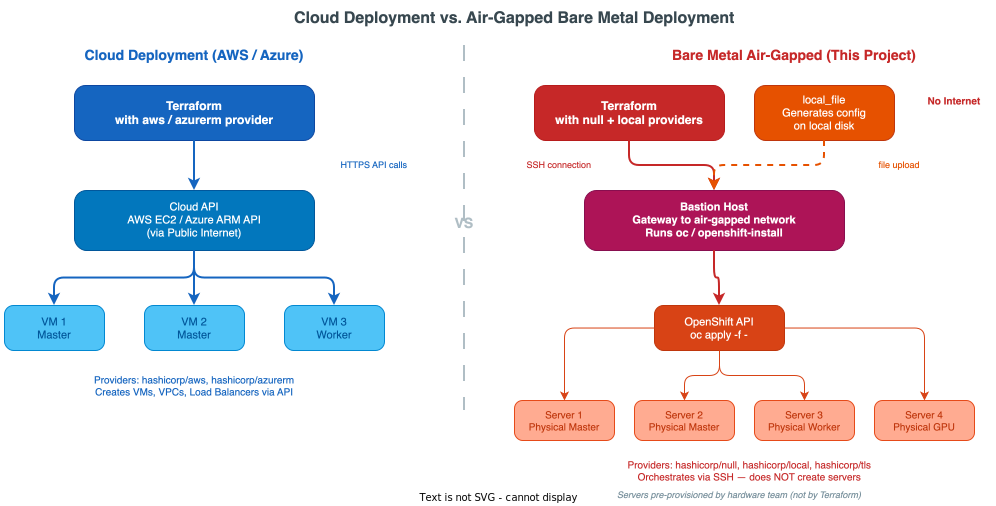
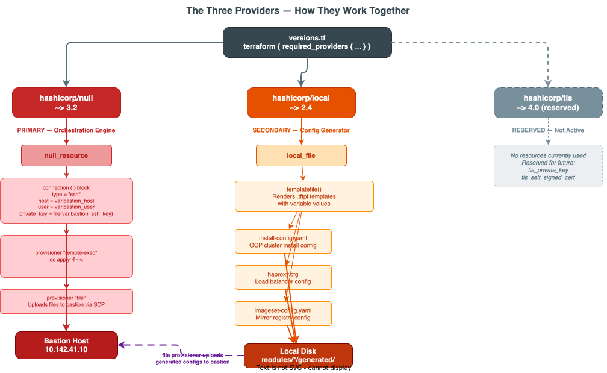
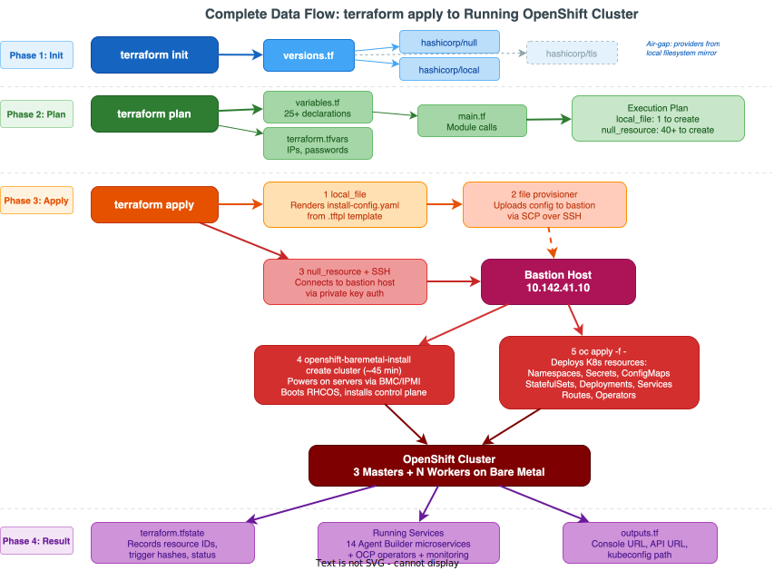
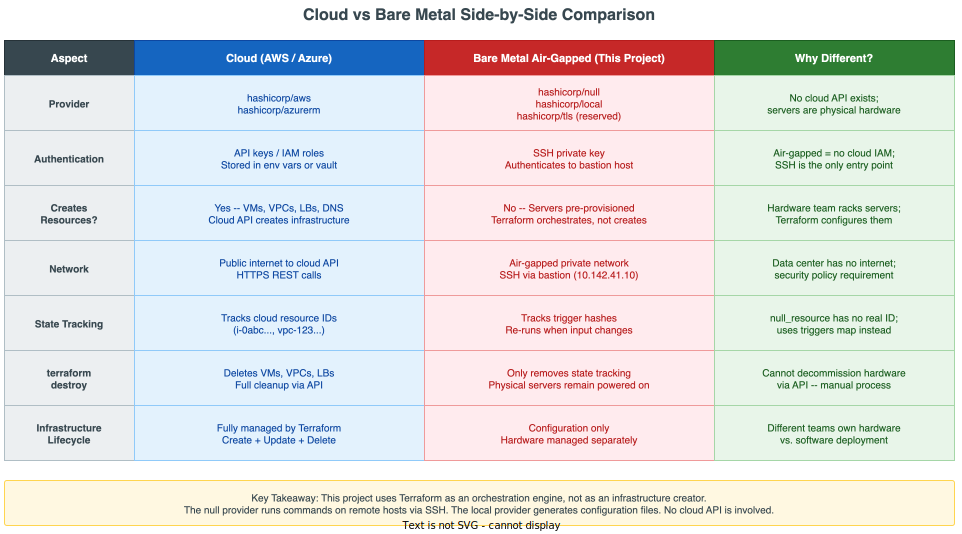
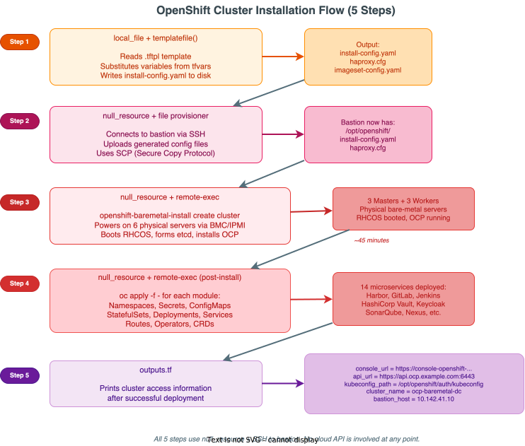

# Why No AWS/Azure Provider? — Understanding the Air-Gapped Bare Metal Pattern

!!! info "File Location"
    This page explains the provider architecture used across **all clusters** in this project — not just Agent Builder.

---

## The Big Question: Where is the Cloud Provider?

If you've used Terraform before for AWS, Azure, or GCP, you're used to seeing providers like:

```hcl
# ❌ NOT USED IN THIS PROJECT
provider "aws" {
  region = "us-east-1"
}

provider "azurerm" {
  features {}
}

provider "google" {
  project = "my-project"
  region  = "us-central1"
}
```

**This project has NONE of those.** Instead, every single `versions.tf` across all 12 cluster configurations declares only three providers:

```hcl
required_providers {
  null = {
    source  = "hashicorp/null"
    version = "~> 3.2"
  }
  local = {
    source  = "hashicorp/local"
    version = "~> 2.8"
  }
  tls = {
    source  = "hashicorp/tls"
    version = "~> 4.2"
  }
}
```

This is **by design** — and understanding **why** is critical to understanding the entire codebase.

---

## The Architecture: Cloud vs. Bare Metal



[:material-download: Download draw.io source](../../../diagrams/code/16-cloud-vs-baremetal-providers.drawio){ .md-button .md-button--primary }

### Cloud Deployment (How Most People Use Terraform)

In a **cloud deployment**, Terraform talks directly to a cloud API:

```
Terraform → AWS API → Creates EC2 instances, VPCs, Load Balancers
Terraform → Azure API → Creates VMs, VNets, App Gateways
```

The cloud provider plugin handles:

- **Authentication** (API keys, service principals)
- **Resource creation** (VMs, networks, storage)
- **State tracking** (knows the ID of every cloud resource)
- **Updates & deletes** (can modify or destroy resources)

### Bare Metal Deployment (How THIS Project Works)

In a **bare metal air-gapped deployment**, there is **no cloud API**:

```
Terraform → SSH → Bastion Host → oc apply / openshift-install → Physical Servers
```

The physical servers are **already provisioned** — someone has racked them, cabled them, configured BIOS/BMC, and connected them to the network. Terraform's job is to **orchestrate the software installation** on top of that hardware.

!!! warning "Air-Gapped = No Internet"
    These clusters run in a **disconnected network** — no access to the public internet. This means:
    
    - No pulling images from Docker Hub or Quay.io
    - No reaching HashiCorp's Terraform registry (providers must be pre-mirrored)
    - No cloud provider APIs to call
    - Everything must go through the **bastion host** — the only machine with access to both the operator's network and the cluster network

---

## The Three Providers — What Each One Does



[:material-download: Download draw.io source](../../../diagrams/code/17-three-providers-architecture.drawio){ .md-button .md-button--primary }

### Provider 1: `hashicorp/null` — The Orchestration Engine

**Registry:** [registry.terraform.io/providers/hashicorp/null](https://registry.terraform.io/providers/hashicorp/null/latest)

This is the **most important provider** in the entire project. It provides the `null_resource` — a resource that doesn't create any real infrastructure but can run **provisioners** (shell commands).

#### How `null_resource` Works

```hcl
resource "null_resource" "example" {
  # Step 1: Define HOW to connect (SSH)
  connection {
    type        = "ssh"
    host        = var.bastion_host        # IP of the bastion server
    user        = var.bastion_user        # SSH username (e.g., "core")
    private_key = file(var.bastion_ssh_key) # Path to SSH private key
  }

  # Step 2: Run commands on the remote server
  provisioner "remote-exec" {
    inline = [
      "export KUBECONFIG=/home/core/ocp/auth/kubeconfig",
      "oc apply -f - <<'EOF'",
      "apiVersion: v1",
      "kind: Namespace",
      "metadata:",
      "  name: my-namespace",
      "EOF",
    ]
  }
}
```

#### Real Example from This Project — Creating a Namespace

From `ipi-method/agent-builder/modules/namespace/main.tf`:

```hcl
resource "null_resource" "namespace" {
  connection {
    type        = "ssh"
    host        = var.bastion_host            # ← SSH to bastion
    user        = var.bastion_user            # ← as this user
    private_key = file(var.bastion_ssh_key)   # ← using this key
  }

  provisioner "remote-exec" {
    inline = [
      "export KUBECONFIG=${var.kubeconfig}",   # ← Tell oc where the cluster auth is

      "cat <<'EOF' | oc apply -f -",           # ← Pipe YAML into oc apply
      "apiVersion: v1",
      "kind: Namespace",
      "metadata:",
      "  name: ${var.namespace}",
      "  labels:",
      "    app.kubernetes.io/part-of: agent-builder",
      "    app.kubernetes.io/managed-by: terraform",
      "  annotations:",
      "    openshift.io/description: \"Kyndryl Agent Builder Factory Platform\"",
      "EOF",

      "echo 'Namespace ${var.namespace} created successfully'",
    ]
  }
}
```

**What happens step by step:**

| Step | What Terraform Does | What the Bastion Does |
|------|--------------------|-----------------------|
| 1 | Opens an SSH connection to the bastion host | Accepts the SSH connection |
| 2 | Sends the `inline` commands over SSH | Receives the commands |
| 3 | — | Runs `export KUBECONFIG=...` to set cluster credentials |
| 4 | — | Pipes the YAML into `oc apply -f -` which talks to the OpenShift API |
| 5 | — | OpenShift API creates the Namespace on the cluster |
| 6 | Marks the resource as "created" in Terraform state | — |

#### Real Example — Creating a PostgreSQL StatefulSet with Secrets

From `ipi-method/agent-builder/modules/postgresql/main.tf`:

```hcl
# Step 1: Create the Kubernetes Secret (contains password)
resource "null_resource" "postgresql_secret" {
  connection {
    type        = "ssh"
    host        = var.bastion_host
    user        = var.bastion_user
    private_key = file(var.bastion_ssh_key)
  }

  provisioner "remote-exec" {
    inline = [
      "export KUBECONFIG=${var.kubeconfig}",

      # oc create secret ... --dry-run=client -o yaml | oc apply -f -
      # This pattern: create the YAML locally, then apply it (idempotent)
      "oc create secret generic agent-builder-postgresql-credentials -n ${var.namespace} \\",
      "  --from-literal=POSTGRES_USER=agentbuilder \\",
      "  --from-literal=POSTGRES_PASSWORD='${var.postgres_password}' \\",
      "  --from-literal=POSTGRES_DB=agentbuilder \\",
      "  --dry-run=client -o yaml | oc apply -f -",
    ]
  }
}

# Step 2: Create the init SQL ConfigMap (depends on secret)
resource "null_resource" "postgresql_init_script" {
  # ...same SSH connection pattern...

  provisioner "remote-exec" {
    inline = [
      "export KUBECONFIG=${var.kubeconfig}",

      "cat <<'CMEOF' | oc apply -f -",
      "apiVersion: v1",
      "kind: ConfigMap",
      "metadata:",
      "  name: agent-builder-postgresql-init",
      "  namespace: ${var.namespace}",
      "data:",
      "  init.sql: |",
      "    CREATE DATABASE temporal_db;",
      "    CREATE DATABASE temporal_visibility_db;",
      "    CREATE DATABASE litellm_db;",
      "    CREATE DATABASE agent_registry_db;",
      "CMEOF",
    ]
  }

  depends_on = [null_resource.postgresql_secret]  # ← Must run AFTER the secret
}

# Step 3: Create the StatefulSet (depends on init script)
resource "null_resource" "postgresql" {
  # ...same SSH connection pattern...
  # ...creates StatefulSet, Service, PVC...

  depends_on = [null_resource.postgresql_init_script]  # ← Must run AFTER init script
}
```

!!! tip "The `depends_on` Chain"
    Notice how each `null_resource` uses `depends_on` to enforce ordering:
    
    **Secret → Init Script → StatefulSet**
    
    Without `depends_on`, Terraform might try to create all three simultaneously — but the StatefulSet needs the Secret to exist first. This is how you build a **dependency chain** without a cloud provider.

#### How It's Used Across the Project

| Cluster | What `null_resource` Does |
|---------|--------------------------|
| **openshiftbaremetal** | Runs `openshift-baremetal-install create cluster` on the bastion |
| **mgmt-dc / mgmt-dr** | Installs ACM (Advanced Cluster Management), deploys operators |
| **agent-builder** | Deploys all 14 microservices (Namespace → PostgreSQL → MongoDB → Redis → Temporal → LiteLLM → API → UI) |
| **openshiftbaremetal-dr** | Sets up DR cluster with identical pattern |
| **haproxy module** | Installs and configures HAProxy load balancer on helper nodes |
| **cluster-logging** | Installs OpenShift Logging operator + ClusterLogging instance |

---

### Provider 2: `hashicorp/local` — The Configuration Generator

**Registry:** [registry.terraform.io/providers/hashicorp/local](https://registry.terraform.io/providers/hashicorp/local/latest)

This provider creates files on the **machine running Terraform** (your laptop or the CI/CD agent). It does NOT create files on the bastion or the cluster.

#### How `local_file` Works

```hcl
resource "local_file" "my_config" {
  filename = "${path.module}/generated/config.yaml"  # ← Local file path
  content  = templatefile("${path.module}/templates/config.yaml.tftpl", {
    cluster_name = var.cluster_name
    api_vip      = var.api_vip
  })
}
```

#### Real Example — Generating `install-config.yaml`

From `ipi-method/openshiftbaremetal/modules/ocp-baremetal/main.tf`:

```hcl
resource "local_file" "install_config" {
  filename = "${path.module}/generated/install-config.yaml"
  content = templatefile("${path.module}/templates/install-config.yaml.tftpl", {
    cluster_name                = var.cluster_name
    base_domain                 = var.base_domain
    machine_network_cidr        = var.machine_network_cidr
    cluster_network_cidr        = var.cluster_network_cidr
    cluster_network_host_prefix = var.cluster_network_host_prefix
    service_network_cidr        = var.service_network_cidr
    api_vip                     = var.api_vip
    ingress_vip                 = var.ingress_vip
    bootstrap_os_image_url      = var.bootstrap_os_image_url
    master_nodes                = var.master_nodes
    worker_nodes                = var.worker_nodes
    dns_servers                 = var.dns_servers
    gateway                     = var.gateway
    pull_secret                 = file(var.pull_secret_file)
    ssh_public_key              = file(var.ssh_public_key_file)
    mirror_registry             = var.mirror_registry
    additional_trust_bundle     = var.additional_trust_bundle_file != "" ? file(var.additional_trust_bundle_file) : ""
  })
}
```

**What happens:**

1. Terraform reads the template file (`install-config.yaml.tftpl`)
2. Replaces all `${variable}` placeholders with actual values from `terraform.tfvars`
3. Writes the rendered YAML to `generated/install-config.yaml` on the local machine
4. A subsequent `null_resource` uploads this file to the bastion via the `file` provisioner

#### Real Example — Generating HAProxy Configuration

From `ipi-method/openshiftbaremetal/modules/haproxy/main.tf`:

```hcl
resource "local_file" "haproxy_config" {
  filename = "${path.module}/generated/haproxy.cfg"
  content = templatefile("${path.module}/templates/haproxy.cfg.tftpl", {
    cluster_domain = local.cluster_domain
    api_vip        = var.api_vip
    ingress_vip    = var.ingress_vip
    master_nodes   = var.master_nodes
    worker_nodes   = var.worker_nodes
  })
}
```

Then the `null_resource` uploads and applies it:

```hcl
resource "null_resource" "deploy_haproxy" {
  for_each = { for idx, h in var.haproxy_hosts : idx => h }

  # Upload the config to each haproxy host
  provisioner "file" {
    source      = local_file.haproxy_config.filename
    destination = "/etc/haproxy/haproxy.cfg"
  }

  # Restart HAProxy to pick up the new config
  provisioner "remote-exec" {
    inline = [
      "systemctl restart haproxy",
    ]
  }
}
```

!!! note "`local_file` + `null_resource` = Generate Locally, Deploy Remotely"
    This is a two-phase pattern:
    
    **Phase 1** (`local_file`): Render the template with variables → write to local disk  
    **Phase 2** (`null_resource` + `file` provisioner): Upload the file to the remote server via SSH

---

### Provider 3: `hashicorp/tls` — Reserved for Future Use

**Registry:** [registry.terraform.io/providers/hashicorp/tls](https://registry.terraform.io/providers/hashicorp/tls/latest)

This provider can generate TLS certificates, private keys, and certificate signing requests. It is **declared but not actively used** in any resource in the current codebase.

```hcl
# What it COULD be used for (not currently used):
resource "tls_private_key" "example" {
  algorithm = "RSA"
  rsa_bits  = 4096
}
```

**Why is it declared?**

- It was likely included during initial scaffolding for potential certificate generation
- It may be needed for future features (e.g., generating TLS certs for internal services)
- Declaring an unused provider has no cost — it just downloads the plugin during `terraform init`

---

## The Complete Data Flow: From `terraform apply` to Running Cluster



[:material-download: Download draw.io source](../../../diagrams/code/18-complete-provider-dataflow.drawio){ .md-button .md-button--primary }

### Phase 1: Initialization (`terraform init`)

```
Your Laptop / CI Agent
    │
    ├── Reads versions.tf
    ├── Downloads hashicorp/null ~> 3.2
    ├── Downloads hashicorp/local ~> 2.8
    └── Downloads hashicorp/tls ~> 4.2
         │
         └── Plugins stored in .terraform/providers/
```

!!! warning "Air-Gapped Mirror Required"
    In an air-gapped environment, you cannot download providers from the internet. You must either:
    
    1. Pre-download plugins and use `filesystem_mirror` in `.terraformrc`
    2. Run a local Terraform registry mirror
    3. Use `terraform providers mirror` to create a local bundle

### Phase 2: Planning (`terraform plan`)

```
Terraform reads:
    ├── variables.tf     → Declares 25+ input variables
    ├── terraform.tfvars → Provides values for all variables
    ├── main.tf          → Defines module calls + locals
    └── Computes execution plan:
         ├── local_file.install_config  → Will CREATE
         ├── null_resource.ocp_install  → Will CREATE
         ├── null_resource.namespace    → Will CREATE
         └── ... (all other resources)
```

### Phase 3: Apply (`terraform apply`)

This is where the three providers do their work:

```
Step 1: local_file provider
    → Renders install-config.yaml from template
    → Writes to modules/ocp-baremetal/generated/install-config.yaml

Step 2: null_resource + file provisioner
    → SSH to bastion_host (10.142.41.10)
    → Uploads install-config.yaml to /home/core/ocp-install/

Step 3: null_resource + remote-exec provisioner
    → SSH to bastion_host
    → Runs: openshift-baremetal-install --dir=/home/core/ocp-install create cluster
    → Waits for cluster installation to complete (~45 minutes)

Step 4: null_resource + remote-exec (post-install modules)
    → SSH to bastion_host
    → Runs: oc apply -f - <<'EOF' ... EOF
    → Creates namespaces, operators, services, deployments
```

### Phase 4: State Storage

```
Terraform stores in terraform.tfstate:
    ├── local_file.install_config → { filename: "...", content_hash: "sha256:..." }
    ├── null_resource.ocp_install → { id: "12345", triggers: { config_hash: "sha256:..." } }
    ├── null_resource.namespace   → { id: "12346" }
    └── ... (IDs for all null_resources)
```

!!! note "State Limitation"
    Because `null_resource` is a pseudo-resource, Terraform state only tracks that the provisioner **ran** — it does NOT know the current state of the Kubernetes resources created by `oc apply`. If someone manually deletes a namespace, Terraform won't detect the drift. You must re-run `terraform apply` to recreate it.

---

## Side-by-Side Comparison: Cloud Provider vs. This Project



[:material-download: Download draw.io source](../../../diagrams/code/19-cloud-vs-baremetal-sidebyside.drawio){ .md-button .md-button--primary }

| Aspect | Cloud (e.g., AWS) | This Project (Bare Metal Air-Gapped) |
|--------|-------------------|--------------------------------------|
| **Provider** | `hashicorp/aws` | `hashicorp/null` + `hashicorp/local` |
| **Authentication** | AWS access keys / IAM roles | SSH private key to bastion host |
| **Resource creation** | API calls to AWS | SSH + `oc apply` / `openshift-install` |
| **Network** | Public internet → AWS API | Private network → bastion → cluster |
| **State tracking** | Full drift detection (Terraform knows every resource ID) | Partial — only knows that provisioners ran |
| **Destroy** | `terraform destroy` deletes all cloud resources | Must manually clean up (or write destroy provisioners) |
| **Infrastructure** | VMs created by Terraform | Physical servers pre-provisioned by hardware team |
| **Image registry** | Pull from public registries | Pull from internal mirror registry |

### Code Comparison

**AWS Pattern:**

```hcl
# AWS: Terraform creates the VM directly
resource "aws_instance" "worker" {
  ami           = "ami-0c55b159cbfafe1f0"
  instance_type = "m5.xlarge"
  subnet_id     = aws_subnet.private.id
  
  tags = {
    Name = "ocp-worker-1"
  }
}
```

**This Project's Pattern:**

```hcl
# Bare Metal: Terraform tells the bastion to deploy software on existing servers
resource "null_resource" "postgresql" {
  connection {
    type        = "ssh"
    host        = var.bastion_host        # Pre-existing bastion server
    user        = var.bastion_user
    private_key = file(var.bastion_ssh_key)
  }

  provisioner "remote-exec" {
    inline = [
      "export KUBECONFIG=${var.kubeconfig}",
      "cat <<'EOF' | oc apply -f -",      # Deploy on existing cluster
      "apiVersion: apps/v1",
      "kind: StatefulSet",
      "metadata:",
      "  name: postgresql",
      "...",
      "EOF",
    ]
  }
}
```

---

## The SSH Connection Pattern — Explained Line by Line

Every module in this project uses the **exact same SSH connection pattern**. Here is what each line means:

```hcl
connection {
  type        = "ssh"                           # ① Connection protocol (always SSH)
  host        = var.bastion_host                # ② IP address of the bastion (e.g., 10.142.41.10)
  user        = var.bastion_user                # ③ SSH username (e.g., "core")
  private_key = file(var.bastion_ssh_key)       # ④ Reads the private key file content
}
```

| Line | What It Does | Example Value |
|------|-------------|---------------|
| `type = "ssh"` | Use SSH protocol (not WinRM or other) | Always `"ssh"` |
| `host = var.bastion_host` | IP or hostname of the remote machine | `"10.142.41.10"` |
| `user = var.bastion_user` | Linux username to SSH as | `"core"` |
| `private_key = file(...)` | Reads the SSH private key from a local file | Contents of `~/.ssh/id_rsa` |

!!! danger "Security: SSH Keys"
    The `bastion_ssh_key` variable is marked as `sensitive = true` in `variables.tf`. This prevents Terraform from printing the key contents in plan output or logs. **Never commit SSH private keys to Git.**

---

## The Heredoc Pattern — How YAML Gets Into the Cluster

The most common pattern across all modules is the **heredoc + oc apply** combo:

```hcl
provisioner "remote-exec" {
  inline = [
    "export KUBECONFIG=${var.kubeconfig}",  # ① Set cluster credentials

    "cat <<'EOF' | oc apply -f -",          # ② Start heredoc, pipe to oc
    "apiVersion: apps/v1",                   # ③ Kubernetes YAML starts here
    "kind: Deployment",
    "metadata:",
    "  name: my-app",
    "  namespace: ${var.namespace}",          # ④ Terraform variable interpolation
    "spec:",
    "  replicas: 1",
    "  selector:",
    "    matchLabels:",
    "      app: my-app",
    "EOF",                                    # ⑤ End of heredoc
  ]
}
```

**Breaking it down:**

| Part | Explanation |
|------|------------|
| `export KUBECONFIG=...` | Tells `oc` which cluster to talk to (path to the kubeconfig file on the bastion) |
| `cat <<'EOF'` | Shell heredoc — everything between `<<'EOF'` and `EOF` is treated as a single text block |
| `\| oc apply -f -` | Pipe the YAML text into `oc apply`, which sends it to the OpenShift API |
| `${var.namespace}` | Terraform replaces this with the actual variable value before sending the command |
| `'EOF'` (quoted) | Single-quoted `'EOF'` prevents the shell from interpreting `$` — only Terraform interpolation works |

---

## The OCP Cluster Installation — The Core Workflow



[:material-download: Download draw.io source](../../../diagrams/code/20-ocp-install-flow.drawio){ .md-button .md-button--primary }

The most critical use of the `null` + `local` provider combination is in the `ocp-baremetal` module, which installs the actual OpenShift cluster:

### Step 1: Generate `install-config.yaml` (local provider)

```hcl
resource "local_file" "install_config" {
  filename = "${path.module}/generated/install-config.yaml"
  content = templatefile("${path.module}/templates/install-config.yaml.tftpl", {
    cluster_name           = var.cluster_name       # e.g., "ocp-ai"
    base_domain            = var.base_domain         # e.g., "kyndryl.local"
    api_vip                = var.api_vip             # e.g., "10.142.41.100"
    ingress_vip            = var.ingress_vip         # e.g., "10.142.41.101"
    master_nodes           = var.master_nodes        # List of 3 master node configs
    worker_nodes           = var.worker_nodes        # List of worker node configs
    pull_secret            = file(var.pull_secret_file)
    ssh_public_key         = file(var.ssh_public_key_file)
    mirror_registry        = var.mirror_registry     # Internal registry for air-gap
    additional_trust_bundle = var.additional_trust_bundle_file != "" ? file(var.additional_trust_bundle_file) : ""
  })
}
```

### Step 2: Upload and Run Installer (null provider)

```hcl
resource "null_resource" "ocp_install" {
  triggers = {
    install_config_hash = sha256(local_file.install_config.content)
  }

  connection {
    type        = "ssh"
    host        = var.bastion_host
    user        = var.bastion_user
    private_key = file(var.bastion_ssh_key)
  }

  # Create install directory on bastion
  provisioner "remote-exec" {
    inline = ["mkdir -p ${local.install_dir}"]
  }

  # Upload the generated install-config.yaml
  provisioner "file" {
    source      = local_file.install_config.filename
    destination = "${local.install_dir}/install-config.yaml"
  }

  # Run the OpenShift bare metal installer
  provisioner "remote-exec" {
    inline = [
      "cd ${local.install_dir}",
      "cp install-config.yaml install-config.yaml.bak",
      "openshift-baremetal-install --dir=${local.install_dir} --log-level=info create cluster",
    ]
  }
}
```

**What `openshift-baremetal-install` does:**

1. Reads the `install-config.yaml`
2. Generates Ignition configs for bootstrap, master, and worker nodes
3. Powers on the physical servers via BMC/IPMI (using the `bmc_address` from config)
4. Boots them with RHCOS (Red Hat CoreOS)
5. Installs the OpenShift control plane on the 3 master nodes
6. Joins the worker nodes to the cluster
7. Waits for all cluster operators to be ready (~45 minutes)

!!! tip "The `triggers` Block"
    ```hcl
    triggers = {
      install_config_hash = sha256(local_file.install_config.content)
    }
    ```
    This means: if the `install-config.yaml` content changes (you modify a variable), Terraform will **re-run the installer**. Without triggers, `null_resource` only runs once.

---

## Summary: Why This Architecture Makes Sense

| Challenge | Solution |
|-----------|----------|
| No cloud API available | Use `null_resource` + SSH to orchestrate |
| No internet access | Mirror providers and container images locally |
| Complex multi-step installs | Chain `null_resource` with `depends_on` |
| Need templated config files | Use `local_file` + `templatefile()` |
| Need idempotent deploys | Use `oc apply` (not `oc create`) and `--dry-run=client -o yaml \| oc apply` pattern |
| Need to track what was deployed | Terraform state records which provisioners ran |
| Multiple identical clusters | Reuse the same modules with different `terraform.tfvars` |

!!! success "Key Takeaway"
    **Terraform is NOT creating the infrastructure** (physical servers, network switches, storage). It is **orchestrating the software deployment** on top of pre-existing bare metal infrastructure. The `null` provider is the glue that turns Terraform into a powerful SSH-based orchestration engine — similar to Ansible, but with Terraform's state management and dependency graph.
