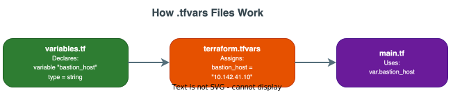

# terraform.tfvars — Line-by-Line Walkthrough

!!! info "File Location"
    `ipi-method/agent-builder/terraform.tfvars`

This file provides **actual values** for the variables declared in `variables.tf`. It is the **only file you need to edit** when deploying to a new environment.

---

## How `.tfvars` Files Work



[:material-download: Download draw.io source](../../../diagrams/code/15-tfvars-flow.drawio){ .md-button .md-button--primary }

**Rules:**

1. Terraform **automatically** loads a file named `terraform.tfvars` (you don't need to specify it)
2. You can also use `-var-file=custom.tfvars` to load additional files
3. Variables in `.tfvars` must match names declared in `variables.tf`
4. The syntax is simple: `variable_name = value`

---

## Complete Source Code with Annotations

### Section 1: Bastion / Cluster Connection

```hcl linenums="1"
# Author: Sathishkumar Munirathinam
# Agent Builder Factory — terraform.tfvars
# Customize values below for your environment

# ==============================================================================
# Bastion / Cluster Connection
# ==============================================================================

bastion_host                 = "10.142.41.10"
bastion_user                 = "kni"
bastion_ssh_private_key_file = "~/.ssh/id_ed25519"
cluster_name                 = "ocp-ai"
base_domain                  = "example.com"
```

| Line | Variable | Value | Explanation |
|---|---|---|---|
| 9 | `bastion_host` | `"10.142.41.10"` | The IP address of the bastion host. This machine has `oc` CLI and can reach the OpenShift API |
| 10 | `bastion_user` | `"kni"` | SSH username. `kni` is the default user created by the OpenShift bare metal installer |
| 11 | `bastion_ssh_private_key_file` | `"~/.ssh/id_ed25519"` | Path to the SSH private key on the machine running Terraform. `~` = home directory |
| 12 | `cluster_name` | `"ocp-ai"` | Name of the OpenShift cluster. Used to find the kubeconfig at `/home/kni/ocp/ocp-ai/auth/kubeconfig` |
| 13 | `base_domain` | `"example.com"` | DNS domain. Routes become `*.apps.ocp-ai.example.com` |

!!! warning "Replace These Values!"
    These are **example values**. Before deploying, replace:
    
    - `10.142.41.10` → Your bastion's actual IP
    - `ocp-ai` → Your cluster name
    - `example.com` → Your actual DNS domain

---

### Section 2: Agent Builder Platform

```hcl linenums="18"
agent_builder_namespace  = "agent-builder"
agent_builder_subdomain  = "agent-builder"
container_registry       = "quay-host:8443/agent-builder"
image_tag                = "latest"
storage_class            = "ocs-storagecluster-ceph-rbd"
```

| Line | Variable | Value | What It Controls |
|---|---|---|---|
| 18 | `agent_builder_namespace` | `"agent-builder"` | Kubernetes namespace where all services deploy |
| 19 | `agent_builder_subdomain` | `"agent-builder"` | URL prefix → `ui.agent-builder.apps.ocp-ai.example.com` |
| 20 | `container_registry` | `"quay-host:8443/agent-builder"` | Where container images are pulled from. In air-gapped mode, this is a local Quay mirror |
| 21 | `image_tag` | `"latest"` | Container image tag. For production use a pinned version like `"v1.0.0"` |
| 22 | `storage_class` | `"ocs-storagecluster-ceph-rbd"` | Ceph block storage from ODF. Used for all PVCs (PostgreSQL, MongoDB, Redis, Ollama) |

!!! tip "How `container_registry` and `image_tag` combine"
    In `main.tf`, these are combined to form full image references:
    ```hcl
    container_image = "${local.registry}/agent-builder-api:${var.image_tag}"
    # Result: "quay-host:8443/agent-builder/agent-builder-api:latest"
    ```

---

### Section 3: Database Passwords

```hcl linenums="27"
postgres_password     = "REPLACE_POSTGRES_PASSWORD"
postgres_storage_size = "50Gi"

mongodb_root_password = "REPLACE_MONGODB_PASSWORD"
mongodb_storage_size  = "50Gi"

redis_password     = "REPLACE_REDIS_PASSWORD"
redis_storage_size = "10Gi"
```

| Variable | Value | Notes |
|---|---|---|
| `postgres_password` | `"REPLACE_POSTGRES_PASSWORD"` | **Must be replaced** with a strong password. This is marked `sensitive` in `variables.tf` |
| `postgres_storage_size` | `"50Gi"` | 50 GiB for PostgreSQL (holds Temporal, LiteLLM, and Agent Registry databases) |
| `mongodb_root_password` | `"REPLACE_MONGODB_PASSWORD"` | **Must be replaced**. MongoDB holds agent metadata |
| `mongodb_storage_size` | `"50Gi"` | 50 GiB for MongoDB |
| `redis_password` | `"REPLACE_REDIS_PASSWORD"` | **Must be replaced**. Redis is used for LiteLLM response caching |
| `redis_storage_size` | `"10Gi"` | 10 GiB is enough — Redis is a cache, not permanent storage |

!!! danger "Security: Never commit real passwords!"
    The `REPLACE_*` values are placeholders. In production:
    
    1. Use environment variables: `export TF_VAR_postgres_password="actual-password"`
    2. Or use a separate `.tfvars` file that is **not committed to git**
    3. Or use a secrets manager (Vault, Azure Key Vault)

---

### Section 4: LiteLLM Gateway

```hcl linenums="40"
litellm_master_key    = "REPLACE_LITELLM_MASTER_KEY"

# Cloud LLM Provider keys (optional — leave empty if using Ollama/local only)
anthropic_api_key     = ""
azure_openai_endpoint = ""
azure_openai_key      = ""
openai_api_key        = ""
```

| Variable | Default | When to Fill In |
|---|---|---|
| `litellm_master_key` | `"REPLACE_LITELLM_MASTER_KEY"` | **Always** — this is the API key to access LiteLLM |
| `anthropic_api_key` | `""` (empty) | Only if using Claude models |
| `azure_openai_endpoint` | `""` (empty) | Only if using Azure OpenAI |
| `azure_openai_key` | `""` (empty) | Only if using Azure OpenAI |
| `openai_api_key` | `""` (empty) | Only if using OpenAI directly |

!!! info "Empty strings = disabled"
    Leaving a key as `""` doesn't cause errors. The LiteLLM config includes all providers, but requests to unconfigured providers simply fail with a clear error message.

---

### Section 5: Ollama (Local LLM)

```hcl linenums="52"
enable_ollama        = true
ollama_model         = "llama3"
ollama_storage_size  = "100Gi"
ollama_gpu_enabled   = false
ollama_gpu_limit     = 1
ollama_memory_limit  = "16Gi"
ollama_cpu_limit     = "8"
```

| Variable | Value | Explanation |
|---|---|---|
| `enable_ollama` | `true` | Deploy Ollama in the cluster. Set `false` to skip |
| `ollama_model` | `"llama3"` | Model to auto-download. Options: `llama3`, `llama3:70b`, `mistral`, `codellama` |
| `ollama_storage_size` | `"100Gi"` | Large PVC because model weights are multi-GB (Llama3 8B ≈ 4.7GB, 70B ≈ 40GB) |
| `ollama_gpu_enabled` | `false` | Set `true` if NVIDIA GPUs are available and GPU Operator is installed |
| `ollama_gpu_limit` | `1` | Number of GPUs. Only used if `ollama_gpu_enabled = true` |
| `ollama_memory_limit` | `"16Gi"` | CPU-mode needs at least 8Gi for Llama3 8B. 16Gi gives headroom |
| `ollama_cpu_limit` | `"8"` | 8 CPU cores for inference. Increase for larger models |

---

### Section 6: Laptop LLM (External)

```hcl linenums="65"
enable_local_llm_laptop = false
local_llm_laptop_url    = ""        # e.g., "http://192.168.1.100:11434"
```

!!! example "When to use this"
    During development, you might run Ollama on your laptop (faster iteration). Set:
    ```hcl
    enable_local_llm_laptop = true
    local_llm_laptop_url    = "http://192.168.1.100:11434"
    ```
    This creates additional model entries in LiteLLM named `laptop-llama3`, `laptop-codellama`, `laptop-mistral`.

---

### Section 7: Temporal, Auth, GitHub

```hcl linenums="73"
temporal_workers_replicas = 2

oidc_authority = ""
oidc_client_id = ""

github_token = ""
```

| Variable | Value | When to Configure |
|---|---|---|
| `temporal_workers_replicas` | `2` | Scale up for production (e.g., 4–8 for heavy workflow loads) |
| `oidc_authority` | `""` | OIDC issuer URL (e.g., `https://your-org.okta.com/oauth2/default`) |
| `oidc_client_id` | `""` | OIDC client ID for Agent Builder authentication |
| `github_token` | `""` | GitHub PAT for agent code repository operations |

---

## How to Create `terraform.tfvars` From Scratch

1. **Copy every variable from `variables.tf`** that you want to override
2. **Only include variables whose defaults you want to change** — variables with acceptable defaults can be omitted
3. **Use the exact variable name** (case-sensitive)
4. **Syntax for different types:**

    ```hcl
    # String
    cluster_name = "ocp-ai"
    
    # Number
    temporal_workers_replicas = 4
    
    # Boolean
    enable_ollama = true
    
    # List
    allowed_cidrs = ["10.0.0.0/8", "172.16.0.0/12"]
    
    # Map
    tags = {
      environment = "production"
      team        = "platform"
    }
    ```

5. **Never commit passwords** — use `TF_VAR_` environment variables for secrets:
    ```bash
    export TF_VAR_postgres_password="my-secure-password"
    export TF_VAR_mongodb_root_password="another-password"
    export TF_VAR_redis_password="redis-password"
    export TF_VAR_litellm_master_key="sk-litellm-key"
    ```
