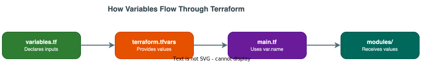

# variables.tf — Line-by-Line Walkthrough

!!! info "File Location"
    `ipi-method/agent-builder/variables.tf`

This file declares **every input** the deployment accepts. Think of variables as the "knobs and dials" that control what gets deployed and how. No actual infrastructure is created here — this file only defines *what questions to ask*.

---

## How Variables Work in Terraform



[:material-download: Download draw.io source](../../../diagrams/code/14-variable-flow.drawio){ .md-button .md-button--primary }

**Three places a variable can get its value (in priority order):**

1. **Command line:** `terraform apply -var="cluster_name=ocp-ai"` (highest priority)
2. **terraform.tfvars file:** `cluster_name = "ocp-ai"`
3. **default value:** `default = "ocp-ai"` (in variables.tf — lowest priority)

If none of these provide a value and no default exists, Terraform will **prompt you interactively**.

---

## Variable Declaration Syntax

Every variable follows this pattern:

```hcl
variable "variable_name" {
  description = "Human-readable explanation"    # Required by convention
  type        = string                           # Data type constraint
  default     = "fallback_value"                # Optional default
  sensitive   = true                             # Optional: hide from logs
}
```

| Attribute | Required? | Purpose |
|---|---|---|
| `description` | No (but always use it) | Documents what this variable is for |
| `type` | No (but always use it) | Constrains the data type: `string`, `number`, `bool`, `list`, `map` |
| `default` | No | Fallback value if none provided. If omitted, the variable is **required** |
| `sensitive` | No | If `true`, value is hidden in `terraform plan` and `terraform apply` output |

---

## Section 1: Bastion / Cluster Connection Variables

These variables establish the SSH connection to the bastion host, which is the gateway to the OpenShift cluster.

### `bastion_host`

```hcl
variable "bastion_host" {
  description = "IP address or hostname of the bastion node with oc/kubectl access"
  type        = string
}
```

| Line | Explanation |
|---|---|
| `variable "bastion_host"` | Declares a variable named `bastion_host`. Referenced later as `var.bastion_host` |
| `description = "..."` | Tells users what value to provide |
| `type = string` | Must be a text value (e.g., `"10.142.41.10"`) |
| *(no default)* | This variable is **required** — Terraform will error if no value is given |

!!! question "Why no default?"
    The bastion IP changes per environment. Providing a default would be dangerous — someone might accidentally deploy to the wrong bastion.

### `bastion_user`

```hcl
variable "bastion_user" {
  description = "SSH user for bastion connection"
  type        = string
  default     = "kni"
}
```

| Line | Explanation |
|---|---|
| `default = "kni"` | If no value is provided, uses `"kni"`. This is the standard OpenShift bare metal installer user |

### `bastion_ssh_private_key_file`

```hcl
variable "bastion_ssh_private_key_file" {
  description = "Path to SSH private key for bastion connection"
  type        = string
  default     = "~/.ssh/id_ed25519"
}
```

| Line | Explanation |
|---|---|
| `default = "~/.ssh/id_ed25519"` | Standard location for Ed25519 SSH keys. The `~` expands to the current user's home directory |

!!! tip "How this is used"
    In modules, this value is read using `file(var.bastion_ssh_key)` — Terraform reads the file contents and passes them as the SSH private key to the `connection` block.

### `cluster_name`

```hcl
variable "cluster_name" {
  description = "OpenShift cluster name"
  type        = string
}
```

Used to construct:

- The kubeconfig path: `/home/kni/ocp/${cluster_name}/auth/kubeconfig`
- The route domain: `*.apps.${cluster_name}.${base_domain}`

### `base_domain`

```hcl
variable "base_domain" {
  description = "Base DNS domain for the cluster"
  type        = string
}
```

Combined with `cluster_name` to form the full cluster domain. Example: if `cluster_name = "ocp-ai"` and `base_domain = "example.com"`, then routes are `*.apps.ocp-ai.example.com`.

---

## Section 2: Agent Builder Platform Variables

These control the Agent Builder namespace, container registry, and image versioning.

### `agent_builder_namespace`

```hcl
variable "agent_builder_namespace" {
  description = "Kubernetes namespace for the Agent Builder platform"
  type        = string
  default     = "agent-builder"
}
```

All 14 microservices are deployed into this single namespace.

### `agent_builder_subdomain`

```hcl
variable "agent_builder_subdomain" {
  description = "Subdomain prefix for Agent Builder routes (e.g., 'agent-builder' creates agent-builder.apps.cluster.domain)"
  type        = string
  default     = "agent-builder"
}
```

Used in `locals` to construct the route domain:
```hcl
domain = "${var.agent_builder_subdomain}.apps.${var.cluster_name}.${var.base_domain}"
# Result: "agent-builder.apps.ocp-ai.example.com"
```

### `container_registry`

```hcl
variable "container_registry" {
  description = "Container registry URL for Agent Builder images (e.g., quay-host:8443/agent-builder)"
  type        = string
}
```

No default — this is environment-specific. In air-gapped environments, this points to a local Quay mirror.

### `image_tag`

```hcl
variable "image_tag" {
  description = "Container image tag for all Agent Builder services"
  type        = string
  default     = "latest"
}
```

All services use the same tag. For production, override with a specific version like `"v1.2.3"`.

### `storage_class`

```hcl
variable "storage_class" {
  description = "Kubernetes StorageClass for persistent volumes (e.g., ocs-storagecluster-ceph-rbd)"
  type        = string
  default     = "ocs-storagecluster-ceph-rbd"
}
```

!!! info "What is a StorageClass?"
    A Kubernetes StorageClass defines *how* persistent storage is provisioned. `ocs-storagecluster-ceph-rbd` is the default class when using OpenShift Data Foundation (ODF) with Ceph block storage.

---

## Section 3: Database Variables

### PostgreSQL

```hcl
variable "postgres_password" {
  description = "PostgreSQL admin password"
  type        = string
  sensitive   = true
}

variable "postgres_storage_size" {
  description = "PostgreSQL PVC storage size"
  type        = string
  default     = "50Gi"
}
```

| Variable | Type | Default | Sensitive | Why |
|---|---|---|---|---|
| `postgres_password` | string | *(none — required)* | **Yes** | Password must never appear in logs |
| `postgres_storage_size` | string | `"50Gi"` | No | 50 GiB is sufficient for Temporal + LiteLLM databases |

!!! warning "Sensitive Variables"
    When `sensitive = true`:
    
    - The value is hidden in `terraform plan` output (shows `(sensitive value)`)
    - The value is hidden in `terraform apply` output
    - The value is still stored in the state file — **always encrypt your state file**

### MongoDB

```hcl
variable "mongodb_root_password" {
  description = "MongoDB root password"
  type        = string
  sensitive   = true
}

variable "mongodb_storage_size" {
  description = "MongoDB PVC storage size"
  type        = string
  default     = "50Gi"
}
```

Same pattern as PostgreSQL. MongoDB stores agent metadata (agent definitions, conversation history).

### Redis

```hcl
variable "redis_password" {
  description = "Redis authentication password"
  type        = string
  sensitive   = true
}

variable "redis_storage_size" {
  description = "Redis PVC storage size"
  type        = string
  default     = "10Gi"
}
```

Redis storage is smaller (10Gi) because it's used as a cache, not persistent storage.

---

## Section 4: LiteLLM Gateway Variables

LiteLLM is a multi-model LLM proxy that abstracts away differences between cloud LLM providers.

```hcl
variable "litellm_master_key" {
  description = "LiteLLM master API key for gateway access"
  type        = string
  sensitive   = true
}
```

This key protects the LiteLLM API. All API requests must include it as a Bearer token.

### Cloud Provider Keys (Optional)

```hcl
variable "anthropic_api_key" {
  description = "Anthropic API key for Claude models (optional if using local LLM only)"
  type        = string
  sensitive   = true
  default     = ""
}

variable "azure_openai_endpoint" {
  description = "Azure OpenAI endpoint URL (optional)"
  type        = string
  default     = ""
}

variable "azure_openai_key" {
  description = "Azure OpenAI API key (optional)"
  type        = string
  sensitive   = true
  default     = ""
}

variable "openai_api_key" {
  description = "OpenAI API key (optional)"
  type        = string
  sensitive   = true
  default     = ""
}
```

!!! tip "Design Pattern: Optional Variables with Empty Defaults"
    All cloud API keys default to `""` (empty string). This means:
    
    - If you only want local LLM (Ollama), leave these empty
    - If you want cloud LLMs, fill in the keys in `terraform.tfvars`
    - The LiteLLM config file includes all providers, but calls fail gracefully for unconfigured ones

---

## Section 5: Ollama (Local LLM) Variables

```hcl
variable "enable_ollama" {
  description = "Deploy Ollama for local LLM inference (Llama3) on the OpenShift cluster"
  type        = bool
  default     = true
}
```

| Line | Explanation |
|---|---|
| `type = bool` | Boolean: `true` or `false` only |
| `default = true` | Ollama is enabled by default |

**How this controls deployment in `main.tf`:**
```hcl
module "ollama" {
  count = var.enable_ollama ? 1 : 0    # count=1 → deploy, count=0 → skip
}
```

### Ollama Model Selection

```hcl
variable "ollama_model" {
  description = "Ollama model to pull and serve (e.g., llama3, llama3:70b, mistral, codellama)"
  type        = string
  default     = "llama3"
}
```

This value is used in the Ollama init script to auto-pull the model on startup.

### GPU Configuration

```hcl
variable "ollama_gpu_enabled" {
  description = "Enable GPU allocation for Ollama (requires NVIDIA GPU Operator)"
  type        = bool
  default     = false
}

variable "ollama_gpu_limit" {
  description = "Number of NVIDIA GPUs to allocate to Ollama"
  type        = number
  default     = 1
}

variable "ollama_memory_limit" {
  description = "Memory limit for Ollama container"
  type        = string
  default     = "16Gi"
}

variable "ollama_cpu_limit" {
  description = "CPU limit for Ollama container"
  type        = string
  default     = "8"
}
```

!!! info "GPU vs CPU Mode"
    - `ollama_gpu_enabled = false` → Ollama runs on CPU only (slower, but works everywhere)
    - `ollama_gpu_enabled = true` → Ollama gets NVIDIA GPU resources (requires GPU Operator installed)

---

## Section 6: Laptop LLM Variables

```hcl
variable "enable_local_llm_laptop" {
  description = "Enable connecting to a local LLM running on a laptop (Ollama endpoint reachable from cluster)"
  type        = bool
  default     = false
}

variable "local_llm_laptop_url" {
  description = "URL of the Ollama instance running on a laptop (e.g., http://192.168.1.100:11434)"
  type        = string
  default     = ""
}
```

This is a development/testing feature: connect LiteLLM to an Ollama instance running on your laptop. The laptop must be network-reachable from the OpenShift cluster.

---

## Section 7: Temporal, Auth, and GitHub Variables

```hcl
variable "temporal_workers_replicas" {
  description = "Number of Temporal Worker replicas"
  type        = number
  default     = 2
}

variable "oidc_authority" {
  description = "OIDC authority URL (e.g., Okta issuer URL)"
  type        = string
  default     = ""
}

variable "oidc_client_id" {
  description = "OIDC client ID for authentication"
  type        = string
  default     = ""
}

variable "github_token" {
  description = "GitHub personal access token for agent repository operations"
  type        = string
  sensitive   = true
  default     = ""
}
```

---

## How to Write `variables.tf` From Scratch

1. **List every configurable value** your deployment needs
2. **Group them logically** with section comments (`# ==== Section ====`)
3. **For each variable, decide:**

    | Question | If Yes | If No |
    |---|---|---|
    | Does it change per environment? | No `default` (required) | Add `default` |
    | Is it a password/key/secret? | `sensitive = true` | Omit `sensitive` |
    | Is it on/off? | `type = bool` | Use `string`, `number`, etc. |

4. **Always add `description`** — future you (and your team) will thank you
5. **Use consistent naming:** `service_property` (e.g., `postgres_password`, `redis_storage_size`)
