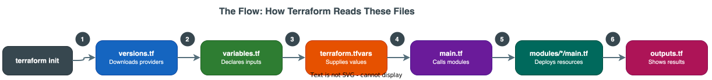

# Terraform Code Walkthrough — Learning Guide

!!! abstract "Who is this for?"
    This guide is written for **novice readers** who want to understand how the Terraform code in this project is structured, why each line exists, and how to re-create it from scratch. By the end, you will be able to write your own Terraform modules for deploying applications on OpenShift.

---

## How This Project is Structured

Every Terraform deployment in this project follows the **same 5-file pattern**:

```
deployment-folder/
├── versions.tf          # 1. Which Terraform providers are needed
├── variables.tf         # 2. What inputs the deployment accepts
├── terraform.tfvars     # 3. Actual values for those inputs
├── main.tf              # 4. The orchestration logic (calls modules)
├── outputs.tf           # 5. What values to display after deployment
└── modules/             # 6. Reusable building blocks (one per service)
    ├── namespace/
    │   └── main.tf
    ├── postgresql/
    │   └── main.tf
    └── ...
```

### The Flow: How Terraform Reads These Files



[:material-download: Download draw.io source](../diagrams/code/12-terraform-flow.drawio){ .md-button .md-button--primary }

1. **`terraform init`** reads `versions.tf` to download required providers
2. **`terraform plan`** loads `variables.tf` (input declarations) + `terraform.tfvars` (values)
3. **`main.tf`** uses those values to call child modules in `modules/`
4. Each module deploys Kubernetes resources via SSH → `oc apply`
5. **`outputs.tf`** prints URLs and endpoints after deployment

---

## Terraform Concepts You Need to Know

### What is a Provider?

A **provider** is a plugin that Terraform downloads to interact with a specific API or system. In this project, we use:

| Provider | Source | Purpose |
|---|---|---|
| `null` | `hashicorp/null` | Runs shell commands via SSH (no cloud API) |
| `local` | `hashicorp/local` | Reads/writes local files |
| `tls` | `hashicorp/tls` | Generates TLS certificates |

!!! tip "Why `null` provider?"
    This project deploys to **air-gapped bare metal** — there is no cloud API. Instead, Terraform SSHs into a bastion host and runs `oc` (OpenShift CLI) commands. The `null_resource` + `remote-exec` provisioner is the mechanism that makes this work.

### What is a Variable?

A **variable** is a named input that your Terraform code accepts. Think of it as a function parameter:

```hcl
variable "cluster_name" {
  description = "OpenShift cluster name"    # Human-readable help text
  type        = string                       # Data type: string, number, bool, list, map
  default     = "ocp-ai"                    # Optional fallback value
  sensitive   = true                         # Hides value from logs (for passwords)
}
```

### What is a Local?

A **local** is a computed value that you define once and reuse many times:

```hcl
locals {
  kubeconfig = "/home/${var.bastion_user}/ocp/${var.cluster_name}/auth/kubeconfig"
  # This avoids repeating the full path in every module call
}
```

### What is a Module?

A **module** is a reusable folder of Terraform code. The root `main.tf` calls modules like functions:

```hcl
module "postgresql" {
  source = "./modules/postgresql"         # Path to the module folder
  
  # Pass variables to the module (like function arguments)
  namespace         = local.ab_namespace
  postgres_password = var.postgres_password
  
  # Control execution order
  depends_on = [module.namespace]
}
```

### What is `depends_on`?

`depends_on` forces Terraform to deploy resources in order. Without it, Terraform would try to deploy everything in parallel:

```hcl
# PostgreSQL MUST exist before Temporal (Temporal needs a database)
module "temporal" {
  depends_on = [module.postgresql]
}
```

### What is `count` (Conditional Deployment)?

`count` lets you deploy a module only if a condition is true:

```hcl
module "ollama" {
  count = var.enable_ollama ? 1 : 0    # Deploy if enable_ollama = true, skip if false
}
```

---

## The Deployment Pattern: SSH + `oc apply`

Every module in this project follows the same pattern:

```hcl
resource "null_resource" "something" {
  # 1. SSH into the bastion host
  connection {
    type        = "ssh"
    host        = var.bastion_host
    user        = var.bastion_user
    private_key = file(var.bastion_ssh_key)
  }

  # 2. Run commands remotely
  provisioner "remote-exec" {
    inline = [
      # 3. Set the kubeconfig for oc/kubectl
      "export KUBECONFIG=${var.kubeconfig}",
      
      # 4. Apply Kubernetes YAML using heredoc
      "cat <<'EOF' | oc apply -f -",
      "apiVersion: v1",
      "kind: Namespace",
      "metadata:",
      "  name: ${var.namespace}",
      "EOF",
    ]
  }
}
```

**Why this pattern?**

- The OpenShift cluster is in an **air-gapped network** (no internet)
- Terraform cannot directly reach the cluster API
- The **bastion host** is the only machine that can access both the internet (for Terraform) and the cluster
- So Terraform SSHs into the bastion and runs `oc` commands from there

---

## How to Re-Create This Project From Scratch

### Step 1: Create `versions.tf`

This is always the first file you create. It tells Terraform what version to use and which plugins to download.

### Step 2: Create `variables.tf`

Define every configurable value your deployment needs. Start with connection variables (bastion host, SSH key), then add service-specific variables.

### Step 3: Create `terraform.tfvars`

Fill in the actual values for your environment. This is the only file that changes between environments.

### Step 4: Create modules

For each service you want to deploy, create a folder under `modules/` with a `main.tf` that:

1. Declares its own variables
2. Creates Kubernetes resources via SSH + `oc apply`
3. Exports outputs for other modules to reference

### Step 5: Create `main.tf`

Write the root orchestration file that:

1. Defines `locals` for computed values
2. Calls each module in dependency order
3. Passes variables from root → modules

### Step 6: Create `outputs.tf`

Define what URLs and values should be displayed after `terraform apply`.

---

!!! success "Next Steps"
    Continue to the detailed walkthrough pages for each file:
    
    - [versions.tf Walkthrough](ipi-method/agent-builder/versions-walkthrough.md) — Provider configuration
    - [variables.tf Walkthrough](ipi-method/agent-builder/variables-walkthrough.md) — Input declarations
    - [terraform.tfvars Walkthrough](ipi-method/agent-builder/tfvars-walkthrough.md) — Value assignment
    - [main.tf Walkthrough](ipi-method/agent-builder/main-walkthrough.md) — Root orchestration
    - [outputs.tf Walkthrough](ipi-method/agent-builder/outputs-walkthrough.md) — Output definitions
    - [Modules Deep Dive](ipi-method/agent-builder/modules-walkthrough.md) — All 14 modules explained
