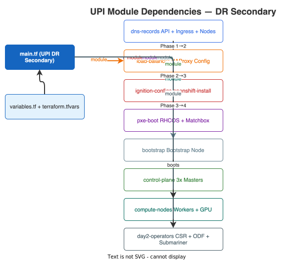
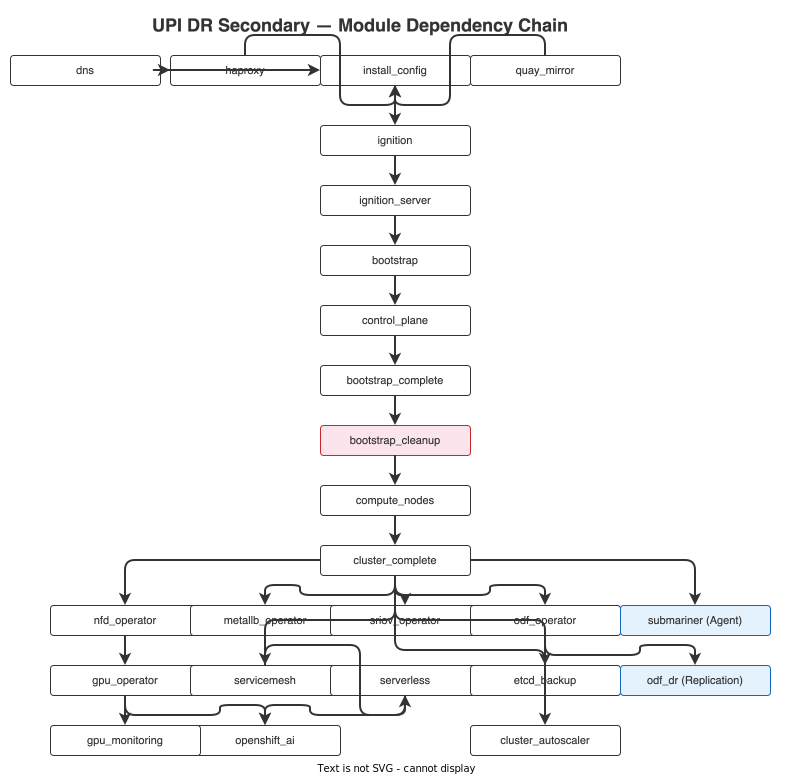

# UPI DR Secondary — main.tf

Main orchestration file for the UPI DR Secondary workload cluster (`upi-method/openshiftbaremetal-dr/`).
Deploys OCP 4.15 on bare metal using **UPI** at the DR site with OpenShift AI, GPU, ODF, Submariner **agent**, and ODF DR replication.

!!! info "Key Differences from DC Primary"
    - **Submariner role**: Agent (connects to DC Primary broker via `broker_api_url`, `broker_token`, `broker_ca`)
    - **ODF DR**: Enables Ceph RBD mirroring to the DC Primary cluster
    - **CIDRs**: Non-overlapping with DC — `10.132.0.0/14` (pod), `172.31.0.0/16` (service)
    - **Modules**: References `../openshiftbaremetal/modules/` (shared with DC Primary)

## Module Dependencies

{: .drawio-diagram }

???+ note "Draw.io Source: UPI DR Module Dependencies"
    [:material-download: Download .drawio file](../../../diagrams/code/04-upi-dr-module-deps.drawio){ .md-button } — Open in [draw.io](https://app.diagrams.net) for interactive editing.

## Module Dependency Chain

{: .drawio-diagram }

???+ note "Draw.io Source: Upi Dr Dep Chain"
    [:material-download: Download .drawio file](../../../diagrams/code/11-upi-dr-dep-chain.drawio){ .md-button } — Open in [draw.io](https://app.diagrams.net) for interactive editing.

## Source Code

```hcl
# =============================================================================
# OpenShift Baremetal UPI DR Secondary — Main Orchestration
# Shares UPI modules with DC Primary (../openshiftbaremetal/modules/)
# =============================================================================

locals {
  cluster_domain            = "${var.cluster_name}.${var.base_domain}"
  kubeconfig                = "${var.install_dir}/auth/kubeconfig"
  gpu_workers               = [for w in var.worker_nodes : w if w.gpu_worker]
  odf_workers               = [for w in var.worker_nodes : w if w.odf_worker]
  effective_mirror_registry = var.enable_quay_mirror ? "${var.quay_host}:${var.quay_port}/${var.quay_organization}" : var.mirror_registry
  effective_trust_bundle    = var.enable_quay_mirror ? var.quay_ca_cert_file : var.additional_trust_bundle_file
}

# --- DNS Records ---
module "dns" {
  source = "../openshiftbaremetal/modules/dns"

  cluster_name    = var.cluster_name
  base_domain     = var.base_domain
  api_vip         = var.api_vip
  ingress_vip     = var.ingress_vip
  master_nodes    = var.master_nodes
  worker_nodes    = var.worker_nodes
  bastion_host    = var.bastion_host
  bastion_user    = var.bastion_user
  bastion_ssh_key = var.bastion_ssh_private_key_file
  dns_servers     = var.dns_servers
}

# --- External Load Balancer (HAProxy — required for UPI) ---
module "haproxy" {
  source = "../openshiftbaremetal/modules/haproxy"

  cluster_name   = var.cluster_name
  base_domain    = var.base_domain
  api_vip        = var.api_vip
  ingress_vip    = var.ingress_vip
  master_nodes   = var.master_nodes
  worker_nodes   = var.worker_nodes
  bootstrap_ip   = var.bootstrap_ip
  haproxy_hosts  = var.haproxy_hosts

  depends_on = [module.dns]
}

# --- Local Quay Mirror Registry (Disconnected Install) ---
module "quay_mirror" {
  source = "../openshiftbaremetal/modules/quay-mirror"
  count  = var.enable_quay_mirror ? 1 : 0

  bastion_host        = var.bastion_host
  bastion_user        = var.bastion_user
  bastion_ssh_key     = var.bastion_ssh_private_key_file
  quay_host           = var.quay_host
  quay_port           = var.quay_port
  quay_admin_user     = var.quay_admin_user
  quay_admin_password = var.quay_admin_password
  quay_ca_cert_file   = var.quay_ca_cert_file
  quay_organization   = var.quay_organization
  ocp_version         = var.ocp_version
  ocp_channel         = var.ocp_channel
  pull_secret_file    = var.pull_secret_file
  mirror_operators    = var.mirror_operators
}

# --- Generate install-config.yaml (platform: none) ---
module "install_config" {
  source = "../openshiftbaremetal/modules/install-config"

  cluster_name                 = var.cluster_name
  base_domain                  = var.base_domain
  ocp_version                  = var.ocp_version
  machine_network_cidr         = var.machine_network_cidr
  cluster_network_cidr         = var.cluster_network_cidr
  cluster_network_host_prefix  = var.cluster_network_host_prefix
  service_network_cidr         = var.service_network_cidr
  dns_servers                  = var.dns_servers
  pull_secret_file             = var.pull_secret_file
  ssh_public_key_file          = var.ssh_public_key_file
  install_dir                  = var.install_dir
  bastion_host                 = var.bastion_host
  bastion_user                 = var.bastion_user
  bastion_ssh_key              = var.bastion_ssh_private_key_file
  mirror_registry              = local.effective_mirror_registry
  additional_trust_bundle_file = local.effective_trust_bundle
  master_replicas              = length(var.master_nodes)
  worker_replicas              = length(var.worker_nodes)

  depends_on = [module.dns, module.haproxy, module.quay_mirror]
}

# --- Generate Ignition Configs ---
module "ignition" {
  source = "../openshiftbaremetal/modules/ignition"

  install_dir     = var.install_dir
  ocp_version     = var.ocp_version
  bastion_host    = var.bastion_host
  bastion_user    = var.bastion_user
  bastion_ssh_key = var.bastion_ssh_private_key_file

  depends_on = [module.install_config]
}

# --- Serve Ignition Configs via HTTP ---
module "ignition_server" {
  source = "../openshiftbaremetal/modules/ignition-server"

  install_dir     = var.install_dir
  bastion_host    = var.bastion_host
  bastion_user    = var.bastion_user
  bastion_ssh_key = var.bastion_ssh_private_key_file
  http_port       = var.ignition_http_port

  depends_on = [module.ignition]
}

# --- Boot Bootstrap Node ---
module "bootstrap" {
  source = "../openshiftbaremetal/modules/bootstrap"

  bootstrap_ip     = var.bootstrap_ip
  bootstrap_mac    = var.bootstrap_mac
  rhcos_iso_url    = var.rhcos_iso_url
  rhcos_rootfs_url = var.rhcos_rootfs_url
  ignition_url     = "http://${var.bastion_host}:${var.ignition_http_port}/bootstrap.ign"
  install_disk     = var.install_disk
  bastion_host     = var.bastion_host
  bastion_user     = var.bastion_user
  bastion_ssh_key  = var.bastion_ssh_private_key_file
  boot_method      = var.boot_method

  depends_on = [module.ignition_server]
}

# --- Boot Control Plane Nodes ---
module "control_plane" {
  source = "../openshiftbaremetal/modules/control-plane"

  master_nodes     = var.master_nodes
  rhcos_iso_url    = var.rhcos_iso_url
  rhcos_rootfs_url = var.rhcos_rootfs_url
  ignition_url     = "http://${var.bastion_host}:${var.ignition_http_port}/master.ign"
  install_disk     = var.install_disk
  bastion_host     = var.bastion_host
  bastion_user     = var.bastion_user
  bastion_ssh_key  = var.bastion_ssh_private_key_file
  boot_method      = var.boot_method

  depends_on = [module.bootstrap]
}

# --- Wait for Bootstrap Complete ---
module "bootstrap_complete" {
  source = "../openshiftbaremetal/modules/bootstrap-complete"

  install_dir     = var.install_dir
  ocp_version     = var.ocp_version
  bastion_host    = var.bastion_host
  bastion_user    = var.bastion_user
  bastion_ssh_key = var.bastion_ssh_private_key_file

  depends_on = [module.control_plane]
}

# --- Remove Bootstrap Node (no longer needed after control plane is self-hosted) ---
module "bootstrap_cleanup" {
  source = "../openshiftbaremetal/modules/bootstrap-cleanup"

  bootstrap_ip    = var.bootstrap_ip
  bastion_host    = var.bastion_host
  bastion_user    = var.bastion_user
  bastion_ssh_key = var.bastion_ssh_private_key_file
  boot_method     = var.boot_method

  depends_on = [module.bootstrap_complete]
}

# --- Boot Worker / Compute Nodes ---
module "compute_nodes" {
  source = "../openshiftbaremetal/modules/compute-nodes"

  worker_nodes     = var.worker_nodes
  rhcos_iso_url    = var.rhcos_iso_url
  rhcos_rootfs_url = var.rhcos_rootfs_url
  ignition_url     = "http://${var.bastion_host}:${var.ignition_http_port}/worker.ign"
  install_disk     = var.install_disk
  bastion_host     = var.bastion_host
  bastion_user     = var.bastion_user
  bastion_ssh_key  = var.bastion_ssh_private_key_file
  boot_method      = var.boot_method

  depends_on = [module.bootstrap_cleanup]
}

# --- Approve CSRs & Wait for Install Complete ---
module "cluster_complete" {
  source = "../openshiftbaremetal/modules/cluster-complete"

  install_dir     = var.install_dir
  ocp_version     = var.ocp_version
  kubeconfig      = local.kubeconfig
  worker_count    = length(var.worker_nodes)
  bastion_host    = var.bastion_host
  bastion_user    = var.bastion_user
  bastion_ssh_key = var.bastion_ssh_private_key_file

  depends_on = [module.compute_nodes]
}

# --- Day-2 Operators (same as DC Primary) ---
module "nfd_operator" {
  source = "../openshiftbaremetal/modules/nfd-operator"

  kubeconfig      = local.kubeconfig
  bastion_host    = var.bastion_host
  bastion_user    = var.bastion_user
  bastion_ssh_key = var.bastion_ssh_private_key_file

  depends_on = [module.cluster_complete]
}

module "gpu_operator" {
  source = "../openshiftbaremetal/modules/gpu-operator"
  count  = length(local.gpu_workers) > 0 ? 1 : 0

  kubeconfig           = local.kubeconfig
  bastion_host         = var.bastion_host
  bastion_user         = var.bastion_user
  bastion_ssh_key      = var.bastion_ssh_private_key_file
  ngc_api_key          = var.ngc_api_key
  nls_token_file       = var.nls_token_file
  vgpu_driver_version  = var.vgpu_driver_version
  vgpu_driver_image    = var.vgpu_driver_image
  rdma_enabled         = var.gpu_rdma_enabled
  entitlement_pem_file = var.entitlement_pem_file

  depends_on = [module.nfd_operator]
}

module "metallb_operator" {
  source = "../openshiftbaremetal/modules/metallb-operator"
  count  = var.enable_metallb ? 1 : 0

  kubeconfig                = local.kubeconfig
  bastion_host              = var.bastion_host
  bastion_user              = var.bastion_user
  bastion_ssh_key           = var.bastion_ssh_private_key_file
  metallb_address_pools     = var.metallb_address_pools
  metallb_l2_advertisements = var.metallb_l2_advertisements

  depends_on = [module.cluster_complete]
}

module "sriov_operator" {
  source = "../openshiftbaremetal/modules/sriov-operator"
  count  = var.enable_sriov ? 1 : 0

  kubeconfig            = local.kubeconfig
  bastion_host          = var.bastion_host
  bastion_user          = var.bastion_user
  bastion_ssh_key       = var.bastion_ssh_private_key_file
  sriov_network_devices = var.sriov_network_devices
  sriov_networks        = var.sriov_networks

  depends_on = [module.cluster_complete]
}

module "odf_operator" {
  source = "../openshiftbaremetal/modules/odf-operator"
  count  = var.enable_odf ? 1 : 0

  kubeconfig       = local.kubeconfig
  bastion_host     = var.bastion_host
  bastion_user     = var.bastion_user
  bastion_ssh_key  = var.bastion_ssh_private_key_file
  odf_channel      = var.odf_channel
  storage_capacity = var.odf_storage_capacity
  odf_worker_nodes = local.odf_workers

  depends_on = [module.cluster_complete]
}

module "servicemesh" {
  source = "../openshiftbaremetal/modules/servicemesh"
  count  = var.enable_servicemesh ? 1 : 0

  kubeconfig      = local.kubeconfig
  bastion_host    = var.bastion_host
  bastion_user    = var.bastion_user
  bastion_ssh_key = var.bastion_ssh_private_key_file

  depends_on = [module.cluster_complete]
}

module "serverless" {
  source = "../openshiftbaremetal/modules/serverless"
  count  = var.enable_serverless ? 1 : 0

  kubeconfig      = local.kubeconfig
  bastion_host    = var.bastion_host
  bastion_user    = var.bastion_user
  bastion_ssh_key = var.bastion_ssh_private_key_file

  depends_on = [module.cluster_complete]
}

module "openshift_ai" {
  source = "../openshiftbaremetal/modules/openshift-ai"
  count  = var.enable_openshift_ai ? 1 : 0

  kubeconfig      = local.kubeconfig
  bastion_host    = var.bastion_host
  bastion_user    = var.bastion_user
  bastion_ssh_key = var.bastion_ssh_private_key_file
  oai_components  = var.oai_components
  enable_nim      = var.enable_nim
  ngc_api_key     = var.ngc_api_key

  depends_on = [
    module.gpu_operator,
    module.odf_operator,
    module.servicemesh,
    module.serverless,
  ]
}

module "gpu_monitoring" {
  source = "../openshiftbaremetal/modules/gpu-monitoring"
  count  = var.enable_gpu_monitoring && length(local.gpu_workers) > 0 ? 1 : 0

  kubeconfig      = local.kubeconfig
  bastion_host    = var.bastion_host
  bastion_user    = var.bastion_user
  bastion_ssh_key = var.bastion_ssh_private_key_file

  depends_on = [module.gpu_operator]
}

module "cluster_autoscaler" {
  source = "../openshiftbaremetal/modules/cluster-autoscaler"
  count  = var.enable_cluster_autoscaler ? 1 : 0

  kubeconfig      = local.kubeconfig
  bastion_host    = var.bastion_host
  bastion_user    = var.bastion_user
  bastion_ssh_key = var.bastion_ssh_private_key_file
  max_nodes       = var.autoscaler_max_nodes
  max_gpus        = var.autoscaler_max_gpus

  depends_on = [module.cluster_complete]
}

module "etcd_backup" {
  source = "../openshiftbaremetal/modules/etcd-backup"
  count  = var.enable_etcd_backup ? 1 : 0

  kubeconfig      = local.kubeconfig
  bastion_host    = var.bastion_host
  bastion_user    = var.bastion_user
  bastion_ssh_key = var.bastion_ssh_private_key_file
  backup_schedule = var.etcd_backup_schedule

  depends_on = [module.cluster_complete]
}

# --- Submariner (Agent role — connects back to DC Primary broker) ---
module "submariner" {
  source = "../openshiftbaremetal/modules/submariner"
  count  = var.enable_submariner ? 1 : 0

  kubeconfig          = local.kubeconfig
  bastion_host        = var.bastion_host
  bastion_user        = var.bastion_user
  bastion_ssh_key     = var.bastion_ssh_private_key_file
  cluster_role        = "agent"
  broker_api_url      = var.submariner_broker_api_url
  broker_token        = var.submariner_broker_token
  broker_ca           = var.submariner_broker_ca
  cable_driver        = var.submariner_cable_driver
  gateway_count       = var.submariner_gateway_count
  cluster_cidr        = var.cluster_network_cidr
  service_cidr        = var.service_network_cidr
  cluster_id          = "${var.cluster_name}-dr"
  globalnet_enabled   = var.submariner_globalnet_enabled
  gateway_node_labels = var.submariner_gateway_node_labels

  depends_on = [module.cluster_complete]
}

# --- ODF Disaster Recovery Replication (DC ↔ DR) ---
module "odf_dr" {
  source = "../openshiftbaremetal/modules/odf-dr"
  count  = var.enable_odf_dr && var.enable_odf ? 1 : 0

  kubeconfig           = local.kubeconfig
  bastion_host         = var.bastion_host
  bastion_user         = var.bastion_user
  bastion_ssh_key      = var.bastion_ssh_private_key_file
  dr_mode              = var.odf_dr_mode
  replication_schedule = var.odf_dr_replication_schedule
  peer_cluster_name    = var.odf_dr_peer_cluster_name
  s3_endpoint          = var.odf_dr_s3_endpoint
  s3_bucket            = var.odf_dr_s3_bucket
  s3_access_key        = var.odf_dr_s3_access_key
  s3_secret_key        = var.odf_dr_s3_secret_key

  depends_on = [module.odf_operator, module.submariner]
}

# --- Cluster Logging (ClusterLogging + ClusterLogForwarder with S3) ---
module "cluster_logging" {
  source = "../openshiftbaremetal/modules/cluster-logging"
  count  = var.enable_cluster_logging ? 1 : 0

  kubeconfig      = local.kubeconfig
  bastion_host    = var.bastion_host
  bastion_user    = var.bastion_user
  bastion_ssh_key = var.bastion_ssh_private_key_file

  logging_channel           = var.logging_channel
  log_store_type            = var.log_store_type
  log_retention_application = var.log_retention_application
  log_retention_infra       = var.log_retention_infra
  log_retention_audit       = var.log_retention_audit
  elasticsearch_node_count  = var.elasticsearch_node_count
  log_storage_class         = var.log_storage_class
  log_storage_size          = var.log_storage_size
  elasticsearch_memory      = var.elasticsearch_memory

  enable_log_forwarding_s3 = var.enable_log_forwarding_s3
  log_s3_endpoint          = var.log_s3_endpoint
  log_s3_bucket            = var.log_s3_bucket
  log_s3_region            = var.log_s3_region
  log_s3_access_key        = var.log_s3_access_key
  log_s3_secret_key        = var.log_s3_secret_key

  depends_on = [module.odf_operator]
}

# --- OADP — Backup & Restore (Velero + S3 BSL) ---
module "oadp" {
  source = "../openshiftbaremetal/modules/oadp"
  count  = var.enable_oadp ? 1 : 0

  kubeconfig      = local.kubeconfig
  bastion_host    = var.bastion_host
  bastion_user    = var.bastion_user
  bastion_ssh_key = var.bastion_ssh_private_key_file

  oadp_channel              = var.oadp_channel
  oadp_dpa_name             = var.oadp_dpa_name
  oadp_s3_endpoint          = var.oadp_s3_endpoint
  oadp_s3_bucket            = var.oadp_s3_bucket
  oadp_s3_prefix            = var.oadp_s3_prefix
  oadp_s3_region            = var.oadp_s3_region
  oadp_s3_access_key        = var.oadp_s3_access_key
  oadp_s3_secret_key        = var.oadp_s3_secret_key
  oadp_s3_insecure_skip_tls = var.oadp_s3_insecure_skip_tls

  enable_backup_schedule      = var.enable_backup_schedule
  backup_schedule_name        = var.backup_schedule_name
  backup_schedule_cron        = var.backup_schedule_cron
  backup_included_namespaces  = var.backup_included_namespaces
  backup_ttl                  = var.backup_ttl
  backup_volumes_fs           = var.backup_volumes_fs
  backup_csi_snapshot_timeout = var.backup_csi_snapshot_timeout

  depends_on = [module.odf_operator]
}

# --- LDAP / OAuth Identity Provider ---
module "ldap_oauth" {
  source = "../openshiftbaremetal/modules/ldap-oauth"
  count  = var.enable_ldap ? 1 : 0

  kubeconfig      = local.kubeconfig
  bastion_host    = var.bastion_host
  bastion_user    = var.bastion_user
  bastion_ssh_key = var.bastion_ssh_private_key_file

  ldap_provider_name           = var.ldap_provider_name
  ldap_url                     = var.ldap_url
  ldap_bind_dn                 = var.ldap_bind_dn
  ldap_bind_password           = var.ldap_bind_password
  ldap_ca_cert_file            = var.ldap_ca_cert_file
  ldap_insecure                = var.ldap_insecure
  ldap_attr_id                 = var.ldap_attr_id
  ldap_attr_email              = var.ldap_attr_email
  ldap_attr_name               = var.ldap_attr_name
  ldap_attr_preferred_username = var.ldap_attr_preferred_username

  enable_ldap_group_sync     = var.enable_ldap_group_sync
  ldap_user_base_dn          = var.ldap_user_base_dn
  ldap_group_base_dn         = var.ldap_group_base_dn
  ldap_group_filter          = var.ldap_group_filter
  ldap_group_membership_attr = var.ldap_group_membership_attr
  ldap_group_sync_schedule   = var.ldap_group_sync_schedule

  ldap_group_role_bindings = var.ldap_group_role_bindings
  disable_kubeadmin        = var.disable_kubeadmin

  depends_on = [module.oadp]
}

# --- OpenShift GitOps (Argo CD) ---
module "openshift_gitops" {
  source = "../openshiftbaremetal/modules/openshift-gitops"
  count  = var.enable_openshift_gitops ? 1 : 0

  kubeconfig      = local.kubeconfig
  bastion_host    = var.bastion_host
  bastion_user    = var.bastion_user
  bastion_ssh_key = var.bastion_ssh_private_key_file

  gitops_channel               = var.gitops_channel
  argocd_ha_enabled            = var.argocd_ha_enabled
  argocd_server_autoscale      = var.argocd_server_autoscale
  argocd_server_cpu_request    = var.argocd_server_cpu_request
  argocd_server_memory_request = var.argocd_server_memory_request
  argocd_server_cpu_limit      = var.argocd_server_cpu_limit
  argocd_server_memory_limit   = var.argocd_server_memory_limit
  argocd_controller_cpu_request    = var.argocd_controller_cpu_request
  argocd_controller_memory_request = var.argocd_controller_memory_request
  argocd_controller_cpu_limit      = var.argocd_controller_cpu_limit
  argocd_controller_memory_limit   = var.argocd_controller_memory_limit
  argocd_cluster_admin         = var.argocd_cluster_admin
  argocd_rbac_default_policy   = var.argocd_rbac_default_policy
  argocd_rbac_policy           = var.argocd_rbac_policy
  argocd_managed_namespaces    = var.argocd_managed_namespaces
  argocd_repo_url              = var.argocd_repo_url
  argocd_repo_token            = var.argocd_repo_token
  argocd_repo_insecure         = var.argocd_repo_insecure

  depends_on = [module.ldap_oauth]
}

# --- OpenShift Pipelines (Tekton) ---
module "openshift_pipelines" {
  source = "../openshiftbaremetal/modules/openshift-pipelines"
  count  = var.enable_openshift_pipelines ? 1 : 0

  kubeconfig      = local.kubeconfig
  bastion_host    = var.bastion_host
  bastion_user    = var.bastion_user
  bastion_ssh_key = var.bastion_ssh_private_key_file

  pipelines_channel              = var.pipelines_channel
  tekton_profile                 = var.tekton_profile
  tekton_api_fields              = var.tekton_api_fields
  enable_cluster_tasks           = var.enable_tekton_cluster_tasks
  enable_pipeline_templates      = var.enable_pipeline_templates
  enable_community_cluster_tasks = var.enable_community_cluster_tasks
  enable_pipelines_as_code       = var.enable_pipelines_as_code
  pipeline_default_timeout       = var.pipeline_default_timeout
  pipeline_default_sa            = var.pipeline_default_sa
  pipeline_namespaces            = var.pipeline_namespaces
  enable_pipeline_resource_limits    = var.enable_pipeline_resource_limits
  pipeline_container_cpu_request     = var.pipeline_container_cpu_request
  pipeline_container_memory_request  = var.pipeline_container_memory_request
  pipeline_container_cpu_limit       = var.pipeline_container_cpu_limit
  pipeline_container_memory_limit    = var.pipeline_container_memory_limit
  pac_webhook_secret             = var.pac_webhook_secret
  pac_webhook_shared_secret      = var.pac_webhook_shared_secret

  depends_on = [module.openshift_gitops]
}

# ============================================================================
# Day 2 — New Modules
# ============================================================================

# --- Security & Compliance ---
module "compliance_operator" {
  source       = "../openshiftbaremetal/modules/compliance-operator"
  count        = var.enable_compliance_operator ? 1 : 0
  kubeconfig   = local.kubeconfig
  bastion_host = var.bastion_host
  bastion_user = var.bastion_user
  bastion_ssh_key = var.bastion_ssh_private_key_file
}

module "file_integrity_operator" {
  source       = "../openshiftbaremetal/modules/file-integrity-operator"
  count        = var.enable_file_integrity_operator ? 1 : 0
  kubeconfig   = local.kubeconfig
  bastion_host = var.bastion_host
  bastion_user = var.bastion_user
  bastion_ssh_key = var.bastion_ssh_private_key_file
}

module "cert_manager" {
  source       = "../openshiftbaremetal/modules/cert-manager"
  count        = var.enable_cert_manager ? 1 : 0
  kubeconfig   = local.kubeconfig
  bastion_host = var.bastion_host
  bastion_user = var.bastion_user
  bastion_ssh_key = var.bastion_ssh_private_key_file
}

module "gatekeeper" {
  source       = "../openshiftbaremetal/modules/gatekeeper"
  count        = var.enable_gatekeeper ? 1 : 0
  kubeconfig   = local.kubeconfig
  bastion_host = var.bastion_host
  bastion_user = var.bastion_user
  bastion_ssh_key = var.bastion_ssh_private_key_file
}

module "network_policies" {
  source       = "../openshiftbaremetal/modules/network-policies"
  count        = var.enable_network_policies ? 1 : 0
  kubeconfig   = local.kubeconfig
  bastion_host = var.bastion_host
  bastion_user = var.bastion_user
  bastion_ssh_key = var.bastion_ssh_private_key_file
}

# --- Networking ---
module "nmstate_operator" {
  source       = "../openshiftbaremetal/modules/nmstate-operator"
  count        = var.enable_nmstate_operator ? 1 : 0
  kubeconfig   = local.kubeconfig
  bastion_host = var.bastion_host
  bastion_user = var.bastion_user
  bastion_ssh_key = var.bastion_ssh_private_key_file
}

module "external_dns" {
  source       = "../openshiftbaremetal/modules/external-dns"
  count        = var.enable_external_dns ? 1 : 0
  kubeconfig   = local.kubeconfig
  bastion_host = var.bastion_host
  bastion_user = var.bastion_user
  bastion_ssh_key = var.bastion_ssh_private_key_file
}

module "ingress_controller" {
  source       = "../openshiftbaremetal/modules/ingress-controller"
  count        = var.enable_ingress_controller ? 1 : 0
  kubeconfig   = local.kubeconfig
  bastion_host = var.bastion_host
  bastion_user = var.bastion_user
  bastion_ssh_key = var.bastion_ssh_private_key_file
}

module "multus_networks" {
  source       = "../openshiftbaremetal/modules/multus-networks"
  count        = var.enable_multus_networks ? 1 : 0
  kubeconfig   = local.kubeconfig
  bastion_host = var.bastion_host
  bastion_user = var.bastion_user
  bastion_ssh_key = var.bastion_ssh_private_key_file
}

module "network_observability" {
  source       = "../openshiftbaremetal/modules/network-observability"
  count        = var.enable_network_observability ? 1 : 0
  kubeconfig   = local.kubeconfig
  bastion_host = var.bastion_host
  bastion_user = var.bastion_user
  bastion_ssh_key = var.bastion_ssh_private_key_file
}

# --- Monitoring & Observability ---
module "alertmanager_config" {
  source       = "../openshiftbaremetal/modules/alertmanager-config"
  count        = var.enable_alertmanager_config ? 1 : 0
  kubeconfig   = local.kubeconfig
  bastion_host = var.bastion_host
  bastion_user = var.bastion_user
  bastion_ssh_key = var.bastion_ssh_private_key_file
}

module "custom_grafana_dashboards" {
  source       = "../openshiftbaremetal/modules/custom-grafana-dashboards"
  count        = var.enable_custom_grafana ? 1 : 0
  kubeconfig   = local.kubeconfig
  bastion_host = var.bastion_host
  bastion_user = var.bastion_user
  bastion_ssh_key = var.bastion_ssh_private_key_file
}

module "opentelemetry_collector" {
  source       = "../openshiftbaremetal/modules/opentelemetry-collector"
  count        = var.enable_opentelemetry ? 1 : 0
  kubeconfig   = local.kubeconfig
  bastion_host = var.bastion_host
  bastion_user = var.bastion_user
  bastion_ssh_key = var.bastion_ssh_private_key_file
}

module "loki_logging" {
  source       = "../openshiftbaremetal/modules/loki-logging"
  count        = var.enable_loki_logging ? 1 : 0
  kubeconfig   = local.kubeconfig
  bastion_host = var.bastion_host
  bastion_user = var.bastion_user
  bastion_ssh_key = var.bastion_ssh_private_key_file
}

module "thanos_ruler" {
  source       = "../openshiftbaremetal/modules/thanos-ruler"
  count        = var.enable_thanos_ruler ? 1 : 0
  kubeconfig   = local.kubeconfig
  bastion_host = var.bastion_host
  bastion_user = var.bastion_user
  bastion_ssh_key = var.bastion_ssh_private_key_file
  thanos_s3_endpoint   = ""
  thanos_s3_access_key = ""
  thanos_s3_secret_key = ""
}

# --- Cluster Operations ---
module "node_tuning_profiles" {
  source       = "../openshiftbaremetal/modules/node-tuning-profiles"
  count        = var.enable_node_tuning ? 1 : 0
  kubeconfig   = local.kubeconfig
  bastion_host = var.bastion_host
  bastion_user = var.bastion_user
  bastion_ssh_key = var.bastion_ssh_private_key_file
}

module "image_registry" {
  source       = "../openshiftbaremetal/modules/image-registry"
  count        = var.enable_image_registry ? 1 : 0
  kubeconfig   = local.kubeconfig
  bastion_host = var.bastion_host
  bastion_user = var.bastion_user
  bastion_ssh_key = var.bastion_ssh_private_key_file
}

module "custom_catalogsource" {
  source       = "../openshiftbaremetal/modules/custom-catalogsource"
  count        = var.enable_custom_catalogsource ? 1 : 0
  kubeconfig   = local.kubeconfig
  bastion_host = var.bastion_host
  bastion_user = var.bastion_user
  bastion_ssh_key = var.bastion_ssh_private_key_file
}

module "machine_config_pools" {
  source       = "../openshiftbaremetal/modules/machine-config-pools"
  count        = var.enable_machine_config_pools ? 1 : 0
  kubeconfig   = local.kubeconfig
  bastion_host = var.bastion_host
  bastion_user = var.bastion_user
  bastion_ssh_key = var.bastion_ssh_private_key_file
}

module "node_maintenance" {
  source       = "../openshiftbaremetal/modules/node-maintenance"
  count        = var.enable_node_maintenance ? 1 : 0
  kubeconfig   = local.kubeconfig
  bastion_host = var.bastion_host
  bastion_user = var.bastion_user
  bastion_ssh_key = var.bastion_ssh_private_key_file
}

module "cost_management" {
  source       = "../openshiftbaremetal/modules/cost-management"
  count        = var.enable_cost_management ? 1 : 0
  kubeconfig   = local.kubeconfig
  bastion_host = var.bastion_host
  bastion_user = var.bastion_user
  bastion_ssh_key = var.bastion_ssh_private_key_file
}

# --- Developer Experience ---
module "devspaces" {
  source       = "../openshiftbaremetal/modules/devspaces"
  count        = var.enable_devspaces ? 1 : 0
  kubeconfig   = local.kubeconfig
  bastion_host = var.bastion_host
  bastion_user = var.bastion_user
  bastion_ssh_key = var.bastion_ssh_private_key_file
}

module "web_terminal" {
  source       = "../openshiftbaremetal/modules/web-terminal"
  count        = var.enable_web_terminal ? 1 : 0
  kubeconfig   = local.kubeconfig
  bastion_host = var.bastion_host
  bastion_user = var.bastion_user
  bastion_ssh_key = var.bastion_ssh_private_key_file
}

module "image_streams" {
  source       = "../openshiftbaremetal/modules/image-streams"
  count        = var.enable_image_streams ? 1 : 0
  kubeconfig   = local.kubeconfig
  bastion_host = var.bastion_host
  bastion_user = var.bastion_user
  bastion_ssh_key = var.bastion_ssh_private_key_file
}

# --- AI/ML ---
module "kuberay_operator" {
  source       = "../openshiftbaremetal/modules/kuberay-operator"
  count        = var.enable_kuberay ? 1 : 0
  kubeconfig   = local.kubeconfig
  bastion_host = var.bastion_host
  bastion_user = var.bastion_user
  bastion_ssh_key = var.bastion_ssh_private_key_file
}

module "training_operator" {
  source       = "../openshiftbaremetal/modules/training-operator"
  count        = var.enable_training_operator ? 1 : 0
  kubeconfig   = local.kubeconfig
  bastion_host = var.bastion_host
  bastion_user = var.bastion_user
  bastion_ssh_key = var.bastion_ssh_private_key_file
}

module "model_registry" {
  source       = "../openshiftbaremetal/modules/model-registry"
  count        = var.enable_model_registry ? 1 : 0
  kubeconfig   = local.kubeconfig
  bastion_host = var.bastion_host
  bastion_user = var.bastion_user
  bastion_ssh_key = var.bastion_ssh_private_key_file
}

module "nvidia_nim" {
  source       = "../openshiftbaremetal/modules/nvidia-nim"
  count        = var.enable_nvidia_nim ? 1 : 0
  kubeconfig   = local.kubeconfig
  bastion_host = var.bastion_host
  bastion_user = var.bastion_user
  bastion_ssh_key = var.bastion_ssh_private_key_file
  ngc_api_key  = ""
}

module "mig_manager" {
  source       = "../openshiftbaremetal/modules/mig-manager"
  count        = var.enable_mig_manager ? 1 : 0
  kubeconfig   = local.kubeconfig
  bastion_host = var.bastion_host
  bastion_user = var.bastion_user
  bastion_ssh_key = var.bastion_ssh_private_key_file
}

# --- Multi-Cluster / DR ---
module "global_load_balancer" {
  source       = "../openshiftbaremetal/modules/global-load-balancer"
  count        = var.enable_global_load_balancer ? 1 : 0
  kubeconfig   = local.kubeconfig
  bastion_host = var.bastion_host
  bastion_user = var.bastion_user
  bastion_ssh_key = var.bastion_ssh_private_key_file
  gslb_domain              = ""
  gslb_primary_ingress_ip  = ""
  gslb_secondary_ingress_ip = ""
}

module "velero_schedule" {
  source       = "../openshiftbaremetal/modules/velero-schedule"
  count        = var.enable_velero_schedule ? 1 : 0
  kubeconfig   = local.kubeconfig
  bastion_host = var.bastion_host
  bastion_user = var.bastion_user
  bastion_ssh_key = var.bastion_ssh_private_key_file
}

module "dr_runbook_automation" {
  source       = "../openshiftbaremetal/modules/dr-runbook-automation"
  count        = var.enable_dr_runbook ? 1 : 0
  kubeconfig   = local.kubeconfig
  bastion_host = var.bastion_host
  bastion_user = var.bastion_user
  bastion_ssh_key = var.bastion_ssh_private_key_file
  dr_primary_api   = ""
  dr_secondary_api = ""
}
```
