# Draw.io Diagrams Index

All architecture, cluster, pipeline, and code diagrams are available as interactive Draw.io files and rendered SVG images. Download any `.drawio` file and open it in [draw.io](https://app.diagrams.net) for full interactive editing.

!!! tip "How to use these diagrams"
    - **SVG images** are embedded directly in the documentation pages
    - **`.drawio` files** can be downloaded and opened in the [draw.io desktop app](https://github.com/jgraph/drawio-desktop/releases) or [draw.io online](https://app.diagrams.net) for interactive editing
    - All original Mermaid source is preserved in collapsible sections on each page

## Architecture Diagrams

| # | Diagram | Download |
|---|---------|----------|
| 1 | 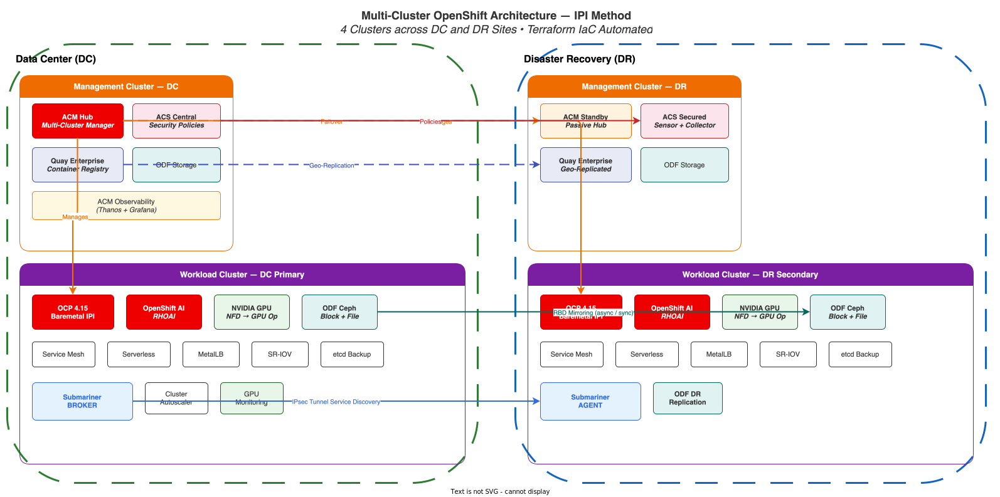{: style="max-width:200px" } | [:material-download: .drawio](architecture/01-high-level-architecture-ipi.drawio) |
| 2 | 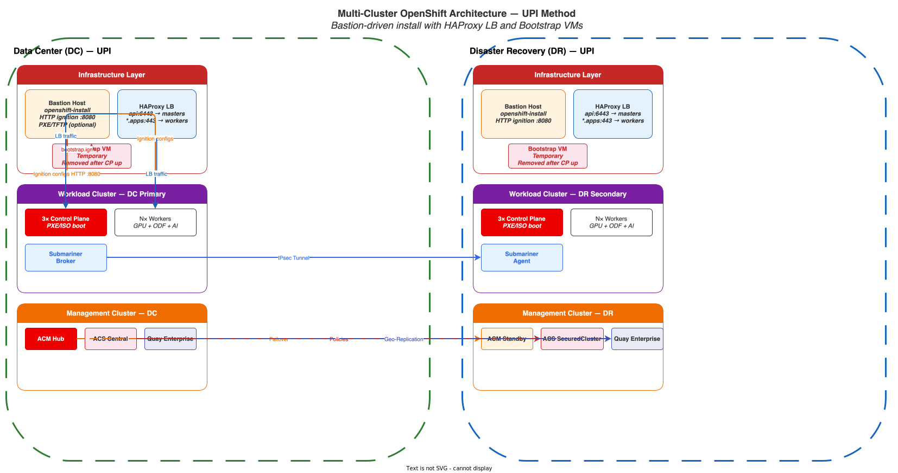{: style="max-width:200px" } | [:material-download: .drawio](architecture/02-upi-architecture-variant.drawio) |
| 3 | 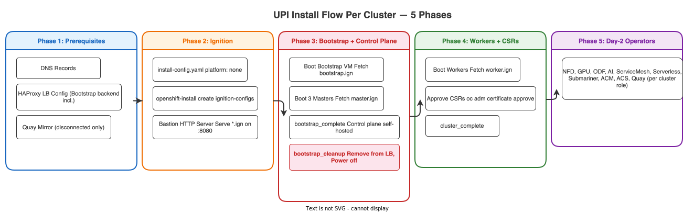{: style="max-width:200px" } | [:material-download: .drawio](architecture/03-upi-install-flow.drawio) |
| 4 | 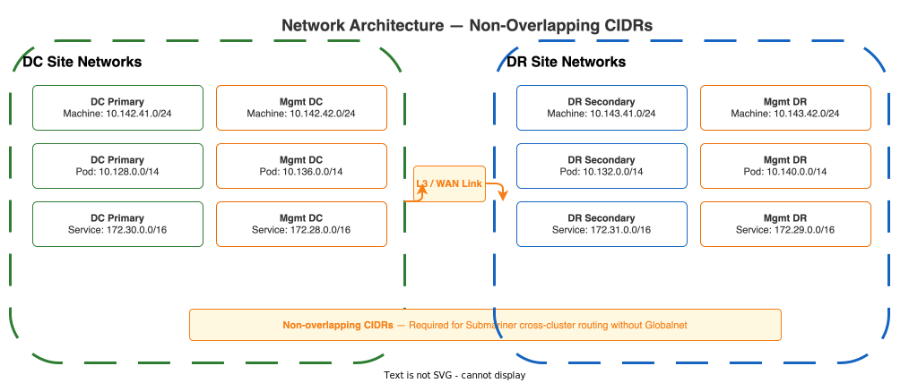{: style="max-width:200px" } | [:material-download: .drawio](architecture/04-network-architecture.drawio) |
| 5 | 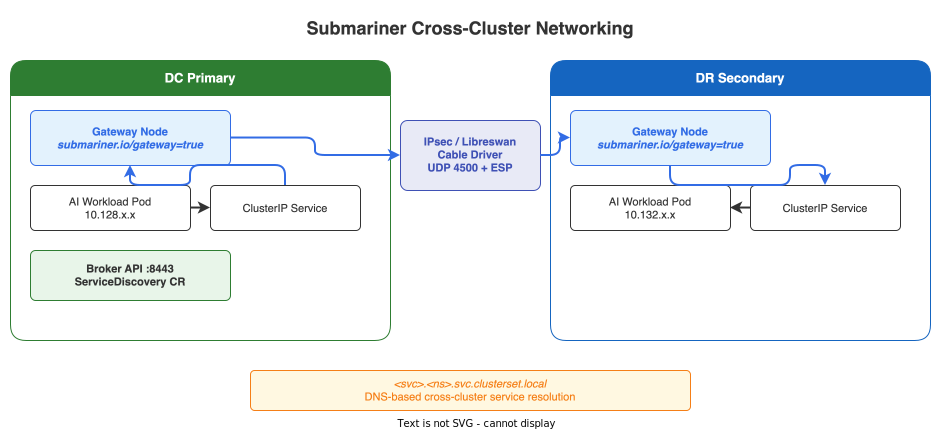{: style="max-width:200px" } | [:material-download: .drawio](architecture/05-submariner-networking.drawio) |
| 6 | 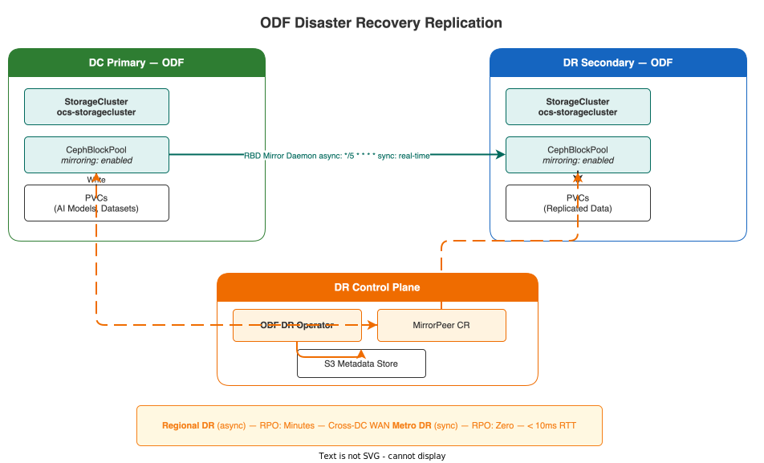{: style="max-width:200px" } | [:material-download: .drawio](architecture/06-odf-dr-replication.drawio) |
| 7 | 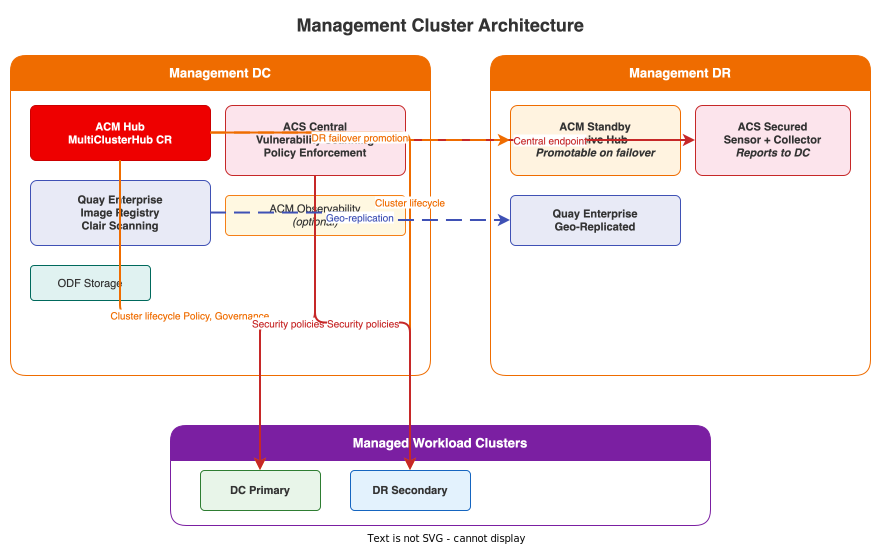{: style="max-width:200px" } | [:material-download: .drawio](architecture/07-management-cluster-architecture.drawio) |
| 8 | 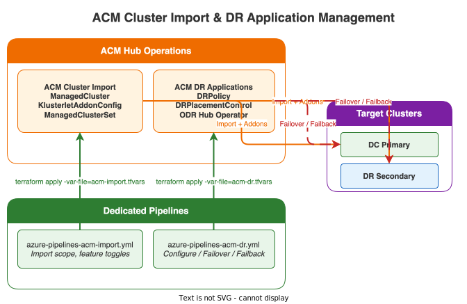{: style="max-width:200px" } | [:material-download: .drawio](architecture/08-acm-import-dr-management.drawio) |
| 9 | 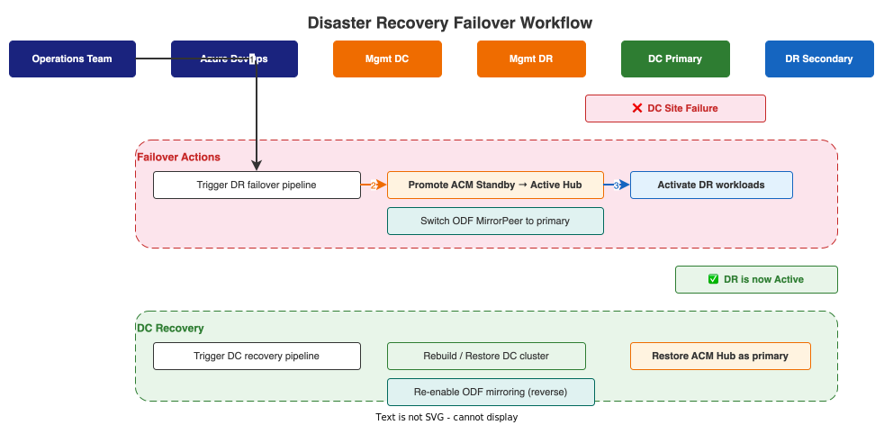{: style="max-width:200px" } | [:material-download: .drawio](architecture/09-dr-failover-workflow.drawio) |
| 10 | 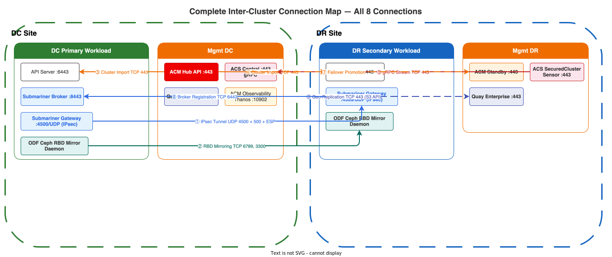{: style="max-width:200px" } | [:material-download: .drawio](architecture/10-inter-cluster-connection-map.drawio) |
| 11 | 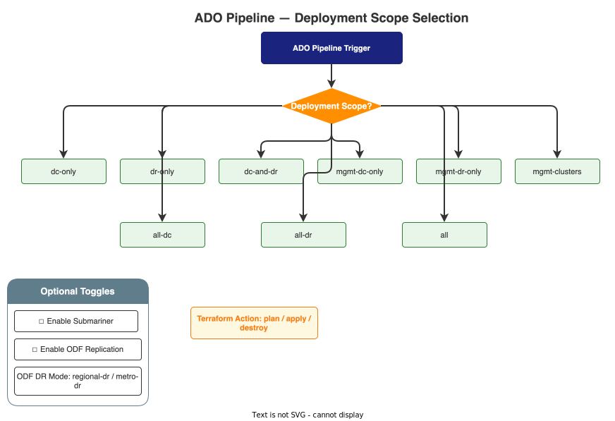{: style="max-width:200px" } | [:material-download: .drawio](architecture/11-ado-pipeline-scope.drawio) |
| 12 | 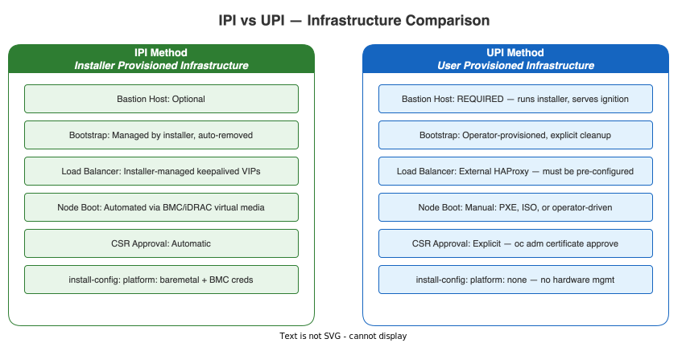{: style="max-width:200px" } | [:material-download: .drawio](architecture/12-ipi-vs-upi-comparison.drawio) |
| 13 | 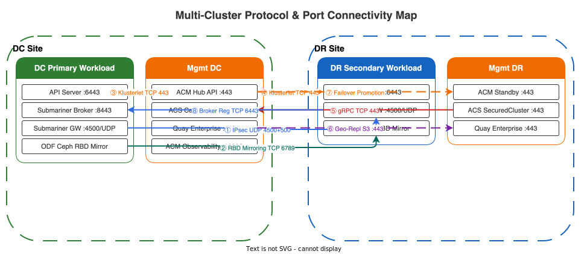{: style="max-width:200px" } | [:material-download: .drawio](architecture/13-protocol-port-map.drawio) |
| 20 | {: style="max-width:200px" } | [:material-download: .drawio](architecture/20-agent-builder-architecture.drawio) |
| 21 | {: style="max-width:200px" } | [:material-download: .drawio](architecture/21-agent-builder-llm-connectivity.drawio) |
| 22 | {: style="max-width:200px" } | [:material-download: .drawio](architecture/22-agent-builder-data-flow.drawio) |
| 23 | {: style="max-width:200px" } | [:material-download: .drawio](architecture/23-agent-builder-service-map.drawio) |

## Cluster Diagrams

| # | Diagram | Download |
|---|---------|----------|
| 1 | 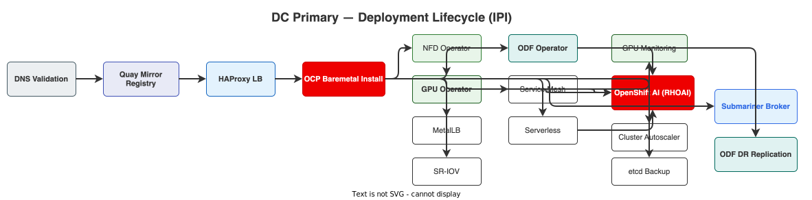{: style="max-width:200px" } | [:material-download: .drawio](clusters/01-dc-primary-deployment-overview.drawio) |
| 2 | 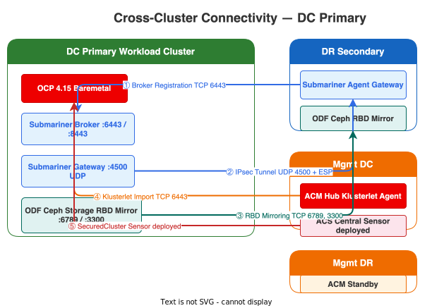{: style="max-width:200px" } | [:material-download: .drawio](clusters/02-dc-primary-connectivity.drawio) |
| 3 | 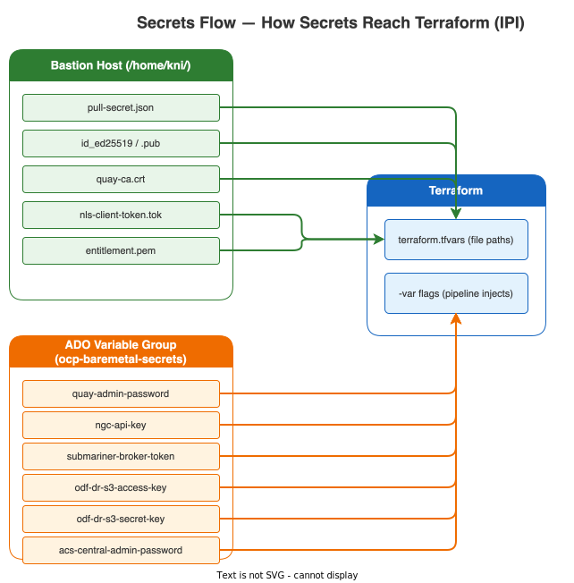{: style="max-width:200px" } | [:material-download: .drawio](clusters/03-dc-primary-secrets-flow-ipi.drawio) |
| 4 | 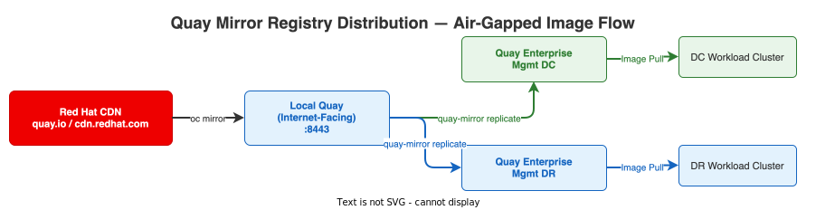{: style="max-width:200px" } | [:material-download: .drawio](clusters/04-quay-mirror-distribution.drawio) |
| 5 | 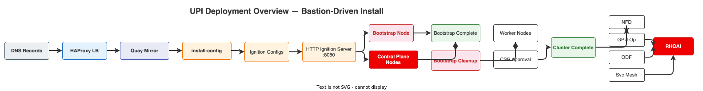{: style="max-width:200px" } | [:material-download: .drawio](clusters/05-upi-deployment-overview.drawio) |
| 6 | 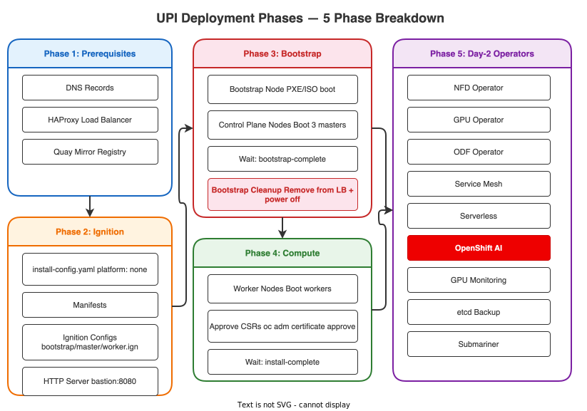{: style="max-width:200px" } | [:material-download: .drawio](clusters/06-upi-deployment-phases.drawio) |
| 7 | 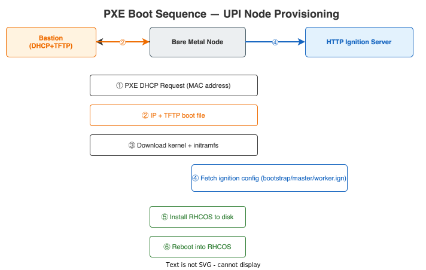{: style="max-width:200px" } | [:material-download: .drawio](clusters/07-pxe-boot-sequence.drawio) |
| 8 | 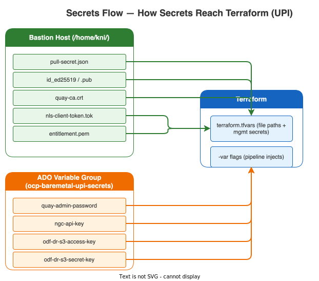{: style="max-width:200px" } | [:material-download: .drawio](clusters/08-upi-secrets-flow.drawio) |
| 9 | 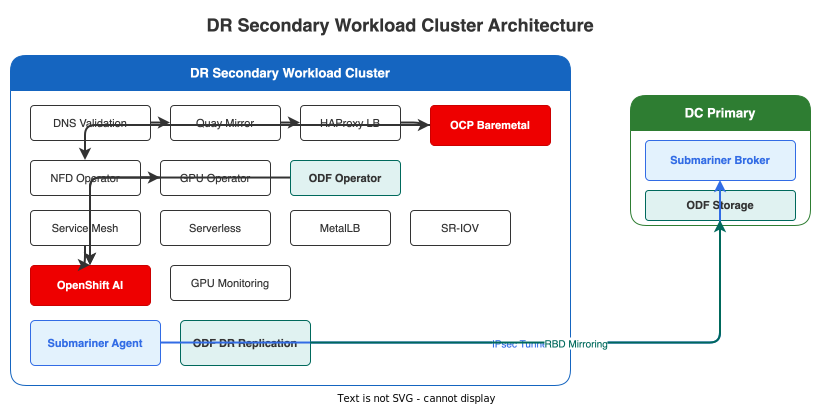{: style="max-width:200px" } | [:material-download: .drawio](clusters/09-dr-secondary-architecture.drawio) |
| 10 | 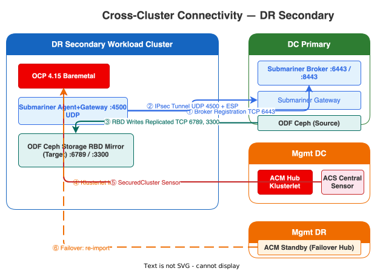{: style="max-width:200px" } | [:material-download: .drawio](clusters/10-dr-secondary-connectivity.drawio) |
| 11 | 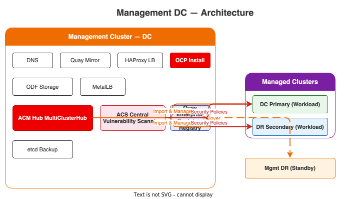{: style="max-width:200px" } | [:material-download: .drawio](clusters/11-mgmt-dc-architecture.drawio) |
| 12 | 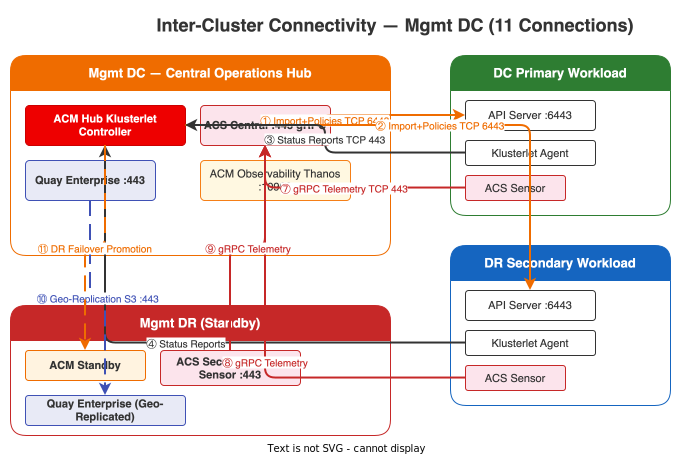{: style="max-width:200px" } | [:material-download: .drawio](clusters/12-mgmt-dc-connectivity.drawio) |
| 13 | 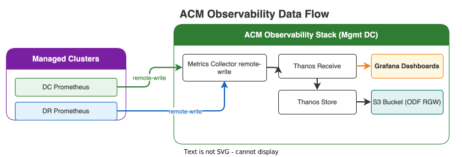{: style="max-width:200px" } | [:material-download: .drawio](clusters/13-acm-observability-flow.drawio) |
| 14 | 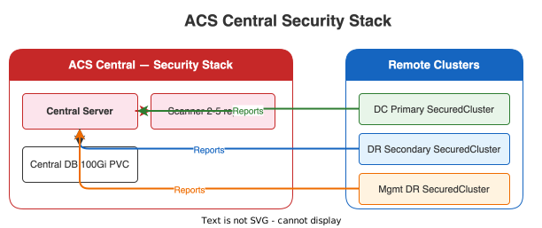{: style="max-width:200px" } | [:material-download: .drawio](clusters/14-acs-central-security-stack.drawio) |
| 15 | 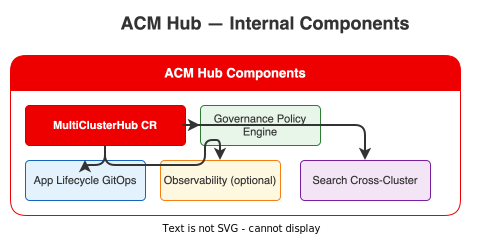{: style="max-width:200px" } | [:material-download: .drawio](clusters/15-acm-hub-components.drawio) |
| 16 | 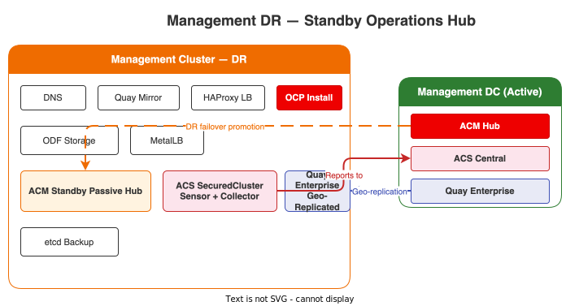{: style="max-width:200px" } | [:material-download: .drawio](clusters/16-mgmt-dr-architecture.drawio) |
| 17 | 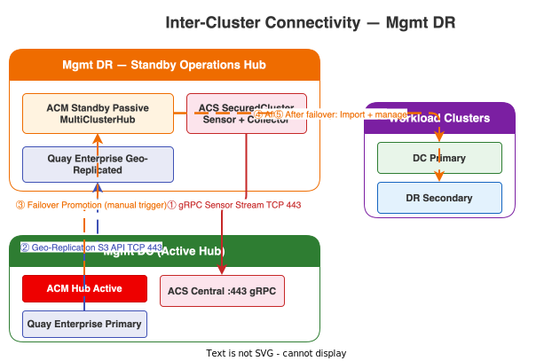{: style="max-width:200px" } | [:material-download: .drawio](clusters/17-mgmt-dr-connectivity.drawio) |
| 18 | 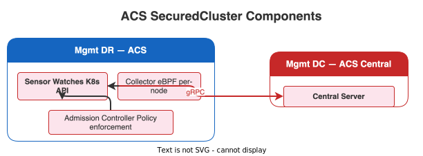{: style="max-width:200px" } | [:material-download: .drawio](clusters/18-acs-secured-cluster-components.drawio) |
| 19 | 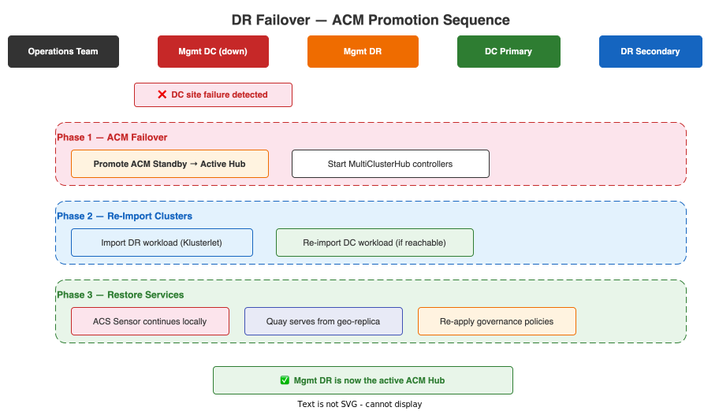{: style="max-width:200px" } | [:material-download: .drawio](clusters/19-dr-failover-acm-promotion.drawio) |
| 20 | 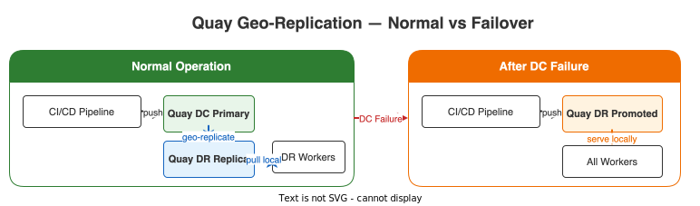{: style="max-width:200px" } | [:material-download: .drawio](clusters/20-quay-geo-replication-failover.drawio) |
| 21 | 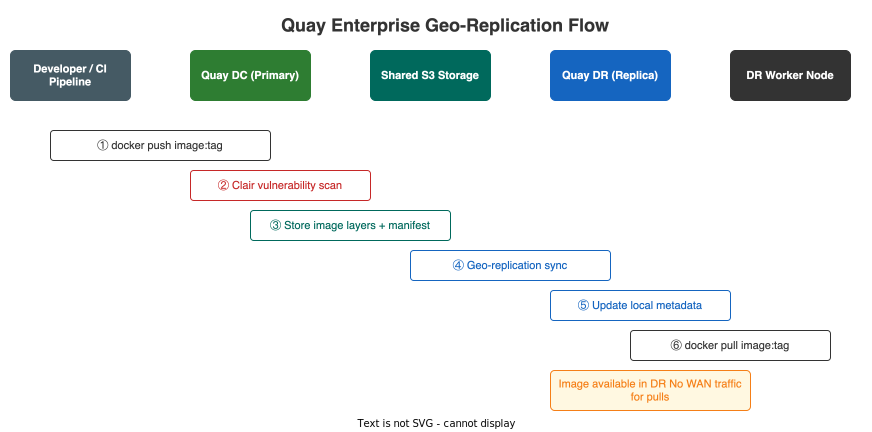{: style="max-width:200px" } | [:material-download: .drawio](clusters/21-quay-geo-replication-flow.drawio) |
| 22 | 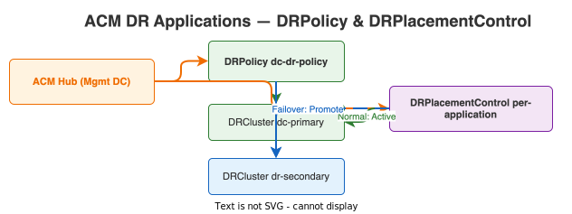{: style="max-width:200px" } | [:material-download: .drawio](clusters/22-acm-dr-applications.drawio) |
| 23 | 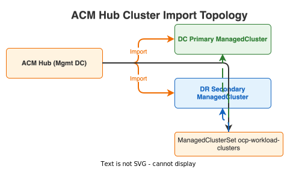{: style="max-width:200px" } | [:material-download: .drawio](clusters/23-acm-import-topology.drawio) |
| 24 | 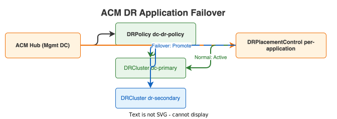{: style="max-width:200px" } | [:material-download: .drawio](clusters/24-acm-dr-application-failover.drawio) |
| 25 | 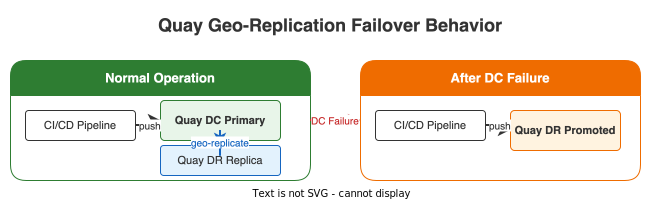{: style="max-width:200px" } | [:material-download: .drawio](clusters/25-quay-failover-behavior.drawio) |
| 26 | 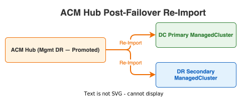{: style="max-width:200px" } | [:material-download: .drawio](clusters/26-acm-post-failover-reimport.drawio) |

## Pipeline Diagrams

| # | Diagram | Download |
|---|---------|----------|
| 1 | 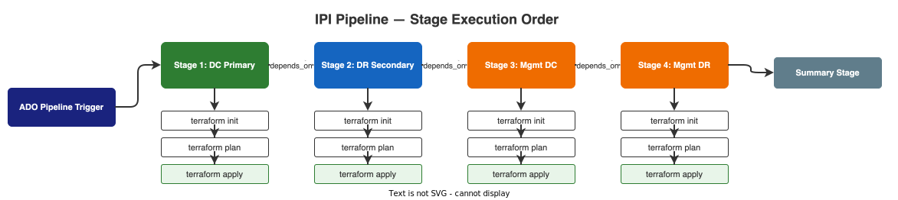{: style="max-width:200px" } | [:material-download: .drawio](pipeline/01-ipi-pipeline-stages.drawio) |
| 2 | 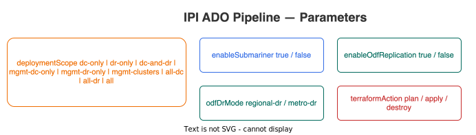{: style="max-width:200px" } | [:material-download: .drawio](pipeline/02-ipi-pipeline-parameters.drawio) |
| 3 | 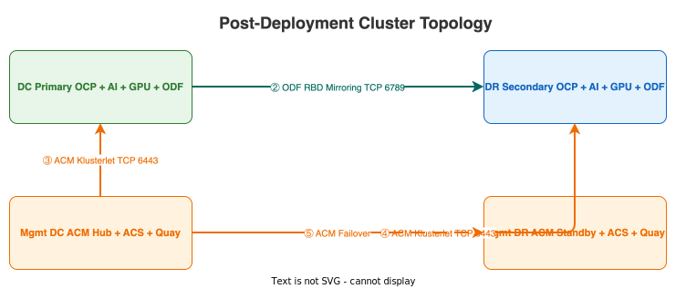{: style="max-width:200px" } | [:material-download: .drawio](pipeline/03-post-deployment-topology.drawio) |
| 4 | 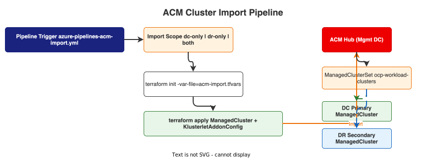{: style="max-width:200px" } | [:material-download: .drawio](pipeline/04-acm-import-pipeline.drawio) |
| 5 | {: style="max-width:200px" } | [:material-download: .drawio](pipeline/05-acm-dr-pipeline.drawio) |
| 6 | 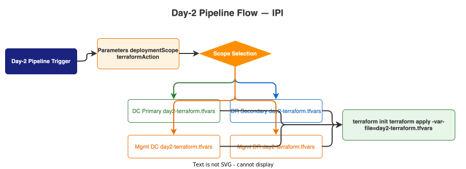{: style="max-width:200px" } | [:material-download: .drawio](pipeline/06-day2-pipeline-flow.drawio) |
| 7 | 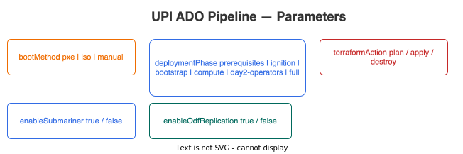{: style="max-width:200px" } | [:material-download: .drawio](pipeline/07-upi-pipeline-parameters.drawio) |
| 8 | 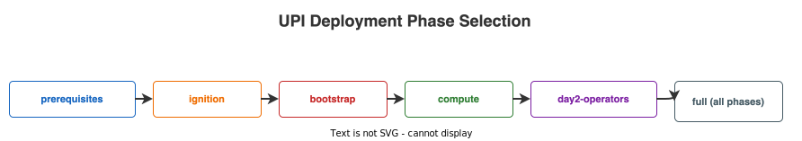{: style="max-width:200px" } | [:material-download: .drawio](pipeline/08-upi-phase-selection.drawio) |
| 9 | 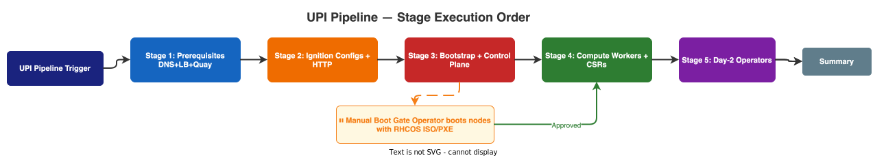{: style="max-width:200px" } | [:material-download: .drawio](pipeline/09-upi-pipeline-stages.drawio) |
| 10 | 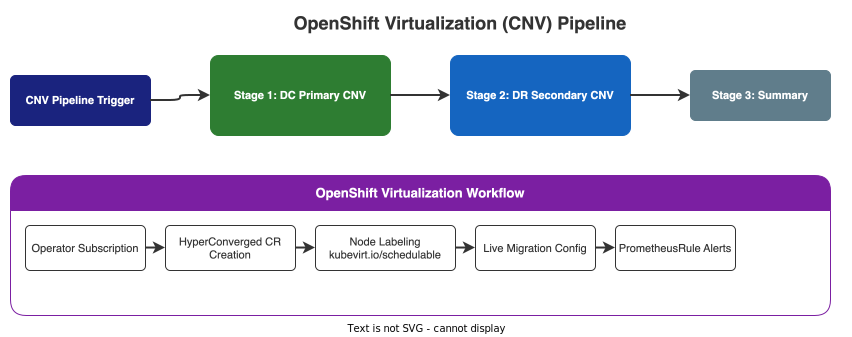{: style="max-width:200px" } | [:material-download: .drawio](pipeline/10-cnv-pipeline.drawio) |
| 11 | 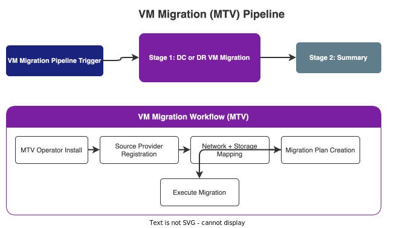{: style="max-width:200px" } | [:material-download: .drawio](pipeline/11-vm-migration-pipeline.drawio) |
| 12 | 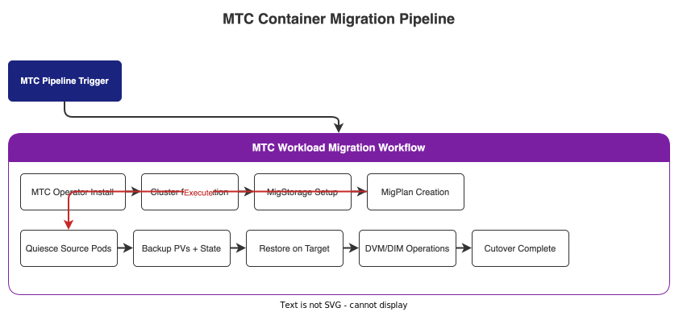{: style="max-width:200px" } | [:material-download: .drawio](pipeline/12-mtc-pipeline.drawio) |
| 13 | 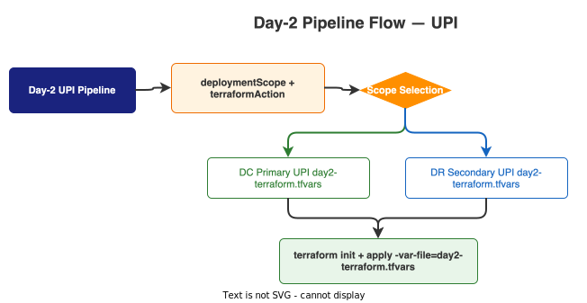{: style="max-width:200px" } | [:material-download: .drawio](pipeline/13-day2-upi-pipeline.drawio) |
| 14 | 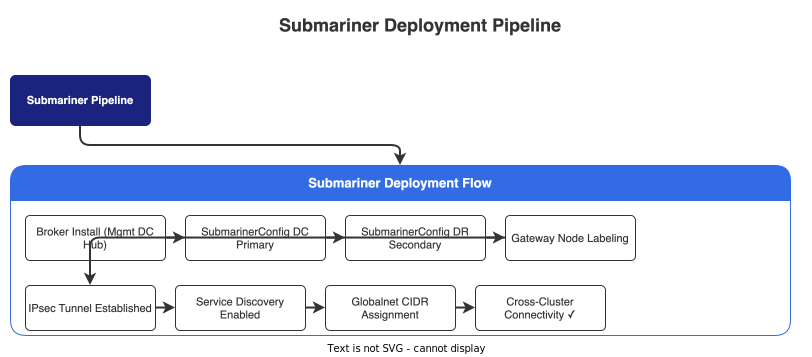{: style="max-width:200px" } | [:material-download: .drawio](pipeline/14-submariner-pipeline.drawio) |
| 15 | 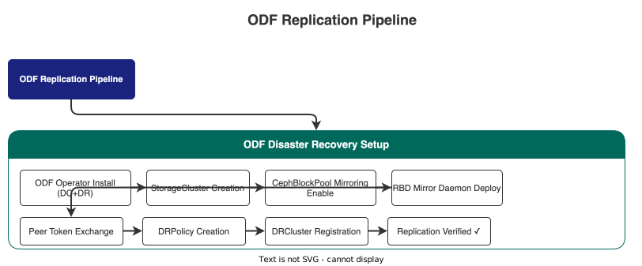{: style="max-width:200px" } | [:material-download: .drawio](pipeline/15-odf-replication-pipeline.drawio) |
| 16 | 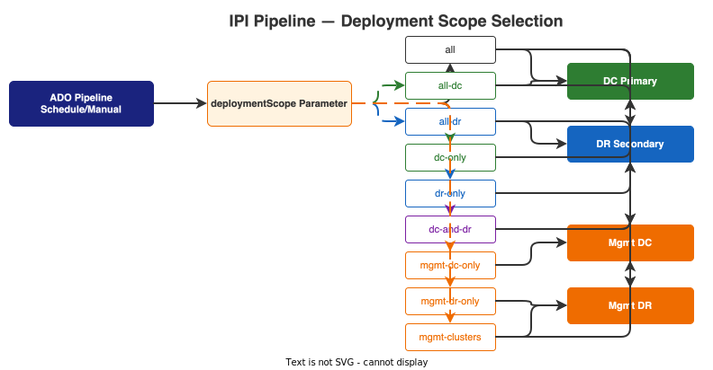{: style="max-width:200px" } | [:material-download: .drawio](pipeline/16-ipi-pipeline-scope.drawio) |
| 17 | 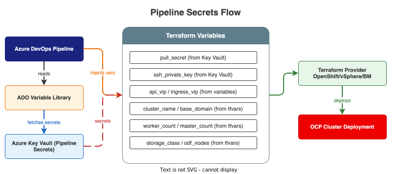{: style="max-width:200px" } | [:material-download: .drawio](pipeline/17-pipeline-secrets-flow.drawio) |
| 18 | 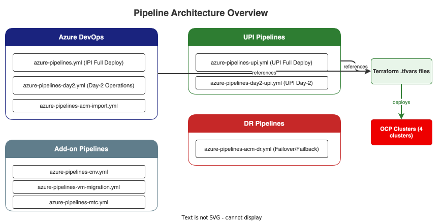{: style="max-width:200px" } | [:material-download: .drawio](pipeline/18-pipeline-architecture-overview.drawio) |
| 19 | 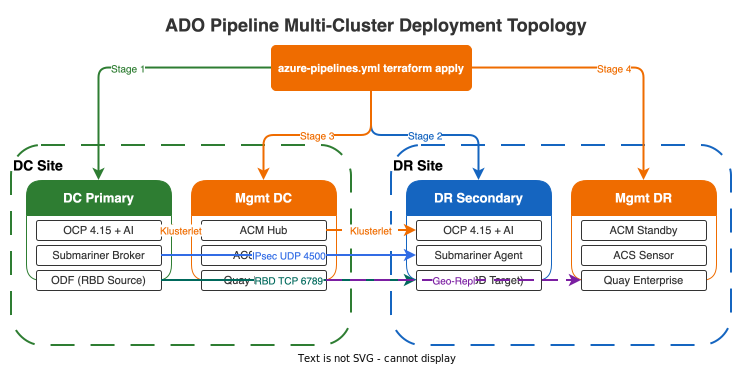{: style="max-width:200px" } | [:material-download: .drawio](pipeline/19-ado-deploy-topology.drawio) |
| 20 | 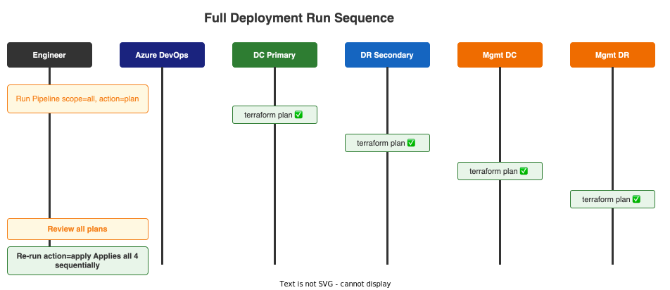{: style="max-width:200px" } | [:material-download: .drawio](pipeline/20-full-deployment-sequence.drawio) |
| 21 | 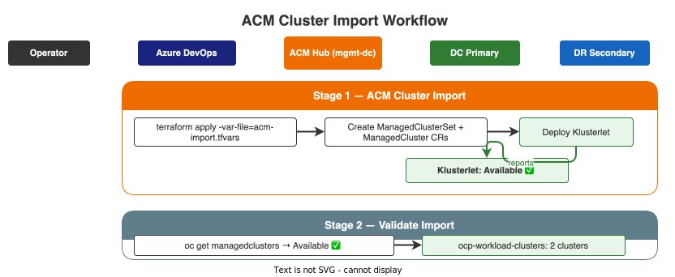{: style="max-width:200px" } | [:material-download: .drawio](pipeline/21-acm-import-workflow.drawio) |
| 22 | {: style="max-width:200px" } | [:material-download: .drawio](pipeline/22-acm-dr-stages.drawio) |
| 23 | {: style="max-width:200px" } | [:material-download: .drawio](pipeline/23-acm-dr-failover-workflow.drawio) |
| 24 | 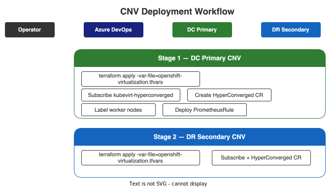{: style="max-width:200px" } | [:material-download: .drawio](pipeline/24-cnv-deploy-workflow.drawio) |
| 25 | 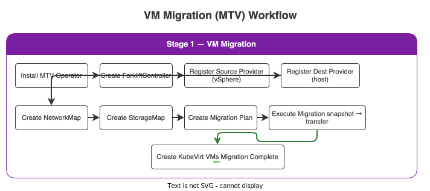{: style="max-width:200px" } | [:material-download: .drawio](pipeline/25-vm-migration-workflow.drawio) |
| 26 | 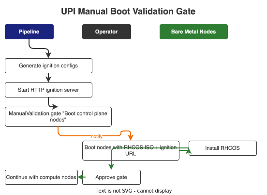{: style="max-width:200px" } | [:material-download: .drawio](pipeline/26-upi-boot-gate.drawio) |
| 27 | {: style="max-width:200px" } | [:material-download: .drawio](pipeline/27-ado-prerequisites.drawio) |
| 30 | {: style="max-width:200px" } | [:material-download: .drawio](pipeline/30-agent-builder-pipeline.drawio) |

## Code / Module Dependency Diagrams

| # | Diagram | Download |
|---|---------|----------|
| 1 | 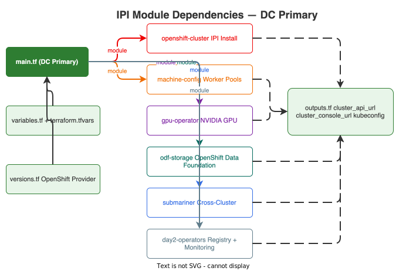{: style="max-width:200px" } | [:material-download: .drawio](code/01-ipi-dc-module-deps.drawio) |
| 2 | 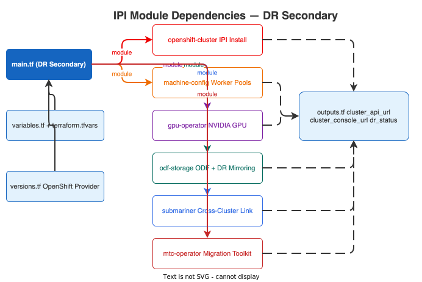{: style="max-width:200px" } | [:material-download: .drawio](code/02-ipi-dr-module-deps.drawio) |
| 3 | 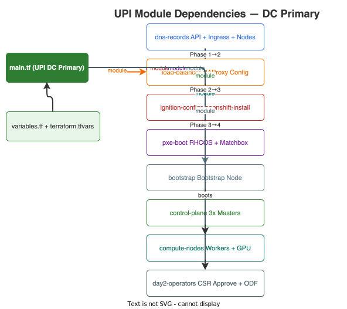{: style="max-width:200px" } | [:material-download: .drawio](code/03-upi-dc-module-deps.drawio) |
| 4 | {: style="max-width:200px" } | [:material-download: .drawio](code/04-upi-dr-module-deps.drawio) |
| 5 | 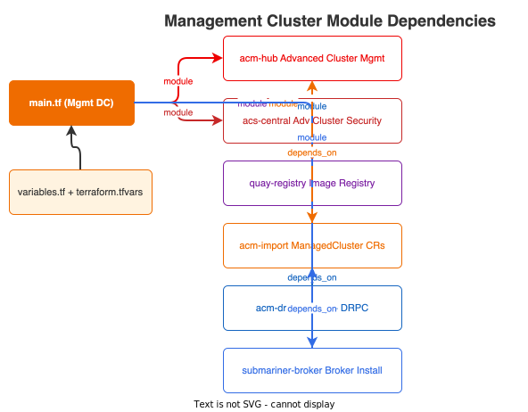{: style="max-width:200px" } | [:material-download: .drawio](code/05-mgmt-module-deps.drawio) |
| 6 | 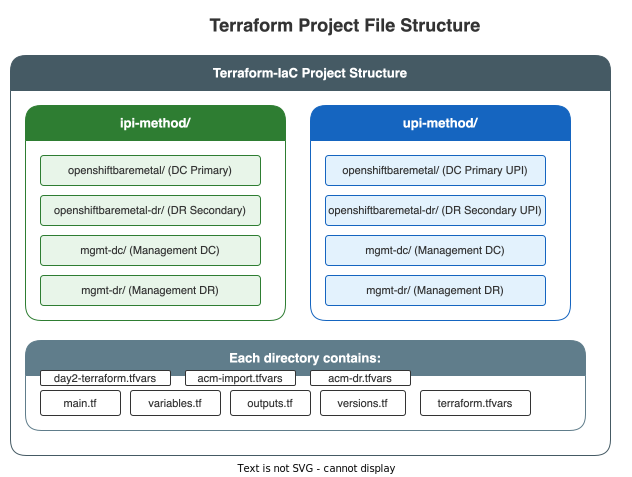{: style="max-width:200px" } | [:material-download: .drawio](code/06-terraform-file-structure.drawio) |
| 7 | 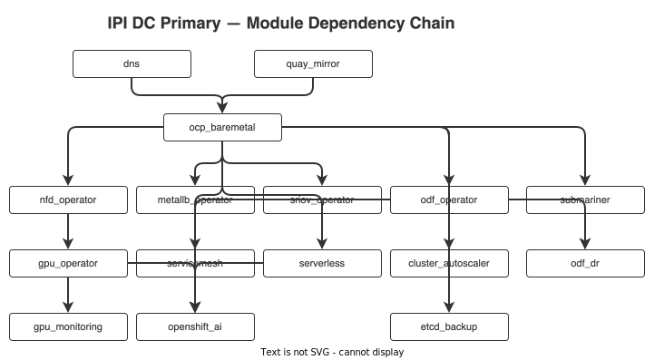{: style="max-width:200px" } | [:material-download: .drawio](code/07-ipi-dc-dep-chain.drawio) |
| 8 | 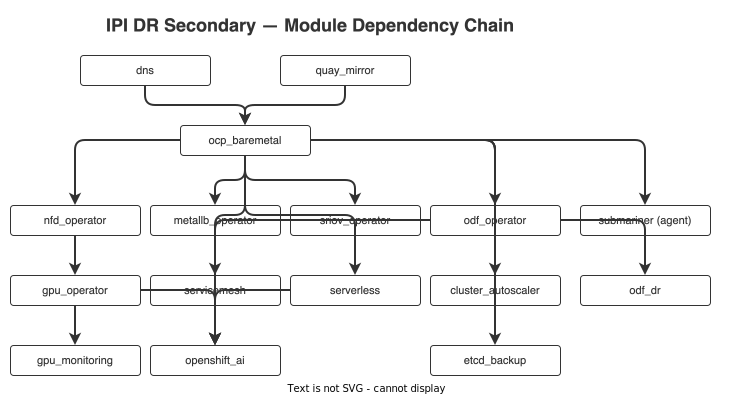{: style="max-width:200px" } | [:material-download: .drawio](code/08-ipi-dr-dep-chain.drawio) |
| 9 | 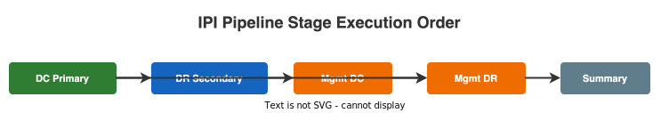{: style="max-width:200px" } | [:material-download: .drawio](code/09-ipi-pipeline-stage-order.drawio) |
| 10 | 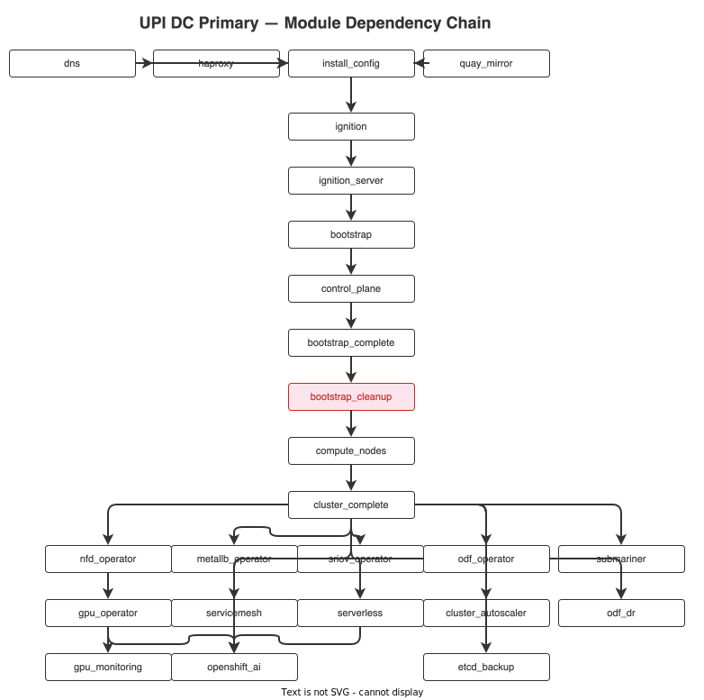{: style="max-width:200px" } | [:material-download: .drawio](code/10-upi-dc-dep-chain.drawio) |
| 11 | {: style="max-width:200px" } | [:material-download: .drawio](code/11-upi-dr-dep-chain.drawio) |
