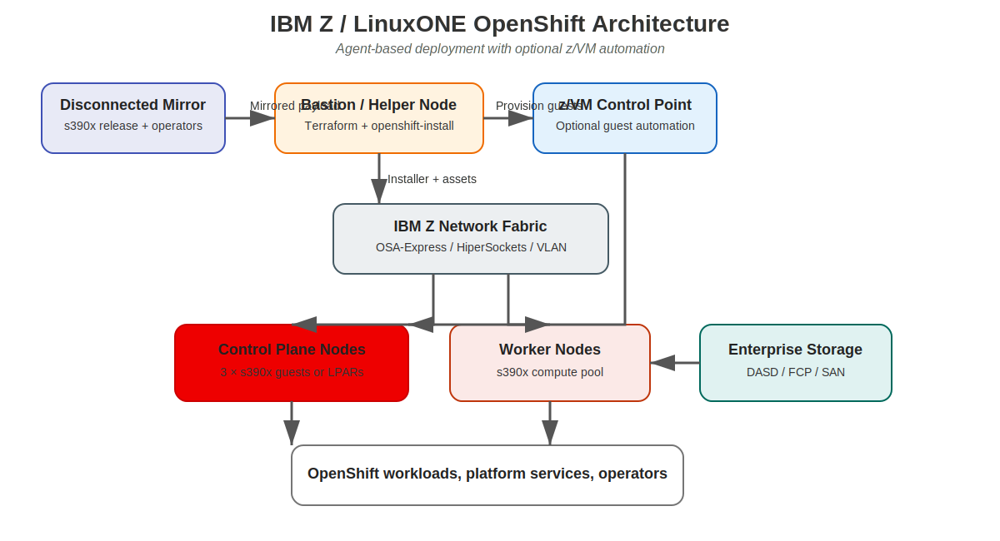
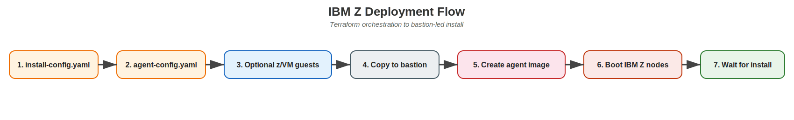

# IBM Z Architecture

This architecture adapts the repository's multi-step Terraform approach to **OpenShift on IBM Z / LinuxONE**. Instead of x86-focused IPI or UPI node provisioning, the IBM Z design uses a **helper node**, **agent-based install assets**, and **IBM Z compute provided as z/VM guests or LPARs**.

## High-level topology

{: .drawio-diagram }

???+ note "Draw.io Source: IBM Z Architecture Overview"
    [:material-download: Download .drawio file](../diagrams/ibm-z/01-ibm-z-architecture.drawio){ .md-button } — Open in [draw.io](https://app.diagrams.net) for interactive editing.

## Deployment flow

{: .drawio-diagram }

???+ note "Draw.io Source: IBM Z Deployment Flow"
    [:material-download: Download .drawio file](../diagrams/ibm-z/02-ibm-z-deployment-flow.drawio){ .md-button } — Open in [draw.io](https://app.diagrams.net) for interactive editing.

## Component mapping

| Layer | IBM Z component | Role in the design |
|---|---|---|
| Mirror | Disconnected registry | Hosts the `s390x` OpenShift release and mirrored operators |
| Bastion | Helper node | Runs Terraform, renders assets, and launches `openshift-install` |
| Management | z/VM control point | Optional automation entry point for guest create/update operations |
| Compute | z/VM guests or LPARs | OpenShift control plane and worker nodes |
| Storage | DASD / FCP / SAN | Root and workload storage depending on platform standards |
| Networking | OSA-Express / HiperSockets / VLAN | Provides static addressing for agent nodes |

## Architecture differences from x86 bare metal

### Provisioning

The x86 documentation in this repo relies heavily on:

- BMC credentials
- Redfish automation
- IPI installers
- external or installer-managed VIP flows

The IBM Z implementation replaces that with:

- `platform: none`
- agent-based install artifacts
- static host inventory in `agent-config.yaml`
- optional z/VM guest provisioning hand-off

### Compute model

IBM Z deployments commonly use one of these two patterns:

| Pattern | When to use it | Terraform role |
|---|---|---|
| **z/VM guests** | Highly automated tenant-style deployments | Generate guest manifest and invoke site automation |
| **LPARs** | Dedicated enterprise partitions managed by operations teams | Render install assets and skip guest provisioning |

### Storage model

The sample Terraform variables use `install_device` values such as `/dev/dasda`, which aligns with common IBM Z storage presentation. Teams using FCP-backed multipath devices should update the variable values per node.

## Networking considerations

IBM Z networks are often more static and operations-controlled than x86 lab environments. For that reason the IBM Z module set explicitly models:

- node IP address
- MAC address
- interface name (for example `enc600`)
- prefix length
- gateway
- DNS servers

That data is rendered into `agent-config.yaml`, allowing a repeatable install without relying on DHCP for day-zero connectivity.

## Security and disconnected operations

The IBM Z flow keeps the same disconnected principles as the rest of the repo:

- mirror the OpenShift payload internally
- trust a local CA bundle when needed
- pass the pull secret through Terraform inputs, not source control
- run installer operations from a bastion host with limited and auditable access

## Practical deployment notes

1. Verify the mirrored release image is explicitly the **`s390x`** payload.
2. Confirm node names, MAC addresses, and static IP assignments with the IBM Z operations team.
3. Validate that the helper node can reach the mirror registry, DNS, NTP, and z/VM management endpoint.
4. If provisioning z/VM guests automatically, align the generated Terraform wrapper with the site's approved SMAPI or DirMaint process.
