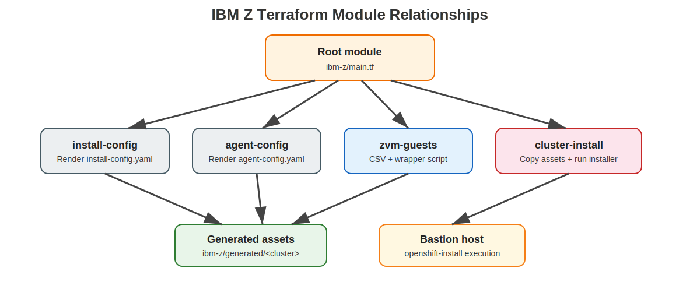

# IBM Z Terraform Code Reference

<!-- markdownlint-disable MD024 -->

This page explains the Terraform implementation under the repository's `ibm-z/` folder and includes the full source for the top-level Terraform files, the sample `terraform.tfvars`, the Azure DevOps pipeline, and each module entry point.

## Module relationship

{: .drawio-diagram }

???+ note "Draw.io Source: IBM Z Terraform Modules"
    [:material-download: Download .drawio file](../diagrams/ibm-z/03-ibm-z-terraform-modules.drawio){ .md-button } — Open in [draw.io](https://app.diagrams.net) for interactive editing.

## Root module structure

```text
ibm-z/
├── main.tf
├── variables.tf
├── outputs.tf
├── versions.tf
├── terraform.tfvars
├── azure-pipelines-ibm-z.yml
└── modules/
    ├── install-config/
    ├── agent-config/
    ├── zvm-guests/
    └── cluster-install/
```

## `main.tf` orchestration

The root module composes the IBM Z workflow in four parts:

- `install-config` — renders the OpenShift cluster definition
- `agent-config` — renders IBM Z host inventory and static network config
- `zvm-guests` — optionally generates and runs guest provisioning commands
- `cluster-install` — copies assets to the bastion host and launches the installer

This is not a placeholder layout with empty submodules. The implementation renders real OpenShift install assets and executable IBM Z handoff scripts while leaving site-specific z/VM and bastion execution boundaries explicit.

### Full source

```hcl
locals {
  cluster_domain = "${var.cluster_name}.${var.base_domain}"
  assets_dir     = "${path.module}/generated/${var.cluster_name}"

  control_plane_nodes = [
    for node in var.control_plane_nodes : merge(node, { role = "master" })
  ]

  compute_nodes = [
    for node in var.compute_nodes : merge(node, { role = "worker" })
  ]

  all_nodes = concat(local.control_plane_nodes, local.compute_nodes)
}

resource "null_resource" "assets_dir" {
  triggers = {
    assets_dir = local.assets_dir
  }

  provisioner "local-exec" {
    command = "mkdir -p '${local.assets_dir}'"
  }
}

module "install_config" {
  source = "./modules/install-config"

  assets_dir                   = local.assets_dir
  cluster_name                 = var.cluster_name
  base_domain                  = var.base_domain
  architecture                 = var.architecture
  control_plane_replicas       = length(local.control_plane_nodes)
  compute_replicas             = length(local.compute_nodes)
  machine_network_cidr         = var.machine_network_cidr
  cluster_network_cidr         = var.cluster_network_cidr
  cluster_network_host_prefix  = var.cluster_network_host_prefix
  service_network_cidr         = var.service_network_cidr
  network_type                 = var.network_type
  publish_strategy             = var.publish_strategy
  pull_secret_file             = var.pull_secret_file
  ssh_public_key_file          = var.ssh_public_key_file
  additional_trust_bundle_file = var.additional_trust_bundle_file
  image_digest_sources         = var.image_digest_sources

  depends_on = [null_resource.assets_dir]
}

module "agent_config" {
  source = "./modules/agent-config"

  assets_dir          = local.assets_dir
  cluster_name        = var.cluster_name
  base_domain         = var.base_domain
  rendezvous_ip       = var.rendezvous_ip
  dns_servers         = var.dns_servers
  ntp_servers         = var.ntp_servers
  gateway             = var.gateway
  control_plane_nodes = local.control_plane_nodes
  compute_nodes       = local.compute_nodes

  depends_on = [null_resource.assets_dir]
}

module "zvm_guests" {
  source = "./modules/zvm-guests"
  count  = var.enable_zvm_guest_provisioning ? 1 : 0

  assets_dir               = local.assets_dir
  zvm_host                 = var.zvm_host
  zvm_user                 = var.zvm_user
  zvm_ssh_private_key_file = var.zvm_ssh_private_key_file
  zvm_ssh_port             = var.zvm_ssh_port
  zvm_guest_script_path    = var.zvm_guest_script_path
  auto_provision           = var.enable_zvm_guest_provisioning
  nodes                    = local.all_nodes

  depends_on = [null_resource.assets_dir]
}

module "cluster_install" {
  source = "./modules/cluster-install"

  assets_dir                   = local.assets_dir
  cluster_name                 = var.cluster_name
  bastion_host                 = var.bastion_host
  bastion_user                 = var.bastion_user
  bastion_ssh_private_key_file = var.bastion_ssh_private_key_file
  openshift_install_binary     = var.openshift_install_binary
  remote_assets_dir            = "${var.remote_assets_dir}/${var.cluster_name}"
  auto_launch_install          = var.auto_launch_install
  auto_approve_install         = var.auto_approve_install

  depends_on = [
    null_resource.assets_dir,
    module.install_config,
    module.agent_config,
    module.zvm_guests,
  ]
}
```

## `variables.tf`

The IBM Z variables intentionally model platform-specific concerns such as `s390x` architecture, rendezvous IP planning, z/VM automation, DASD/root-device hints, and static interface naming.

### Full source

```hcl
variable "cluster_name" {
  description = "Short cluster name used in DNS and install assets."
  type        = string
}

variable "base_domain" {
  description = "Base DNS domain for the OpenShift cluster."
  type        = string
}

variable "openshift_version" {
  description = "OpenShift version used for documentation and tagging."
  type        = string
  default     = "4.20"
}

variable "release_image" {
  description = "Mirrored OpenShift release image for the s390x payload."
  type        = string
}

variable "architecture" {
  description = "Target CPU architecture. IBM Z uses s390x."
  type        = string
  default     = "s390x"
}

variable "pull_secret_file" {
  description = "Path to the pull secret file available to Terraform."
  type        = string
}

variable "ssh_public_key_file" {
  description = "Path to the SSH public key injected into cluster nodes."
  type        = string
}

variable "additional_trust_bundle_file" {
  description = "Optional CA bundle for disconnected registry trust."
  type        = string
  default     = ""
}

variable "machine_network_cidr" {
  description = "Machine network CIDR used by the IBM Z nodes."
  type        = string
}

variable "cluster_network_cidr" {
  description = "Pod network CIDR."
  type        = string
}

variable "cluster_network_host_prefix" {
  description = "Pod network host prefix."
  type        = number
  default     = 23
}

variable "service_network_cidr" {
  description = "Service network CIDR."
  type        = string
}

variable "network_type" {
  description = "OpenShift network plugin."
  type        = string
  default     = "OVNKubernetes"
}

variable "publish_strategy" {
  description = "OpenShift publish strategy."
  type        = string
  default     = "External"
}

variable "dns_servers" {
  description = "DNS servers reachable by IBM Z nodes."
  type        = list(string)
}

variable "ntp_servers" {
  description = "NTP servers reachable by IBM Z nodes."
  type        = list(string)
  default     = []
}

variable "gateway" {
  description = "Default gateway for static node configuration."
  type        = string
}

variable "rendezvous_ip" {
  description = "Rendezvous IP used by the agent-based installer."
  type        = string
}

variable "image_digest_sources" {
  description = "Optional mirrored registry sources for disconnected installations."
  type = list(object({
    source  = string
    mirrors = list(string)
  }))
  default = []
}

variable "bastion_host" {
  description = "Bastion or helper host that runs openshift-install."
  type        = string
}

variable "bastion_user" {
  description = "SSH user for the bastion host."
  type        = string
}

variable "bastion_ssh_private_key_file" {
  description = "Path to the SSH private key used for bastion access."
  type        = string
}

variable "openshift_install_binary" {
  description = "Absolute path to openshift-install on the bastion host."
  type        = string
  default     = "/usr/local/bin/openshift-install"
}

variable "remote_assets_dir" {
  description = "Remote directory on the bastion host that stores cluster assets."
  type        = string
  default     = "/var/tmp/ocp-ibmz"
}

variable "enable_zvm_guest_provisioning" {
  description = "If true, Terraform generates and optionally runs z/VM guest provisioning commands."
  type        = bool
  default     = false
}

variable "auto_approve_install" {
  description = "If true, Terraform waits for install completion on the bastion host."
  type        = bool
  default     = false
}

variable "auto_launch_install" {
  description = "If true, Terraform copies the rendered assets to the bastion host and starts the remote installer wrapper."
  type        = bool
  default     = false
}

variable "zvm_host" {
  description = "Optional z/VM management host."
  type        = string
  default     = ""
}

variable "zvm_user" {
  description = "SSH user for the z/VM management host."
  type        = string
  default     = ""
}

variable "zvm_ssh_private_key_file" {
  description = "SSH private key used for the z/VM management host."
  type        = string
  default     = ""
}

variable "zvm_ssh_port" {
  description = "SSH port for the z/VM management host."
  type        = number
  default     = 22
}

variable "zvm_guest_script_path" {
  description = "Site-specific automation wrapper used to create or update z/VM guests."
  type        = string
  default     = "/opt/ibmz/provision-guest.sh"
}

variable "control_plane_nodes" {
  description = "IBM Z control plane nodes."
  type = list(object({
    name           = string
    ipv4           = string
    mac_address    = string
    interface_name = optional(string, "enc600")
    prefix_length  = optional(number, 24)
    install_device = optional(string, "/dev/dasda")
    cpu            = optional(number, 8)
    memory_mb      = optional(number, 32768)
    disk_gb        = optional(number, 250)
    zvm_userid     = optional(string, null)
    zvm_network    = optional(string, "VSW1")
  }))
}

variable "compute_nodes" {
  description = "IBM Z worker nodes."
  type = list(object({
    name           = string
    ipv4           = string
    mac_address    = string
    interface_name = optional(string, "enc600")
    prefix_length  = optional(number, 24)
    install_device = optional(string, "/dev/dasda")
    cpu            = optional(number, 8)
    memory_mb      = optional(number, 32768)
    disk_gb        = optional(number, 500)
    zvm_userid     = optional(string, null)
    zvm_network    = optional(string, "VSW1")
  }))
}
```

## `outputs.tf`

The outputs expose the generated asset paths, bastion hand-off directory, and expected API and console URLs for the cluster.

### Full source

```hcl
output "cluster_domain" {
  description = "Fully qualified OpenShift cluster domain."
  value       = local.cluster_domain
}

output "generated_assets_dir" {
  description = "Local directory containing generated install assets."
  value       = local.assets_dir
}

output "install_config_file" {
  description = "Path to the generated install-config.yaml file."
  value       = module.install_config.install_config_file
}

output "agent_config_file" {
  description = "Path to the generated agent-config.yaml file."
  value       = module.agent_config.agent_config_file
}

output "zvm_guest_manifest_file" {
  description = "Optional z/VM guest manifest generated for site automation."
  value       = try(module.zvm_guests[0].guest_inventory_file, null)
}

output "remote_assets_dir" {
  description = "Remote bastion directory used by openshift-install."
  value       = module.cluster_install.remote_assets_dir
}

output "api_url" {
  description = "Expected Kubernetes API endpoint."
  value       = "https://api.${local.cluster_domain}:6443"
}

output "console_url" {
  description = "Expected OpenShift web console endpoint."
  value       = "https://console-openshift-console.apps.${local.cluster_domain}"
}
```

## `versions.tf`

Provider and Terraform version constraints for the IBM Z blueprint.

### Full source

```hcl
terraform {
  required_version = ">= 1.9.0"

  required_providers {
    local = {
      source  = "hashicorp/local"
      version = "~> 2.5"
    }
    null = {
      source  = "hashicorp/null"
      version = "~> 3.2"
    }
  }
}
```

## `terraform.tfvars`

Sample input values for an IBM Z / LinuxONE agent-based OpenShift deployment, including mirrored release sources, bastion settings, and node inventories.

### Full source

```hcl
cluster_name        = "ocp-z-prod"
base_domain         = "example.ibmz.lab"
openshift_version   = "4.20"
release_image       = "mirror.ibmz.lab:8443/openshift/release-images:4.20.0-s390x"
architecture        = "s390x"
pull_secret_file    = "/secure/pull-secret.json"
ssh_public_key_file = "/secure/id_ed25519.pub"

additional_trust_bundle_file = "/secure/mirror-ca.crt"

machine_network_cidr        = "10.154.10.0/24"
cluster_network_cidr        = "10.160.0.0/14"
cluster_network_host_prefix = 23
service_network_cidr        = "172.31.0.0/16"
network_type                = "OVNKubernetes"
publish_strategy            = "External"

dns_servers = ["10.154.10.10", "10.154.10.11"]
ntp_servers = ["10.154.10.20"]
gateway     = "10.154.10.1"

rendezvous_ip = "10.154.10.21"

image_digest_sources = [
  {
    source  = "quay.io/openshift-release-dev/ocp-release"
    mirrors = ["mirror.ibmz.lab:8443/openshift/release-images"]
  },
  {
    source  = "quay.io/openshift-release-dev/ocp-v4.0-art-dev"
    mirrors = ["mirror.ibmz.lab:8443/openshift/release-artifacts"]
  }
]

bastion_host                 = "helper.ibmz.lab"
bastion_user                 = "kni"
bastion_ssh_private_key_file = "/secure/id_ed25519"
openshift_install_binary     = "/usr/local/bin/openshift-install"
remote_assets_dir            = "/var/tmp/ocp-ibmz"
auto_launch_install          = false
auto_approve_install         = false

enable_zvm_guest_provisioning = true
zvm_host                      = "zvm-mgmt.ibmz.lab"
zvm_user                      = "automation"
zvm_ssh_private_key_file      = "/secure/id_ed25519"
zvm_guest_script_path         = "/opt/ibmz/provision-guest.sh"

control_plane_nodes = [
  {
    name        = "ocp-z-master-0"
    ipv4        = "10.154.10.21"
    mac_address = "02:00:00:00:10:21"
    zvm_userid  = "OCPZM01"
    zvm_network = "VSW1"
  },
  {
    name        = "ocp-z-master-1"
    ipv4        = "10.154.10.22"
    mac_address = "02:00:00:00:10:22"
    zvm_userid  = "OCPZM02"
    zvm_network = "VSW1"
  },
  {
    name        = "ocp-z-master-2"
    ipv4        = "10.154.10.23"
    mac_address = "02:00:00:00:10:23"
    zvm_userid  = "OCPZM03"
    zvm_network = "VSW1"
  }
]

compute_nodes = [
  {
    name        = "ocp-z-worker-0"
    ipv4        = "10.154.10.31"
    mac_address = "02:00:00:00:10:31"
    zvm_userid  = "OCPZW01"
    zvm_network = "VSW1"
    disk_gb     = 750
  },
  {
    name        = "ocp-z-worker-1"
    ipv4        = "10.154.10.32"
    mac_address = "02:00:00:00:10:32"
    zvm_userid  = "OCPZW02"
    zvm_network = "VSW1"
    disk_gb     = 750
  }
]
```

## `azure-pipelines-ibm-z.yml`

Azure DevOps pipeline for validating the IBM Z Terraform, rendering install assets, optionally provisioning z/VM guests, and optionally launching the remote installer on the bastion.

### Full source

```yaml
# =============================================================================
# Azure DevOps Pipeline — IBM Z / LinuxONE OpenShift Deployment
# Agent-based deployment for s390x clusters with optional z/VM guest provisioning
# =============================================================================

trigger:
  branches:
    include:
      - develop
  paths:
    include:
      - ibm-z/**
      - docs/ibm-z/**
      - docs/diagrams/ibm-z/**

parameters:
  - name: terraformAction
    displayName: Terraform Action
    type: string
    default: plan
    values:
      - plan
      - apply
      - destroy

  - name: autoProvisionZvm
    displayName: Provision z/VM guests
    type: boolean
    default: false

  - name: waitForInstall
    displayName: Wait for install completion
    type: boolean
    default: false

  - name: runRemoteInstall
    displayName: Launch remote installer on bastion
    type: boolean
    default: false

variables:
  - name: TF_IN_AUTOMATION
    value: "true"
  - name: TF_INPUT
    value: "false"
  - name: WORKING_DIR
    value: "ibm-z"

stages:
  - stage: Validate
    displayName: Validate IBM Z Terraform
    jobs:
      - job: FmtValidate
        pool:
          name: self-hosted-linux
        steps:
          - checkout: self
          - task: TerraformInstaller@1
            inputs:
              terraformVersion: latest
          - script: |
              cd $(WORKING_DIR)
              terraform init -input=false
              terraform fmt -check
              terraform validate
            displayName: terraform init / fmt / validate

  - stage: Render_Assets
    displayName: Render install-config and agent-config
    dependsOn: Validate
    jobs:
      - job: Render
        pool:
          name: self-hosted-linux
        steps:
          - checkout: self
          - task: TerraformInstaller@1
            inputs:
              terraformVersion: latest
          - script: |
              cd $(WORKING_DIR)
              terraform init -input=false
              terraform ${{ parameters.terraformAction }} \
                -var-file=terraform.tfvars \
                -var auto_launch_install=${{ lower(parameters.runRemoteInstall) }} \
                -var auto_approve_install=${{ lower(parameters.waitForInstall) }} \
                -var enable_zvm_guest_provisioning=${{ lower(parameters.autoProvisionZvm) }} \
                -input=false \
                $(if [ "${{ parameters.terraformAction }}" != "plan" ]; then echo "-auto-approve"; fi)
            displayName: Render IBM Z deployment assets

  - stage: Summary
    displayName: IBM Z summary
    dependsOn: Render_Assets
    condition: always()
    jobs:
      - job: OutputSummary
        pool:
          name: self-hosted-linux
        steps:
          - checkout: none
          - script: |
              echo "IBM Z Terraform workflow completed."
              echo "Review ibm-z/generated for install-config.yaml, agent-config.yaml, and provisioning scripts."
              echo "If runRemoteInstall=false, execute the generated launch-ibmz-install.sh script manually when the bastion is ready."
              echo "If waitForInstall=false but runRemoteInstall=true, installation starts remotely but completion tracking remains manual."
            displayName: Print summary
```

## `modules/install-config`

This module writes `install-config.yaml` for the disconnected, `platform: none`, agent-based IBM Z installation path.

### Full source

```hcl
variable "assets_dir" {
  type = string
}

variable "cluster_name" {
  type = string
}

variable "base_domain" {
  type = string
}

variable "architecture" {
  type = string
}

variable "control_plane_replicas" {
  type = number
}

variable "compute_replicas" {
  type = number
}

variable "machine_network_cidr" {
  type = string
}

variable "cluster_network_cidr" {
  type = string
}

variable "cluster_network_host_prefix" {
  type = number
}

variable "service_network_cidr" {
  type = string
}

variable "network_type" {
  type = string
}

variable "publish_strategy" {
  type = string
}

variable "pull_secret_file" {
  type = string
}

variable "ssh_public_key_file" {
  type = string
}

variable "additional_trust_bundle_file" {
  type = string
}

variable "image_digest_sources" {
  type = list(object({
    source  = string
    mirrors = list(string)
  }))
}

locals {
  install_config = merge(
    {
      apiVersion = "v1"
      baseDomain = var.base_domain
      metadata = {
        name = var.cluster_name
      }
      controlPlane = {
        name           = "master"
        replicas       = var.control_plane_replicas
        architecture   = var.architecture
        hyperthreading = "Enabled"
      }
      compute = [
        {
          name           = "worker"
          replicas       = var.compute_replicas
          architecture   = var.architecture
          hyperthreading = "Enabled"
        }
      ]
      networking = {
        networkType = var.network_type
        machineNetwork = [
          {
            cidr = var.machine_network_cidr
          }
        ]
        clusterNetwork = [
          {
            cidr       = var.cluster_network_cidr
            hostPrefix = var.cluster_network_host_prefix
          }
        ]
        serviceNetwork = [var.service_network_cidr]
      }
      platform = {
        none = {}
      }
      publish    = var.publish_strategy
      pullSecret = trimspace(file(var.pull_secret_file))
      sshKey     = trimspace(file(var.ssh_public_key_file))
    },
    length(trimspace(var.additional_trust_bundle_file)) > 0 ? {
      additionalTrustBundle = file(var.additional_trust_bundle_file)
    } : {},
    length(var.image_digest_sources) > 0 ? {
      imageDigestSources = var.image_digest_sources
    } : {}
  )
}

resource "local_file" "install_config" {
  filename = "${var.assets_dir}/install-config.yaml"
  content  = yamlencode(local.install_config)
}

output "install_config_file" {
  value = local_file.install_config.filename
}
```

## `modules/agent-config`

This module translates node inventory into `agent-config.yaml`, including roles, boot MAC addresses, static network configuration, DNS, and default routes.

### Full source

```hcl
variable "assets_dir" {
  type = string
}

variable "cluster_name" {
  type = string
}

variable "base_domain" {
  type = string
}

variable "rendezvous_ip" {
  type = string
}

variable "dns_servers" {
  type = list(string)
}

variable "ntp_servers" {
  type = list(string)
}

variable "gateway" {
  type = string
}

variable "control_plane_nodes" {
  type = list(object({
    name           = string
    role           = string
    ipv4           = string
    mac_address    = string
    interface_name = string
    prefix_length  = number
    install_device = string
    cpu            = number
    memory_mb      = number
    disk_gb        = number
    zvm_userid     = string
    zvm_network    = string
  }))
}

variable "compute_nodes" {
  type = list(object({
    name           = string
    role           = string
    ipv4           = string
    mac_address    = string
    interface_name = string
    prefix_length  = number
    install_device = string
    cpu            = number
    memory_mb      = number
    disk_gb        = number
    zvm_userid     = string
    zvm_network    = string
  }))
}

locals {
  all_nodes = concat(var.control_plane_nodes, var.compute_nodes)

  agent_config = {
    apiVersion           = "v1alpha1"
    kind                 = "AgentConfig"
    rendezvousIP         = var.rendezvous_ip
    additionalNTPSources = var.ntp_servers
    hosts = [
      for node in local.all_nodes : {
        hostname       = node.name
        role           = node.role
        bootMACAddress = node.mac_address
        rootDeviceHints = {
          deviceName = node.install_device
        }
        interfaces = [
          {
            name       = node.interface_name
            macAddress = node.mac_address
          }
        ]
        networkConfig = {
          interfaces = [
            {
              name          = node.interface_name
              type          = "ethernet"
              state         = "up"
              "mac-address" = node.mac_address
              ipv4 = {
                enabled = true
                dhcp    = false
                address = [
                  {
                    ip              = node.ipv4
                    "prefix-length" = node.prefix_length
                  }
                ]
              }
            }
          ]
          "dns-resolver" = {
            config = {
              server = var.dns_servers
            }
          }
          routes = {
            config = [
              {
                destination          = "0.0.0.0/0"
                "next-hop-address"   = var.gateway
                "next-hop-interface" = node.interface_name
              }
            ]
          }
        }
      }
    ]
  }
}

resource "local_file" "agent_config" {
  filename = "${var.assets_dir}/agent-config.yaml"
  content  = yamlencode(local.agent_config)
}

output "agent_config_file" {
  value = local_file.agent_config.filename
}
```

## `modules/zvm-guests`

This module produces `zvm-guests.csv` and `provision-zvm-guests.sh`, giving site-owned z/VM automation an explicit inventory and execution wrapper.

### Full source

```hcl
variable "assets_dir" {
  type = string
}

variable "zvm_host" {
  type = string
}

variable "zvm_user" {
  type = string
}

variable "zvm_ssh_private_key_file" {
  type = string
}

variable "zvm_ssh_port" {
  type = number
}

variable "zvm_guest_script_path" {
  type = string
}

variable "auto_provision" {
  type = bool
}

variable "nodes" {
  type = list(object({
    name           = string
    role           = string
    ipv4           = string
    mac_address    = string
    interface_name = string
    prefix_length  = number
    install_device = string
    cpu            = number
    memory_mb      = number
    disk_gb        = number
    zvm_userid     = string
    zvm_network    = string
  }))
}

locals {
  guest_inventory_lines = concat(
    ["name,role,zvm_userid,cpu,memory_mb,disk_gb,ip,mac,network"],
    [
      for node in var.nodes : join(",", [
        node.name,
        node.role,
        coalesce(node.zvm_userid, upper(replace(node.name, "-", ""))),
        tostring(node.cpu),
        tostring(node.memory_mb),
        tostring(node.disk_gb),
        node.ipv4,
        node.mac_address,
        node.zvm_network,
      ])
    ]
  )

  provision_script = <<-EOT
    #!/usr/bin/env bash
    set -euo pipefail

    inventory_file="${var.assets_dir}/zvm-guests.csv"

    if [[ ! -f "$inventory_file" ]]; then
      echo "Inventory file not found: $inventory_file" >&2
      exit 1
    fi

    tail -n +2 "$inventory_file" | while IFS=, read -r name role userid cpu memory_mb disk_gb ip mac network; do
      echo "Provisioning $name ($role) on ${var.zvm_host} using USERID $userid"
      ssh -i "${var.zvm_ssh_private_key_file}" -p "${var.zvm_ssh_port}" -o StrictHostKeyChecking=no "${var.zvm_user}@${var.zvm_host}" \
        "sudo ${var.zvm_guest_script_path} --userid $userid --hostname $name --cpu $cpu --memory-mb $memory_mb --disk-gb $disk_gb --network $network --ip $ip --mac $mac"
    done
  EOT
}

resource "local_file" "guest_inventory" {
  filename = "${var.assets_dir}/zvm-guests.csv"
  content  = join("\n", local.guest_inventory_lines)
}

resource "local_file" "provision_script" {
  filename = "${var.assets_dir}/provision-zvm-guests.sh"
  content  = local.provision_script
}

resource "null_resource" "provision_guests" {
  triggers = {
    inventory_sha = sha256(local_file.guest_inventory.content)
    script_sha    = sha256(local_file.provision_script.content)
  }

  provisioner "local-exec" {
    command = var.auto_provision ? "chmod +x '${local_file.provision_script.filename}' && '${local_file.provision_script.filename}'" : "echo 'z/VM guest manifest written to ${local_file.guest_inventory.filename}; provisioning skipped by configuration.'"
  }
}

output "guest_inventory_file" {
  value = local_file.guest_inventory.filename
}

output "provision_script_file" {
  value = local_file.provision_script.filename
}
```

## `modules/cluster-install`

This module creates the bastion launcher script that copies the generated YAML files, runs `openshift-install agent create image`, and can optionally wait for installation completion.

### Full source

```hcl
variable "assets_dir" {
  type = string
}

variable "cluster_name" {
  type = string
}

variable "bastion_host" {
  type = string
}

variable "bastion_user" {
  type = string
}

variable "bastion_ssh_private_key_file" {
  type = string
}

variable "openshift_install_binary" {
  type = string
}

variable "remote_assets_dir" {
  type = string
}

variable "auto_launch_install" {
  type = bool
}

variable "auto_approve_install" {
  type = bool
}

locals {
  remote_install_script = <<-EOT
    #!/usr/bin/env bash
    set -euo pipefail

    REMOTE_DIR="${var.remote_assets_dir}"
    INSTALLER="${var.openshift_install_binary}"

    mkdir -p "$REMOTE_DIR"
    cd "$REMOTE_DIR"
    "$INSTALLER" agent create image --dir .

    echo "Agent ISO and PXE artifacts generated in $REMOTE_DIR"

    if [[ "${var.auto_approve_install}" == "true" ]]; then
      "$INSTALLER" wait-for bootstrap-complete --dir . --log-level=info
      "$INSTALLER" wait-for install-complete --dir . --log-level=info
    else
      echo "Install monitoring disabled. Run openshift-install wait-for install-complete manually when ready."
    fi
  EOT

  launch_script = <<-EOT
    #!/usr/bin/env bash
    set -euo pipefail

    remote_target="${var.bastion_user}@${var.bastion_host}"

    ssh -i "${var.bastion_ssh_private_key_file}" -o StrictHostKeyChecking=no "$remote_target" "mkdir -p '${var.remote_assets_dir}'"
    scp -i "${var.bastion_ssh_private_key_file}" -o StrictHostKeyChecking=no "${var.assets_dir}/install-config.yaml" "${var.assets_dir}/agent-config.yaml" "$remote_target:${var.remote_assets_dir}/"
    ssh -i "${var.bastion_ssh_private_key_file}" -o StrictHostKeyChecking=no "$remote_target" "cat > '${var.remote_assets_dir}/run-ibmz-install.sh' <<'SCRIPT'
${local.remote_install_script}
SCRIPT
chmod +x '${var.remote_assets_dir}/run-ibmz-install.sh'
'${var.remote_assets_dir}/run-ibmz-install.sh'"
  EOT
}

resource "local_file" "launch_script" {
  filename = "${var.assets_dir}/launch-ibmz-install.sh"
  content  = local.launch_script
}

resource "null_resource" "launch_install" {
  triggers = {
    install_config = fileexists("${var.assets_dir}/install-config.yaml") ? filesha256("${var.assets_dir}/install-config.yaml") : "missing"
    agent_config   = fileexists("${var.assets_dir}/agent-config.yaml") ? filesha256("${var.assets_dir}/agent-config.yaml") : "missing"
    launch_mode    = tostring(var.auto_launch_install)
  }

  provisioner "local-exec" {
    command = var.auto_launch_install ? "chmod +x '${local_file.launch_script.filename}' && '${local_file.launch_script.filename}'" : "echo 'IBM Z install launcher rendered to ${local_file.launch_script.filename}; remote execution skipped by configuration.'"
  }
}

output "remote_assets_dir" {
  value = var.remote_assets_dir
}

output "launch_script_file" {
  value = local_file.launch_script.filename
}
```
