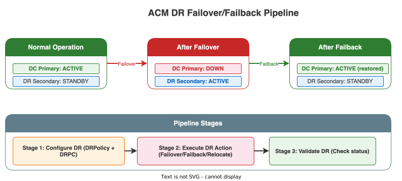
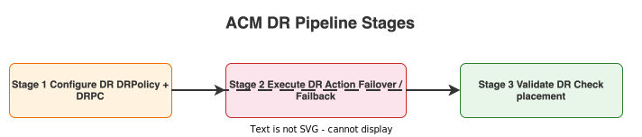
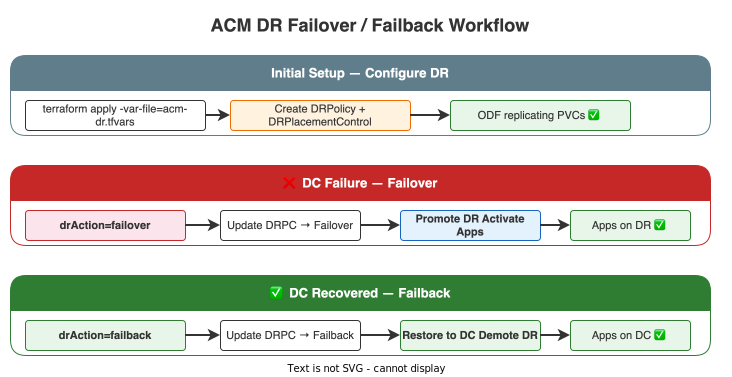

# ACM DR Failover / Failback Pipeline

Dedicated Azure DevOps pipeline for configuring **DRPolicy**, **DRPlacementControl**, and executing **Failover** or **Failback** (Relocate) actions on the ACM Hub using OpenShift DR (ODR).

!!! info "Pipeline Location"
    Source file: `ipi-method/azure-pipelines-acm-dr.yml`

!!! tip "Runs on ACM Hub"
    This pipeline targets the **management cluster** running the ACM Hub. It uses `acm-dr.tfvars` alongside `terraform.tfvars`.

## Overview

ACM DR with OpenShift DR (ODR) provides application-level disaster recovery across clusters. The pipeline supports:

- **Configure** — Create DRPolicy, DRClusters, and DRPlacementControl resources for protected applications
- **Failover** — Move applications from the primary cluster to the DR cluster when the primary is unavailable
- **Failback** — Move applications back to the primary cluster after recovery
- **Relocate** — Planned migration of applications between clusters (both clusters healthy)

{: .drawio-diagram }

???+ note "Draw.io Source: ACM DR Failover/Failback Pipeline"
    [:material-download: Download .drawio file](../diagrams/pipeline/05-acm-dr-pipeline.drawio){ .md-button } — Open in [draw.io](https://app.diagrams.net) for interactive editing.

## Pipeline Parameters

| Parameter | Type | Default | Values | Description |
|-----------|------|---------|--------|-------------|
| `drAction` | string | `none` | `none`, `failover`, `failback`, `relocate` | DR action to execute |
| `acmHub` | string | `mgmt-dc` | `mgmt-dc`, `mgmt-dr` | ACM Hub cluster (DR control plane) |
| `configureDRPolicy` | boolean | `true` | — | Configure DRPolicy + DRPlacementControl (initial setup) |
| `executeDRAction` | boolean | `false` | — | Execute the selected failover/failback action |
| `applicationScope` | string | `all` | `all`, `selected` | Applications to protect or failover |
| `terraformAction` | string | `plan` | `plan`, `apply`, `destroy` | Terraform action to execute |
| `variableGroup` | string | `ocp-baremetal-acm-dr-secrets` | — | ADO Variable Group containing secrets |

## Pipeline Stages

{: .drawio-diagram }

???+ note "Draw.io Source: Acm Dr Stages"
    [:material-download: Download .drawio file](../diagrams/pipeline/22-acm-dr-stages.drawio){ .md-button } — Open in [draw.io](https://app.diagrams.net) for interactive editing.

### Stage 1 — Configure DR

- Creates **DRPolicy** with the specified scheduling interval and cluster pair
- Creates **DRPlacementControl** for each protected application
- Installs the **ODR Hub Operator** if not already present
- Only runs when `configureDRPolicy = true`

### Stage 2 — Execute DR Action

- Triggers the actual **failover**, **failback**, or **relocate** by updating the DRPlacementControl `action` field
- Only runs when `executeDRAction = true` and `drAction != none`
- Always uses `terraform apply` (regardless of `terraformAction`) since DR actions are state changes

### Stage 3 — Validate DR

- Checks `DRPolicy`, `DRClusters`, and `DRPlacementControl` status
- Verifies application placement matches the expected cluster after failover/failback
- Runs after either Configure or Execute stages when `terraformAction = apply`

## Failover vs Failback vs Relocate

| Action | When to Use | Primary Cluster | DR Cluster | Data Sync |
|--------|-------------|-----------------|------------|-----------|
| **Failover** | Primary is **down** or unreachable | Fenced (unavailable) | Promoted to active | Last replicated snapshot |
| **Failback** | Primary **recovered** after failover | Restored, becomes active | Returns to standby | Re-sync from DR → Primary |
| **Relocate** | Planned migration, **both clusters healthy** | Graceful handoff | Takes over workload | Clean sync before switchover |

## Prerequisites

!!! warning "Before running this pipeline"
    1. **Clusters imported into ACM** — Run the [ACM Cluster Import Pipeline](terraform-acm-import-pipeline.md) first
    2. **ODF DR configured** — Ceph RBD mirroring must be active between DC and DR clusters
    3. **Submariner running** — Cross-cluster networking required for metadata sync
    4. **ODR Hub Operator** — The `odr-hub-operator` must be mirrored (included in `mirror_operators`)
    5. **S3 metadata store** — ODR requires S3-compatible storage for DR metadata

## Workflow — Failover / Failback

{: .drawio-diagram }

???+ note "Draw.io Source: Acm Dr Failover Workflow"
    [:material-download: Download .drawio file](../diagrams/pipeline/23-acm-dr-failover-workflow.drawio){ .md-button } — Open in [draw.io](https://app.diagrams.net) for interactive editing.

## Required ADO Variable Group Secrets

| Secret | Description |
|--------|-------------|
| `channel-git-token` | Git token for application channel repository access |

## Usage

```bash
# Step 1: Configure DR (initial setup) — plan first
# Set configureDRPolicy = true, executeDRAction = false, terraformAction = plan

# Step 2: Apply DR configuration
# Set configureDRPolicy = true, executeDRAction = false, terraformAction = apply

# Step 3: Execute failover (DC is down)
# Set configureDRPolicy = false, executeDRAction = true, drAction = failover, terraformAction = apply

# Step 4: Execute failback (DC recovered)
# Set configureDRPolicy = false, executeDRAction = true, drAction = failback, terraformAction = apply

# Planned relocation (both clusters healthy)
# Set configureDRPolicy = false, executeDRAction = true, drAction = relocate, terraformAction = apply
```

!!! note "Terraform State"
    DR state is stored in the management cluster Terraform state (`mgmt-dc/` or `mgmt-dr/`). The `acm_dr_apps` module is conditionally enabled via `enable_acm_dr_apps`.

!!! danger "Failover is a Disruptive Action"
    Failover will fence the primary cluster and activate workloads on the DR cluster. Only execute failover when the primary cluster is confirmed unavailable. Use `relocate` for planned migrations.
