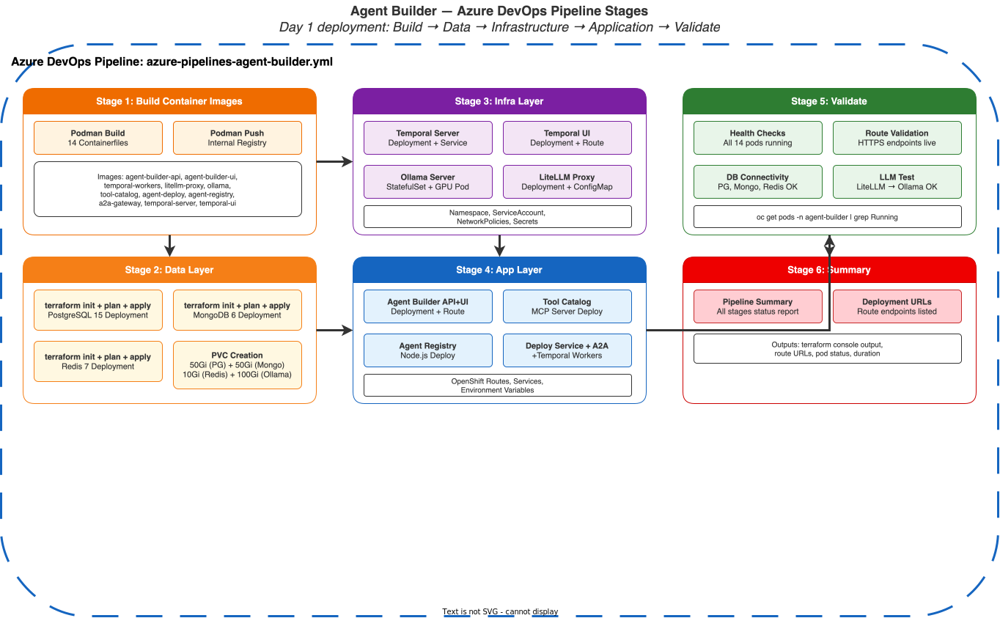

# ADO Pipeline — Agent Builder Factory (Day 1)

This page documents the **Azure DevOps pipeline** for deploying the Agent Builder Factory platform on OpenShift Baremetal.

!!! info "Pipeline File"
    **Source:** `ipi-method/azure-pipelines-agent-builder.yml`
    See also: [Day 2 Operations Pipeline](terraform-agent-builder-pipeline-day2.md) | [Agent Builder Deployment](../clusters/terraform-agent-builder.md)

## Pipeline Overview

{: .drawio-diagram }

???+ note "Draw.io Source: Agent Builder Pipeline"
    [:material-download: Download .drawio file](../diagrams/pipeline/30-agent-builder-pipeline.drawio){ .md-button } — Open in [draw.io](https://app.diagrams.net) for interactive editing.

## Pipeline Parameters

| Parameter | Type | Default | Description |
|-----------|------|---------|-------------|
| `deploymentScope` | string | `full-platform` | Scope: `full-platform` / `data-layer-only` / `app-layer-only` / `ollama-only` / `litellm-only` |
| `terraformAction` | string | `plan` | Action: `plan` / `apply` / `destroy` |
| `enableOllama` | boolean | `true` | Deploy Ollama (in-cluster LLM) |
| `enableLocalLLMLaptop` | boolean | `false` | Configure laptop Ollama connectivity |
| `localLLMLaptopUrl` | string | `http://192.168.1.100:11434` | Laptop Ollama endpoint URL |
| `ollamaModel` | string | `llama3` | Model: `llama3` / `llama3:70b` / `mistral` / `codellama` / `llama3:8b` |
| `ollamaGpuEnabled` | boolean | `false` | Enable NVIDIA GPU for Ollama |
| `imageTag` | string | `latest` | Container image tag for Agent Builder services |
| `targetCluster` | string | `dc-primary` | Target: `dc-primary` / `dr-secondary` |
| `enableOIDC` | boolean | `false` | Enable OIDC authentication |

## Pipeline Stages

### Stage 1: Build & Push Images

Builds container images for all Agent Builder microservices using `podman` and pushes to the Quay mirror registry.

!!! note "Images Built"
    - `agent-builder-api` — FastAPI backend
    - `agent-builder-ui` — React + Vite frontend
    - `temporal-workers` — Python Temporal workers
    - `tool-catalog` — MCP tool server
    - `agent-deployment-service` — OCP build/deploy orchestrator
    - `agent-registry` — Agent metadata registry
    - `a2a-gateway` — Agent-to-Agent gateway

### Stage 2: Deploy Data Layer

Deploys the persistence tier using targeted Terraform apply:

```bash
terraform apply \
  -target=module.namespace \
  -target=module.postgresql \
  -target=module.mongodb \
  -target=module.redis
```

**Condition:** Runs when `deploymentScope` is `full-platform` or `data-layer-only`.

### Stage 3: Deploy Infrastructure (Temporal + LiteLLM + Ollama)

Deploys the orchestration and LLM inference layer:

```bash
terraform apply \
  -target=module.temporal \
  -target=module.ollama \
  -target=module.litellm
```

**Condition:** Runs when `deploymentScope` is `full-platform`, `ollama-only`, or `litellm-only`.

### Stage 4: Deploy Application Services

Deploys all application microservices:

```bash
terraform apply \
  -target=module.temporal_workers \
  -target=module.agent_builder_api \
  -target=module.agent_builder_ui \
  -target=module.tool_catalog \
  -target=module.agent_deployment_service \
  -target=module.agent_registry \
  -target=module.a2a_gateway
```

**Condition:** Runs when `deploymentScope` is `full-platform` or `app-layer-only` and `terraformAction` is `apply`.

### Stage 5: Validate Platform Health

Post-deployment health checks via SSH to bastion:

```bash
oc get pods -n agent-builder
oc get routes -n agent-builder
oc get pvc -n agent-builder
```

### Stage 6: Pipeline Summary

Outputs deployment summary including action, scope, cluster, image tag, and LLM configuration.

## ADO Variable Group

The pipeline uses the `agent-builder-secrets` variable group:

| Secret | Description |
|--------|-------------|
| `postgres-password` | PostgreSQL admin password |
| `mongodb-root-password` | MongoDB root password |
| `redis-password` | Redis authentication password |
| `litellm-master-key` | LiteLLM proxy master API key |
| `anthropic-api-key` | Anthropic API key (Claude models) |
| `azure-openai-key` | Azure OpenAI deployment key |
| `openai-api-key` | OpenAI direct API key |
| `github-token` | GitHub token (agent builds) |

## Execution Environment

| Setting | Value |
|---------|-------|
| **Pool** | `self-hosted-linux` |
| **Agent** | Bastion node with SSH access |
| **Tools** | Terraform >= 1.5.0, oc CLI, podman |
| **Working Directory** | `ipi-method/agent-builder/` |
| **Pattern** | `null_resource` + SSH `remote-exec` |

## Prerequisites

Before running this pipeline, ensure:

| Prerequisite | Details |
|--------------|---------|
| **ADO Variable Group** | `agent-builder-secrets` created with all secrets (see table below) |
| **ADO Agent Pool** | `self-hosted-linux` pool with bastion node registered |
| **Bastion Tools** | Terraform >= 1.5.0, `oc` CLI (authenticated), `podman`, SSH keys |
| **OCP Access** | `oc login` with `cluster-admin` on target cluster from ADO agent |
| **ODF Storage** | `ocs-storagecluster-ceph-rbd` StorageClass with >= 210Gi available |
| **Container Images** | All images accessible or mirrored (see [Agent Builder Deployment](../clusters/terraform-agent-builder.md#container-image-requirements)) |
| **LLM API Keys** | At least one LLM provider key (Anthropic, Azure OpenAI, or OpenAI) |
| **Network** | Outbound HTTPS to LLM API endpoints from cluster |
| **GPU Operator** | Installed if `ollamaGpuEnabled` is `true` |
| **Quay Registry** | Accessible for pushing Agent Builder container images |

!!! warning "First Run"
    On first deployment, use `deploymentScope: full-platform` and `terraformAction: plan` to review the plan before applying.

## Related Pages

- [Agent Builder Deployment](../clusters/terraform-agent-builder.md)
- [Day 2 Operations Pipeline](terraform-agent-builder-pipeline-day2.md)
- [ADO Pipeline (IPI — Day 1)](terraform-ado-pipeline.md)
