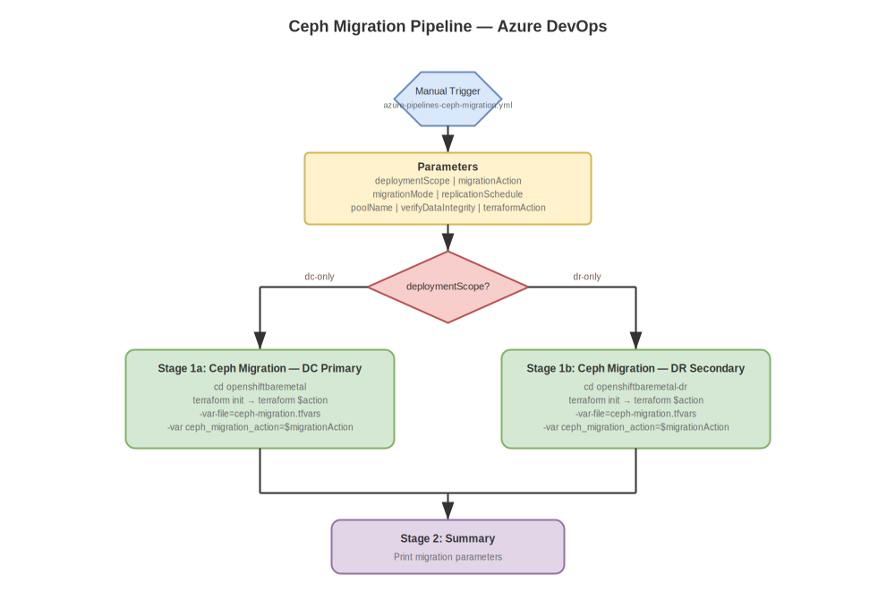
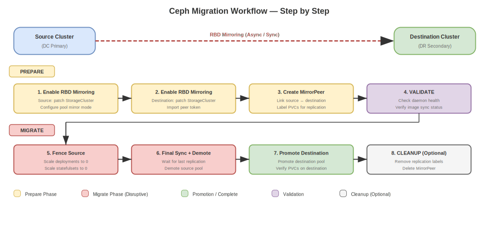

# Ceph Migration Pipeline

Dedicated Azure DevOps pipeline for migrating **Ceph/ODF storage data** (RBD images, CephFS volumes) between OpenShift clusters or datacenters using **Rook-Ceph RBD mirroring** with snapshot-based replication.

!!! info "Pipeline Locations"
    - IPI: `ipi-method/azure-pipelines-ceph-migration.yml`
    - UPI: `upi-method/azure-pipelines-ceph-migration.yml`

!!! warning "Prerequisites"
    1. **ODF installed** on both source and destination clusters
    2. **Submariner** configured for cross-cluster networking
    3. **S3-compatible storage** available for migration metadata
    4. **Bastion access** to both source and destination clusters

## Overview

Ceph Migration automates the process of moving persistent storage data between OpenShift clusters using Rook-Ceph RBD mirroring. The pipeline supports:

1. **Prepare** — Enable RBD mirroring, create MirrorPeer, and label PVCs for replication
2. **Migrate** — Fence source workloads, wait for final sync, and promote destination
3. **Validate** — Check mirroring health, replication status, and data integrity
4. **Cleanup** — Remove mirroring configuration and MirrorPeer from source

{: .drawio-diagram }

???+ note "Draw.io Source: Ceph Migration Pipeline"
    [:material-download: Download .drawio file](../diagrams/pipeline/28-ceph-migration-pipeline.drawio){ .md-button } — Open in [draw.io](https://app.diagrams.net) for interactive editing.

## Pipeline Parameters

| Parameter | Type | Default | Values | Description |
|-----------|------|---------|--------|-------------|
| `deploymentScope` | string | `dc-only` | `dc-only`, `dr-only` | Source cluster to migrate FROM |
| `migrationAction` | string | `prepare` | `prepare`, `migrate`, `validate`, `cleanup` | Migration action to execute |
| `migrationMode` | string | `async` | `async`, `sync` | Replication mode |
| `replicationSchedule` | string | `*/5 * * * *` | cron expression | Snapshot interval (async only) |
| `poolName` | string | `ocs-storagecluster-cephblockpool` | — | Ceph block pool name |
| `verifyDataIntegrity` | boolean | `true` | — | Verify data after migration |
| `terraformAction` | string | `plan` | `plan`, `apply`, `destroy` | Terraform action |
| `variableGroup` | string | `ocp-ceph-migration-secrets` | — | ADO Variable Group |

## Pipeline Stages

{: .drawio-diagram }

???+ note "Draw.io Source: Ceph Migration Workflow"
    [:material-download: Download .drawio file](../diagrams/pipeline/29-ceph-migration-workflow.drawio){ .md-button } — Open in [draw.io](https://app.diagrams.net) for interactive editing.

### Stage 1 — Ceph Migration (DC Primary or DR Secondary)

Executes the selected migration action on the chosen cluster:

- **Prepare**: Enables RBD mirroring on both clusters, creates MirrorPeer, labels PVCs
- **Migrate**: Scales down source workloads, waits for final sync, promotes destination
- **Validate**: Checks pool mirroring status, daemon health, image replication state
- **Cleanup**: Removes mirroring labels, disables mirroring, deletes MirrorPeer

### Stage 2 — Summary

Prints deployment summary with all parameter values.

## Migration Workflow

### Step-by-Step Migration Process

```
┌─────────────────────────────────────────────────────────┐
│ Step 1: PREPARE (run once)                              │
│   - Enable RBD mirroring on source cluster              │
│   - Enable RBD mirroring on destination cluster         │
│   - Create MirrorPeer between clusters                  │
│   - Label PVCs for replication in selected namespaces   │
│   - Wait for initial sync to complete                   │
├─────────────────────────────────────────────────────────┤
│ Step 2: VALIDATE (run periodically)                     │
│   - Check daemon health on both clusters                │
│   - Verify image replication status                     │
│   - Ensure all PVCs are in sync                         │
├─────────────────────────────────────────────────────────┤
│ Step 3: MIGRATE (cutover — run once)                    │
│   - Fence source workloads (scale to 0)                 │
│   - Wait for final replication sync                     │
│   - Demote source pool                                  │
│   - Promote destination pool                            │
│   - Verify namespaces and PVCs on destination           │
├─────────────────────────────────────────────────────────┤
│ Step 4: CLEANUP (optional — run after verification)     │
│   - Remove replication labels from source PVCs          │
│   - Disable RBD mirroring on source pool                │
│   - Delete MirrorPeer resource                          │
└─────────────────────────────────────────────────────────┘
```

## Async vs Sync Migration

| Mode | Use Case | Data Loss Risk | Performance Impact | Requirement |
|------|----------|---------------|-------------------|-------------|
| **Async** | Cross-datacenter (high latency) | RPO = snapshot interval | Low | S3 metadata store |
| **Sync** | Same-site / metro distance | Zero RPO | Higher | Low-latency network (<10ms RTT) |

## Required ADO Variable Group Secrets

| Secret | Description |
|--------|-------------|
| `ceph-s3-access-key` | S3 access key for Ceph migration metadata store |
| `ceph-s3-secret-key` | S3 secret key for Ceph migration metadata store |

## Terraform Var Files

| File | Purpose |
|------|---------|
| `terraform.tfvars` | Base cluster configuration |
| `ceph-migration.tfvars` | Ceph migration source/destination, namespaces, and options |

## Usage

```bash
# Step 1: Prepare mirroring (initial setup) — plan first
# Set migrationAction=prepare, terraformAction=plan

# Step 2: Apply preparation
# Set migrationAction=prepare, terraformAction=apply

# Step 3: Validate replication is healthy
# Set migrationAction=validate, terraformAction=apply

# Step 4: Execute cutover migration
# Set migrationAction=migrate, terraformAction=apply

# Step 5: Verify and cleanup source
# Set migrationAction=cleanup, terraformAction=apply
```

!!! danger "Migration is a Disruptive Action"
    The `migrate` action will scale down all workloads in the selected namespaces on the source cluster. Ensure replication is fully synced before executing the cutover. Use `validate` to verify sync status first.

!!! note "Terraform State"
    Migration state is stored in the cluster Terraform state (`openshiftbaremetal/` or `openshiftbaremetal-dr/`). The `ceph_migration` module is conditionally enabled via `enable_ceph_migration`.
