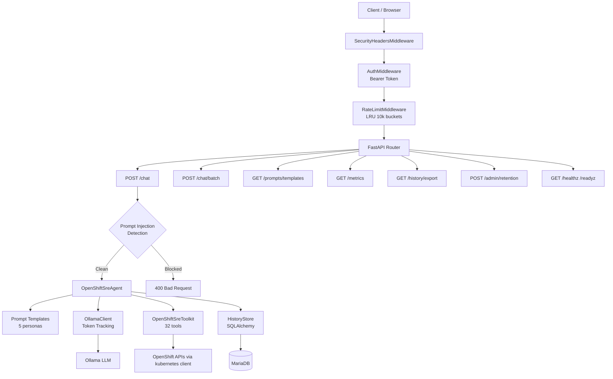
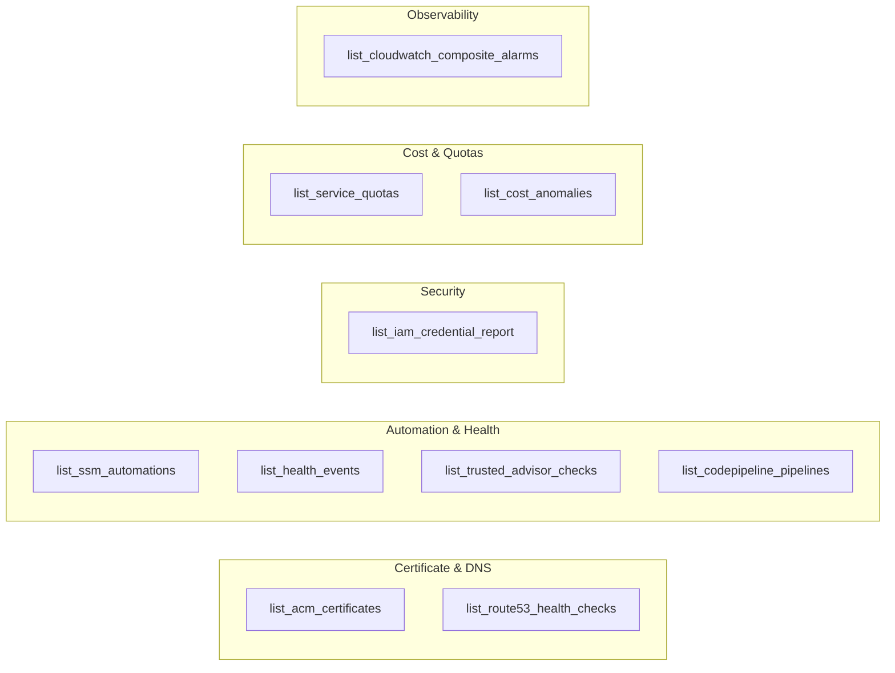
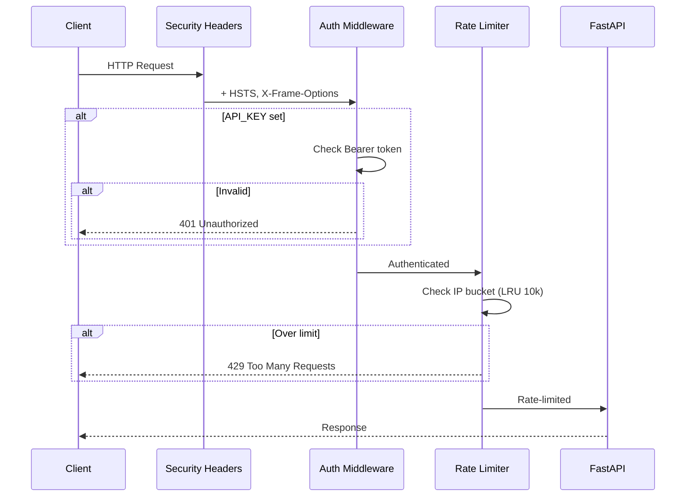
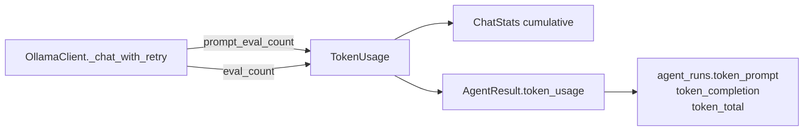

# v0.3.0 Architecture Diagram

## Request pipeline

```mermaid
graph TD
    Client[Client / Browser] --> SH[SecurityHeadersMiddleware]
    SH --> Auth[AuthMiddleware<br/>Bearer Token]
    Auth --> RL[RateLimitMiddleware<br/>LRU 10k buckets]
    RL --> API[FastAPI Router]
    
    API --> Chat[POST /chat]
    API --> Batch[POST /chat/batch]
    API --> Templates[GET /prompts/templates]
    API --> Metrics[GET /metrics]
    API --> Export[GET /history/export]
    API --> Retention[POST /admin/retention]
    API --> Health[GET /healthz /readyz]
    
    Chat --> PIDetect{Prompt Injection<br/>Detection}
    PIDetect -->|Clean| Agent[OpenShiftSreAgent]
    PIDetect -->|Blocked| Reject[400 Bad Request]
    
    Agent --> Prompts[Prompt Templates<br/>5 personas]
    Agent --> ModelClient[OllamaClient<br/>Token Tracking]
    Agent --> Toolkit[OpenShiftSreToolkit<br/>32 tools]
    
    ModelClient --> Ollama[Ollama LLM]
    Toolkit --> OCP[OpenShift APIs via kubernetes client]
    
    Agent --> Persist[HistoryStore<br/>SQLAlchemy]
    Persist --> DB[(MariaDB)]
```

## New platform tools (v0.3.0)

```mermaid
graph LR
    subgraph "Certificate & DNS"
        ACM[list_acm_certificates]
        R53[list_route53_health_checks]
    end
    subgraph "Automation & Health"
        SSM[list_ssm_automations]
        Health[list_health_events]
        TA[list_trusted_advisor_checks]
        CP[list_codepipeline_pipelines]
    end
    subgraph "Security"
        IAM[list_iam_credential_report]
    end
    subgraph "Cost & Quotas"
        SQ[list_service_quotas]
        CA[list_cost_anomalies]
    end
    subgraph "Observability"
        CW[list_cloudwatch_composite_alarms]
    end
```

## Middleware stack

```mermaid
sequenceDiagram
    participant C as Client
    participant SH as Security Headers
    participant A as Auth Middleware
    participant RL as Rate Limiter
    participant F as FastAPI
    
    C->>SH: HTTP Request
    SH->>A: + HSTS, X-Frame-Options
    alt API_KEY set
        A->>A: Check Bearer token
        alt Invalid
            A-->>C: 401 Unauthorized
        end
    end
    A->>RL: Authenticated
    RL->>RL: Check IP bucket (LRU 10k)
    alt Over limit
        RL-->>C: 429 Too Many Requests
    end
    RL->>F: Rate-limited
    F-->>C: Response
```

## Token tracking flow

```mermaid
graph LR
    OC[OllamaClient._chat_with_retry] -->|prompt_eval_count| TU[TokenUsage]
    OC -->|eval_count| TU
    TU --> CS[ChatStats cumulative]
    TU --> AR[AgentResult.token_usage]
    AR --> DB[agent_runs.token_prompt<br/>token_completion<br/>token_total]
```
