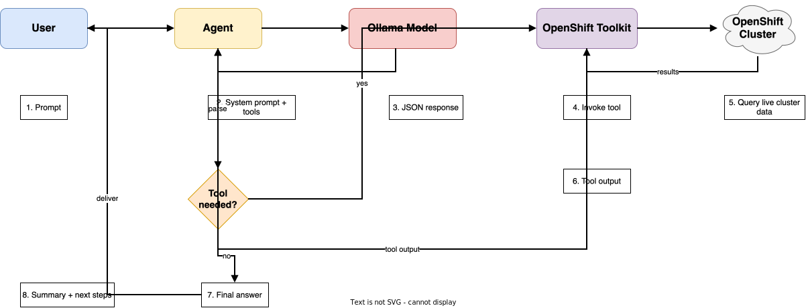
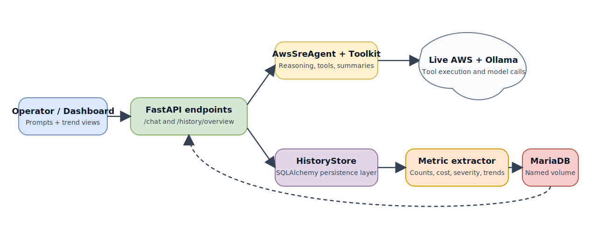

# Architecture

## Component breakdown

### `config.py`

Loads environment variables from `.env` and centralizes runtime settings such as the active LLM provider, Ollama endpoint, external-provider endpoint and credentials, OpenShift cluster, kubeconfig, project scope, and step limit.

### `model_client.py`

Contains the provider-aware `ModelClient` class.

Responsibilities:

- send a normalized chat payload to the configured provider
- adapt provider-specific request formats for Ollama, OpenAI-compatible APIs, Azure OpenAI, Anthropic, and Gemini
- normalize provider-specific usage fields into a shared token model
- apply retry, circuit-breaker, and fallback-model behavior consistently across providers

`OllamaClient` still exists as a compatibility alias, but the architecture is no longer Ollama-only.

### `prompts.py`

Defines the system prompt that makes the model behave like a cautious OpenShift SRE assistant. The model is instructed to return a strict JSON envelope so the agent can reliably decide what to do next.

### `agent.py`

Implements the main reasoning loop.

Responsibilities:

- send the operator question plus tool manifest to the local model
- parse the JSON envelope from the model
- call a tool when requested
- feed tool output back into the model
- stop with a final operational answer once enough evidence is available

### `tools.py`

Contains the OpenShift operational toolkit.

The toolkit uses the Python Kubernetes client for common control-plane access and offers a restricted fallback for read-only `oc` CLI commands when a direct helper is not yet present.

It spans multiple OpenShift domains:

- cluster core: identity, projects, cluster version, cluster operators, nodes, node pressure
- workloads and traffic: pods, workload health, services, routes, ingresses, events
- storage and quotas: PVs, PVCs, storage classes, resource quotas
- platform lifecycle: machine config pools, machine sets, OLM subscriptions, ClusterServiceVersions, builds, image streams
- security posture: SCCs, network policies, route exposure, and related platform signals

### `architect.py`

Contains the OpenShift architecture generator used by the browser-based Architect Workspace.

Responsibilities:

- detect the intended OpenShift design pattern from the operator prompt and any live cluster-state hints
- normalize prompts against a senior-architect baseline grounded in OpenShift 4.20+, ACM 2.14+, and OpenShift GitOps 1.18+
- generate multi-page draw.io architecture packs, page previews, and matching HLD / LLD / assessment document structures
- shape diagrams differently for platform-specific and portfolio-derived patterns instead of reusing a single generic topology
- add pattern-specific appendix and matrix content so the LLD captures operationally relevant ownership, access, and recovery detail

The architect engine now covers both repository-native platform patterns and Red Hat Architecture Center-inspired patterns.

Examples include:

- ROSA, ARO, OpenStack, IBM Z / LinuxONE, disconnected, GitOps, DR, virtualization, and migration factory patterns
- external authentication with separate ROSA HCP, ARO HCP, and self-managed enablement paths
- SAP clean core on ROSA
- cloud sovereignty and digital-sovereignty control planes
- cloud-native application delivery and promotion lanes
- telco 5G core and supplementary CNF services
- event-driven automation with broker, task-store, and execution-results feedback chains
- Model as a Service and AI self-service platform-engineering flows

### `persistence.py`

Adds the historical storage layer.

Responsibilities:

- initialize the SQLAlchemy engine for a MySQL-compatible database
- store each prompt, answer, reasoning step, and tool result
- extract trend-friendly metrics from tool output such as counts and posture summaries
- serve aggregated history back to the dashboard through `/history/overview`
- compute duration percentiles and comparison summaries for the selected dashboard window
- surface executive exception rollups from failures, latency spread, and hotspot cohorts
- serve drilldown payloads for `/history/runs/{run_id}`, `/history/tools/{tool_name}`, and `/history/metrics/{metric_key}`
- persist queue-style approval records used by the browser workflows

### Browser operator layer

The repository has a browser operator layer on top of the FastAPI and persistence stack.

That layer is composed of:

- `ui/src/app-shell.jsx` for shared React framing
- `docs/history.html`, `docs/console.html`, `docs/troubleshooting.html`, `docs/llm-utilization.html`, and `docs/tool-drilldown.html` for page structure
- `docs/assets/javascripts/*.js` for page-specific live behavior
- `docs/assets/stylesheets/agent-console.css` for the shared visual system

This layer is responsible for turning backend payloads into:

- operator workflows
- troubleshooting playbooks
- historical analytics
- executive-style dashboard summaries
- review-export presets and safe preview states when APIs are unavailable

### `safety.py`

Provides the safety policy for shell execution and CLI command validation.

It blocks:

- shell chaining operators such as `&&`
- redirection such as `>`
- multi-line commands
- mutating `oc` verbs such as `apply`, `delete`, `patch`, or `rollout restart`

### `api.py`

Exposes the agent through FastAPI with the following endpoints:

- `GET /health` — simple health check
- `GET /healthz` — liveness probe
- `GET /readyz` — readiness probe (checks the configured LLM provider + DB)
- `GET /llm/providers` — provider catalog for the UI
- `POST /chat` — synchronous agent invocation
- `POST /chat/stream` — SSE streaming agent invocation
- `WebSocket /ws/events` — live run-completion push events
- `POST /settings/refresh` — reload env-based configuration at runtime
- `GET /history/overview` — paginated/filtered run analytics
- `GET /history/runs/{run_id}`
- `GET /history/tools/{tool_name}`
- `GET /history/metrics/{metric_key}`
- `GET /ollama/utilization` — local Ollama process/model snapshot
- architect endpoints for template lookup, prompt clarification, knowledge training/search, state collection, assessment, and multi-page diagram generation
- queue, watchlist, investigation, comparison, export, and admin retention endpoints

The API mounts the generated MkDocs site at `/guide` so the documentation and browser console are served from the same container.

It also provides multiple redirect aliases for the architect page so the same workspace can be reached when the app is mounted directly or under a nested documentation path:

- `/architect.html`
- `/openshift-sre/architect.html`
- `/terraform-iac/openshift-sre/architect.html`

### `cli.py`

Provides terminal commands:

- `ask`: run the agent locally for a single prompt
- `serve`: start the API server on port `8000`

## Control-flow diagram

[Open the editable draw.io source](assets/diagrams/control-flow.drawio)

## Historical metrics pipeline

[Open the editable draw.io source](assets/diagrams/history-pipeline.drawio)

## Why a JSON envelope?

The JSON response contract makes tool calling deterministic enough for a lightweight local agent. Without that structure, local models can drift into free-form prose and become harder to automate safely.
