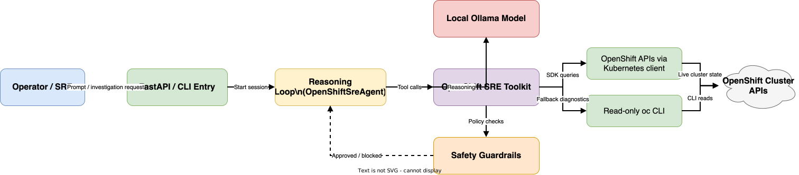
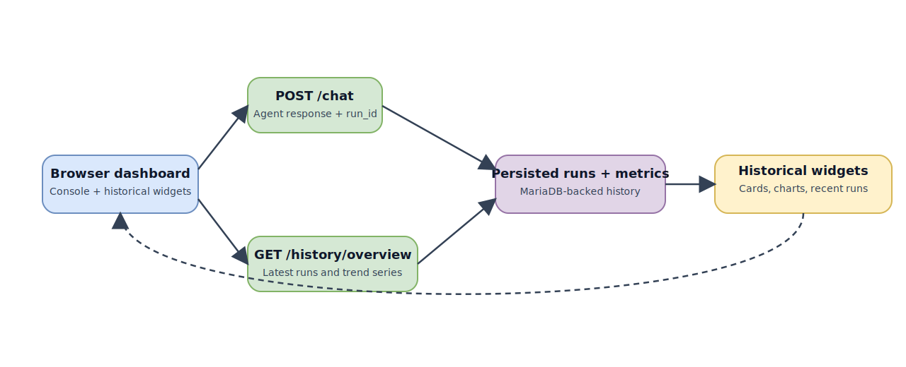

# OpenShift SRE Local Agent

This project provides a **local-model AI agent** for **Red Hat OpenShift Site Reliability Engineering** workflows.

It uses a local reasoning model through **Ollama**, then selectively calls guarded OpenShift and Kubernetes inspection tools to investigate operational questions.

## What the agent can do

- inspect cluster identity, current kube context, and default project scope
- inspect OpenShift projects, cluster version, cluster operators, and node posture
- inspect pod restarts, pending pods, warning events, and workload rollout health
- inspect services, routes, ingresses, and delivery exposure posture
- inspect persistent storage, storage classes, and quota pressure
- inspect machine config pools, machine sets, operator subscriptions, and ClusterServiceVersions
- inspect security context constraints, network policies, and project isolation posture
- inspect image streams and build health
- run validated **read-only** `oc` CLI commands for uncommon troubleshooting cases

See [`Service Coverage`](service-coverage.md) for the full domain-by-domain list.

If you want to understand platform impact before running a prompt, see [`Platform Impact Notes`](cost-impact.md) for a per-tool impact label.

If you want a dedicated scenario-driven troubleshooting experience, open [`Troubleshooting Console`](troubleshooting.html) for an agent page that keeps common OpenShift troubleshooting scenarios in a dropdown and lets you run them directly.

If you want a dedicated audit and platform-security workspace with compliance profiles plus OpenShift security-control selection, open [`Security Console`](security-console.html). It includes the same connection and credentials controls as the main console, so you can choose the Ollama endpoint/model and pass request-scoped cluster runtime overrides without leaving the security workflow.

If you want to turn an Architect design into reusable or newly generated OpenShift delivery pipelines, open [`OpenShift Builder`](openshift-builder.html). It is listed in the shared console shell alongside Architect, Platform, Security, FinOps, History, and the other operator workspaces.

If you want to inspect the **currently loaded Ollama model** and its live VRAM/context/runtime visibility, open [`LLM Utilization`](llm-utilization.html). The historical dashboard also links to this page and shows a compact live summary.

If you want a dedicated planned-operations workspace for **upgrade preflight scoring**, **SLO / error-budget posture**, **operator upgrade blast-radius mapping**, and **alert-to-runbook correlation**, use the Platform Console lane inside the SRE UI. It complements troubleshooting and security by focusing on structured pre-change reviews and owner-ready handoffs.

## Design goals

- **local reasoning**: keep model execution on your machine
- **safe operations**: default to read-only OpenShift and Kubernetes actions
- **SRE focused**: optimize for diagnosis, triage, and clear recommendations
- **container friendly**: run the API in Podman on port `8000`
- **history aware**: store investigations, steps, metrics, and queue records in a local database when enabled

## Typical workflow

1. Operator asks a question.
2. The local model decides whether a tool is needed.
3. OpenShift data is fetched through a controlled tool.
4. The API persists the run, steps, and extracted summary metrics into the historical store.
5. The dashboard refreshes cards, tables, and trend charts from the persisted history API.

## Source code walkthrough

The full project source is documented directly in MkDocs with explanations:

- [`Core Python Files`](code-core.md)
- [`Service & API Files`](code-services.md)
- [`Runtime, Docs, and Tests`](code-runtime.md)
- [`Function Reference`](function-reference.md)
- [`API reference`](api-reference.md)
- [`FinOps queue API and UI flow`](finops-queue-flow.md)

Those pages cover:

- all modules in `src/openshift_sre_agent/`
- the HTTP endpoint contracts and example payloads
- the persisted queue and history lifecycle
- the main public functions and important internal helpers used across the agent runtime

For operator workflows and service-specific runbooks, see:

- [`Audit & Security`](playbook-audit-security.md)
- [`Advanced Security & Governance`](playbook-advanced-security-governance.md)
- [`Capacity & Optimization`](playbook-finops.md)
- [`Platform & Automation`](playbook-platform-automation.md)
- [`Storage & Governance`](playbook-storage-governance.md)

## Supported infrastructure platforms

This SRE agent is designed to operate across the full multi-cluster OpenShift estate managed by this repository:

| Platform | Deployment Method | Location |
| -------- | ----------------- | -------- |
| **Bare-metal IPI** | Installer-Provisioned Infrastructure | `ipi-method/` |
| **Bare-metal UPI** | User-Provisioned Infrastructure | `upi-method/` |
| **AWS ROSA** | Red Hat OpenShift on AWS (managed) | `aws-rosa/` |
| **Azure ARO** | Azure Red Hat OpenShift (managed) | `azure-aro/` |
| **IBM Z** | OpenShift on IBM Z/LinuxONE | `ibm-z/` |

The agent connects to any of these clusters via `KUBECONFIG` or explicit API URL + token and performs the same read-only operational investigations regardless of the underlying infrastructure provider.

## System overview diagram

[Open the editable draw.io source](assets/diagrams/agent-overview.drawio)

## Historical dashboard flow

[Open the editable draw.io source](assets/diagrams/dashboard-refresh.drawio)
