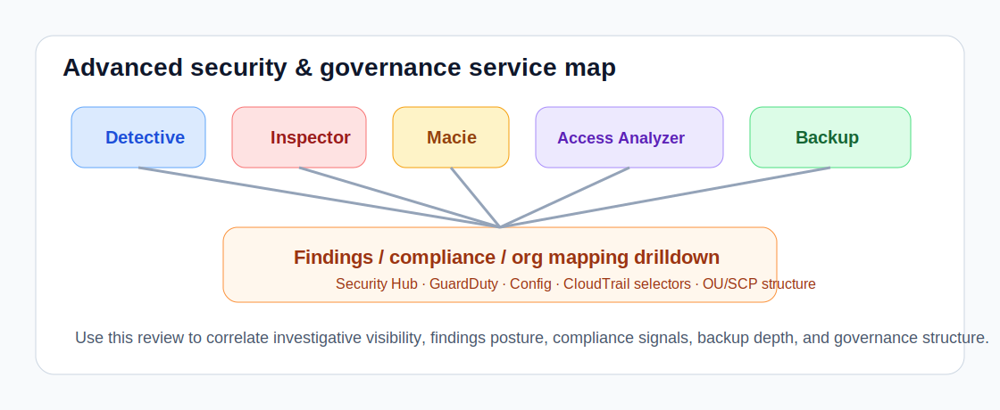

# Advanced Security & Governance Playbook

This playbook covers the deeper posture services that help answer:

- **Can we investigate suspicious behavior effectively?**
- **Do we have vulnerability and data-security visibility?**
- **Can we spot risky external access paths?**
- **Do backup depth and org structure match policy expectations?**

## Detective

Use: `list_detective_graphs`

What to look for:

- no graph in an environment where investigation tooling is expected
- inconsistent graph coverage across regions/accounts

Suggested prompts:

- `Summarize Detective graph coverage and whether investigative visibility looks incomplete.`

## GuardDuty findings

Use:

- `list_guardduty_detectors`
- `list_guardduty_findings`

What to look for:

- recurring higher-severity findings on similar resource classes
- findings without an obvious owner or containment path
- detector coverage present but no meaningful findings visibility workflow

Suggested prompts:

- `Summarize GuardDuty findings by severity and likely resource blast radius.`

## Inspector

Use: `list_inspector_findings`

What to look for:

- severe findings clustering in one resource type
- many active findings without obvious ownership
- high-severity sample findings on public-facing workloads

Suggested prompts:

- `Review sampled Inspector findings and summarize the most urgent exposure themes.`

## Macie

Use: `list_macie_posture`

What to look for:

- Macie not enabled where S3 data sensitivity review is expected
- no active job footprint in data-heavy environments
- stale classification-job posture

Suggested prompts:

- `Inspect Macie session posture and summarize data-security coverage gaps.`

## IAM Access Analyzer

Use: `list_access_analyzers`

What to look for:

- no analyzers where external-sharing review is expected
- analyzers not active
- analyzer types inconsistent with governance design

Suggested prompts:

- `Review IAM Access Analyzer coverage and summarize external-access visibility gaps.`

## KMS key posture

Use: `list_kms_keys`

What to look for:

- customer-managed keys without rotation
- keys with unclear aliases or ownership
- keys not in an enabled state when they should be active

Suggested prompts:

- `Review KMS key posture and summarize key-management risks.`

## Security Hub findings

Use:

- `list_securityhub_standards`
- `list_securityhub_findings`

What to look for:

- recurring critical/high findings across the same product or resource type
- stale workflow states
- findings volume that does not match the enabled standards footprint

Suggested prompts:

- `Review Security Hub findings and summarize the most urgent cross-service posture issues.`

## AWS Config compliance summary

Use:

- `list_config_rules`
- `list_config_compliance_summary`

What to look for:

- non-compliant rule concentrations
- rules with unknown or insufficiently updated status
- rule state and compliance status drifting apart

Suggested prompts:

- `Summarize AWS Config compliance by rule and highlight the most important non-compliant controls.`

## CloudTrail event selectors

Use:

- `list_cloudtrail_trails`
- `list_cloudtrail_event_selectors`

What to look for:

- trails with no data-event coverage where it is expected
- management events enabled but write visibility incomplete
- inconsistent selector posture across trails

Suggested prompts:

- `Inspect CloudTrail event selectors and summarize data-event coverage gaps.`

## Backup recovery-point depth

Use:

- `list_backup_recovery_points`
- `list_backup_plan_vault_mappings`

What to look for:

- vaults with zero or suspiciously low recovery-point counts
- stale latest recovery-point timestamps
- vault lock posture missing where expected

Suggested prompts:

- `Inspect backup recovery-point posture and identify weak coverage areas.`
- `Review backup plan-to-vault mappings and summarize schedule or vault-target inconsistencies.`

## Organizations structure and SCP inventory

Use:

- `list_organization_structure`
- `list_organization_account_mappings`

What to look for:

- missing top-level OUs in known environments
- surprisingly high or low SCP inventory
- roots and policy types not matching governance design

Suggested prompts:

- `Summarize Organizations structure, top-level OUs, and SCP inventory for governance drift.`
- `Inspect account-to-OU mappings and summarize suspicious placement or ownership drift.`

## Combined workflow

Suggested prompt:

- `Summarize Detective, Inspector, Macie, Access Analyzer, backup recovery-point posture, and Organizations structure into one governance review.`
- `Summarize GuardDuty findings, Security Hub findings, Config compliance counts, CloudTrail selectors, backup mappings, and account-to-OU placement into one governance drilldown.`

Operator actions:

1. confirm the security detective/assessment services are enabled where expected
2. review sampled Inspector severity distribution
3. verify Macie and Access Analyzer presence in sensitive environments
4. compare backup depth with stated recovery expectations
5. compare OU and SCP structure with intended landing-zone design
6. compare findings volume and compliance posture with the expected security operating model
