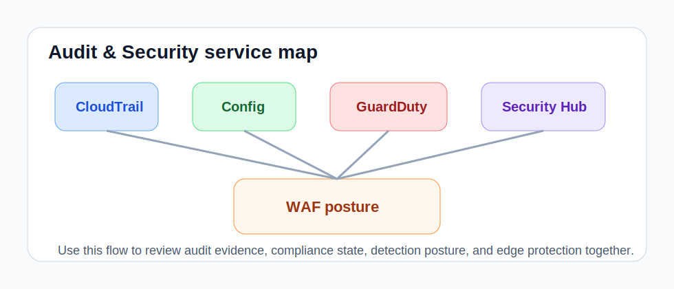

# Audit & Security Playbook



This playbook covers the services that help an operator answer:

- **Are we collecting enough audit evidence?**
- **Are compliance recorders/rules healthy?**
- **Are detection services enabled where we expect them?**
- **Is edge protection present?**

For deeper vulnerability, data-security, and org-governance review, continue into the [`Advanced Security & Governance`](playbook-advanced-security-governance.md) playbook.

## Security Console workflow

If you prefer a guided UI instead of typing every prompt manually, use the dedicated [`Security Console`](security-console.html).

That page now gives you:

- audit-profile launchers for SOX and related frameworks
- a multi-select for AWS security and governance controls
- the same **Connection & credentials** panel used in the FinOps console
- export actions for CSV, PowerPoint, PDF, and Word-compatible security handoff packs

The important implementation detail is that the page sends request-scoped runtime overrides directly to `/chat`, so an operator can change model or AWS credential context for a single review without changing the global container environment.

Example runtime shape used by the UI:

```json
{
  "runtime": {
    "aws_region": "us-east-1",
    "local_model_name": "gpt-oss:20b",
    "ollama_base_url": "http://host.containers.internal:11434",
    "aws_profile": "default",
    "aws_verify_ssl": true
  }
}
```

Use this when you want the browser workflow to mirror the same runtime flexibility already available in the FinOps workspace.

## CloudTrail

Use: `list_cloudtrail_trails`

What to look for:

- no active trail
- no multi-region trail
- log file validation disabled
- logging stopped unexpectedly

Suggested prompts:

- `Inspect CloudTrail trails and summarize any gaps in audit logging posture.`
- `Check whether CloudTrail is logging across regions and whether validation is enabled.`

Operator actions:

1. confirm at least one expected trail exists
2. check `is_logging`
3. verify `is_multi_region_trail`
4. confirm central S3 destination is expected

## AWS Config

Use: `list_config_rules`

What to look for:

- recorder not running
- rules in unexpected states
- no recorder in an account/region that should be monitored

Suggested prompts:

- `Review AWS Config recorders and rules for compliance drift.`
- `Tell me whether Config is recording properly in this region.`

Operator actions:

1. inspect recorder `recording` status
2. review rule inventory and scope coverage
3. note whether the recorder is tracking all supported resource types

## GuardDuty

Use: `list_guardduty_detectors`

What to look for:

- no detector present
- detector disabled
- suspicious feature count mismatch across regions/accounts

Suggested prompts:

- `Inspect GuardDuty detector posture and summarize missing coverage.`

Operator actions:

1. confirm detector exists
2. verify detector `status`
3. compare posture across environments if multi-account

## Security Hub

Use: `list_securityhub_standards`

What to look for:

- hub not enabled
- standards missing or disabled
- unexpected standards status

Suggested prompts:

- `Review Security Hub and enabled standards for security posture drift.`

Operator actions:

1. confirm hub exists
2. inspect enabled standards count
3. flag disabled or unhealthy subscriptions

## WAF

Use: `list_waf_web_acls`

What to look for:

- missing regional or CloudFront web ACLs
- ACLs present but not aligned to expected protection layers

Suggested prompts:

- `Inspect WAF coverage for regional and CloudFront scopes.`
- `Tell me whether our ALB/NLB edge protection posture looks incomplete.`

Operator actions:

1. review regional ACL count
2. review CloudFront ACL count
3. compare expected protected surfaces against actual ACL inventory
