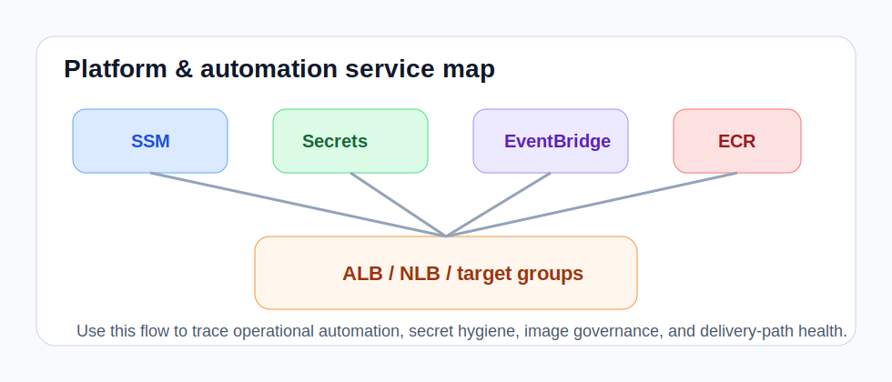

# Platform & Automation Playbook

This playbook covers the OpenShift platform services used to understand lifecycle automation, delivery posture, machine management, virtualization, and day-2 operating readiness.

It also serves as the primary runbook destination for the Platform Console lanes that now cover **upgrade preflight scoring**, **operator upgrade blast-radius mapping**, and parts of **alert-to-runbook correlation**.

## Upgrade preflight scoring

Use:

- `list_cluster_version`
- `list_cluster_operators`
- `list_machine_config_pools`
- `list_machine_sets`
- `list_monitoring_alert_posture`
- `list_pod_disruption_budgets`

What to look for:

- upgradeable posture that looks technically allowed but operationally unsafe
- degraded operators, paused pools, or disruption constraints that would elongate or derail the window
- monitoring gaps that make the change hard to observe safely

Suggested prompts:

- `Calculate an upgrade preflight score and explain whether the next OpenShift upgrade should be go, hold, or no-go.`

## Operator upgrade blast-radius mapping

Use:

- `list_cluster_operators`
- `list_operator_subscriptions`
- `list_cluster_service_versions`
- `list_operator_extension_readiness`
- `list_api_service_health`
- `list_admission_webhook_configurations`

What to look for:

- operators whose degradation would spread across auth, ingress, workload rollout, storage, or fleet governance
- extension APIs or webhooks that turn a localized issue into a platform-wide upgrade problem
- sequencing mistakes that increase dependency risk during a maintenance window

Suggested prompts:

- `Map operator upgrade blast radius and explain which platform domains are most exposed if current operator issues worsen.`

## Cluster infrastructure and platform pattern

Use: `list_cluster_infrastructure`

What to look for:

- platform type resolving differently than expected for ROSA, ARO, baremetal, or IBM Z clusters
- infrastructure signals that explain why lifecycle or delivery workflows behave differently across clusters
- cluster identity or topology drift before broader automation analysis

Suggested prompts:

- `Inspect cluster infrastructure posture and summarize platform-pattern drift.`

## Machine config pools

Use: `list_machine_config_pools`

What to look for:

- pools stuck updating, degraded, or paused unexpectedly
- machine config rollout drift affecting upgrade readiness
- worker configuration differences that explain inconsistent workload behavior

Suggested prompts:

- `Inspect machine config pools and summarize lifecycle or rollout drift.`

## Machine sets

Use: `list_machine_sets`

What to look for:

- replica targets that no longer match capacity intent
- machine-set posture inconsistent with the infrastructure pattern
- unhealthy or stale machine-set definitions in clusters that should scale predictably

Suggested prompts:

- `Inspect machine sets and summarize scaling or topology drift.`

## GitOps controllers and applications

Use:

- `list_gitops_argocds`
- `list_gitops_applications`

What to look for:

- Argo CD instances missing from clusters where GitOps is expected
- applications drifting, out of sync, or failing health checks repeatedly
- fleet delivery posture that diverges across clusters or platform patterns

Suggested prompts:

- `Review OpenShift GitOps posture and summarize the most important delivery drift.`

## Tekton and build automation

Use:

- `list_tekton_configs`
- `list_tekton_pipeline_runs`
- `list_builds`
- `list_image_streams`

What to look for:

- Tekton configuration drift or missing controller posture
- pipeline runs failing in the same namespaces or phases
- build and image-stream patterns that block release velocity

Suggested prompts:

- `Inspect Tekton, builds, and image streams and summarize delivery-automation drift.`

## Operator lifecycle posture

Use:

- `list_operator_subscriptions`
- `list_cluster_service_versions`

What to look for:

- subscriptions that are not progressing or are pinned unexpectedly
- CSVs stuck in pending, replacing, or failed states
- operator drift that can break day-2 automation or upgrades

Suggested prompts:

- `Review OLM subscriptions and CSVs for platform-automation drift.`

## Cluster logging and day-2 automation

Use:

- `list_cluster_logging`
- `list_oadp_resources`

What to look for:

- logging components or forwarding posture not ready
- backup schedules or backup storage missing where platform standards expect them
- day-2 services drifting enough to weaken operational recovery

Suggested prompts:

- `Inspect cluster logging and OADP posture and summarize day-2 automation gaps.`

## Alert-to-runbook correlation

Use:

- `list_monitoring_alert_posture`
- `list_cluster_logging`
- `list_events`
- `list_workload_health`

What to look for:

- alerting gaps where the signal exists but the operational response is unclear
- warning-event patterns that should land in a platform, storage, security, or migration playbook
- logging blind spots that make runbook execution slower or less trustworthy

Suggested prompts:

- `Correlate current alerts and warning events to the most relevant platform runbook and identify any missing or stale guidance.`

## Virtualization and disaster recovery

Use:

- `list_virtualization_resources`
- `list_disaster_recovery_resources`

What to look for:

- virtualization resources not aligned with workload-mobility expectations
- DR resources missing from clusters expected to support failover or migration
- migration posture that looks blocked by platform-service drift

Suggested prompts:

- `Inspect virtualization and disaster-recovery resources and summarize platform readiness concerns.`

Operator actions:

1. confirm the cluster infrastructure matches the platform pattern you think you are operating
2. calculate an upgrade preflight score before major lifecycle changes instead of relying on isolated health checks
3. map operator blast radius before platform changes so sequencing reduces dependency risk
4. inspect GitOps, Tekton, builds, and image streams for delivery drift
5. review OLM, logging, and OADP posture as part of day-2 automation readiness
6. correlate alerts to the nearest runbook so the next owner gets a concrete handoff, not just a signal dump
7. compare virtualization and DR posture before migration, failover, or upgrade work
