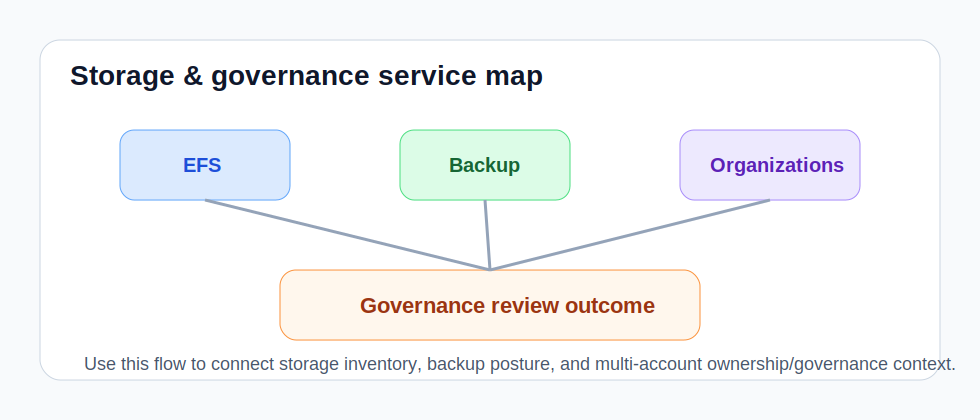

# Storage & Governance Playbook

This playbook covers storage, backup, and multi-account governance visibility.

## Persistent storage

Use: `list_persistent_storage`

What to look for:

- PVCs stuck pending or bound in ways that do not match workload intent
- PV reclaim or access-mode posture that looks risky for shared environments
- namespaces carrying storage debt that will complicate migration or DR planning

Suggested prompts:

- `Inspect persistent storage posture and summarize the biggest governance concerns.`

## Storage classes

Use: `list_storage_classes`

What to look for:

- default-class posture not matching the platform standard
- unexpected class sprawl across the cluster
- storage classes whose provisioner or policy hints do not align with workload expectations

Suggested prompts:

- `Review storage classes and summarize class sprawl or policy drift.`

## Storage Backup

Use:

- `list_oadp_resources`
- `list_disaster_recovery_resources`

What to look for:

- backup storage locations, schedules, or restore assets missing where protection is expected
- DR resources present but not clearly mapped to important workloads or namespaces
- storage posture that will slow or block failover and migration workflows

Suggested prompts:

- `Review OADP and disaster-recovery storage posture and identify weak protection areas.`

## Namespace governance

Use:

- `list_resource_quotas`
- `list_projects`

What to look for:

- projects without obvious quota posture in shared clusters
- inconsistent namespace ownership or guardrails
- storage-heavy namespaces without the project controls expected by platform standards

Suggested prompts:

- `Inspect project and quota posture and summarize storage-governance drift.`

## Virtualization-backed storage readiness

Use: `list_virtualization_resources`

What to look for:

- VM or migration workflows that appear blocked by storage posture
- virtualization resources concentrated in clusters without the expected storage support
- evidence that storage policy and workload mobility are drifting apart

Suggested prompts:

- `Review virtualization resources and summarize storage or mobility risks.`

## Combined storage/governance workflow

Suggested prompt:

- `Inspect persistent storage, storage classes, OADP resources, disaster-recovery resources, virtualization posture, projects, and resource quotas for storage-governance issues.`

Operator actions:

1. inventory storage surfaces
2. inspect backup coverage and disaster-recovery posture
3. correlate storage-heavy namespaces with project ownership and quota guardrails
4. capture follow-up remediation items for missing protections

For deeper cross-service security/governance review, continue into the [`Advanced Security & Governance`](playbook-advanced-security-governance.md) playbook.
